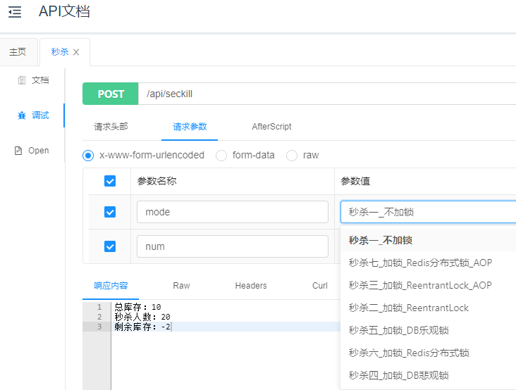

# 秒杀

### 一、环境准备

#### 1、MySQL5.7

配置 `application.yml` 数据库连接参数

```yml
spring:
  datasource:
    url: jdbc:mysql://127.0.0.1:3306/demo?allowMultiQueries=true&useUnicode=true&characterEncoding=UTF8&zeroDateTimeBehavior=convertToNull&useSSL=false
    username: root
    password: root
    platform: mysql
    driver-class-name: com.mysql.jdbc.Driver
```

#### 2、Redis7.0.5

### 二、测试

启动项目，访问 http://127.0.0.1/doc.html#/home



Controller 见 `com.zhengqing.demo.api.SeckillController.seckill`
