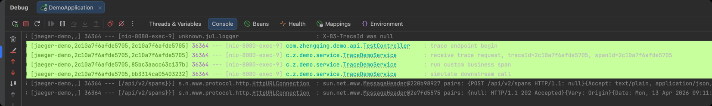
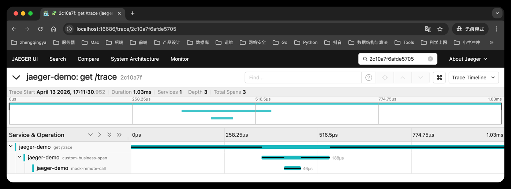

# 01-jaeger-demo

## Jaeger 的作用简述

- 官方文档: [https://www.jaegertracing.io/docs/](https://www.jaegertracing.io/docs/)
- GitHub: [https://github.com/jaegertracing/jaeger](https://github.com/jaegertracing/jaeger)

Jaeger 是一个分布式链路追踪系统，主要用来观察一次请求在多个服务、多个线程、多个调用步骤之间是如何流转的。

它最常见的价值有：

1. 查看一次请求经过了哪些服务和方法
2. 找出慢请求卡在哪个环节
3. 关联上下游调用关系，辅助排查超时和异常
4. 结合 `traceId` / `spanId` 把日志和链路图对应起来

在这个 demo 里，Jaeger 主要承担的是“接收和展示链路数据”的角色。
应用会把 trace 数据按 Zipkin 协议上报给 Jaeger，然后你可以在 Jaeger UI 中看到完整的请求链路。

## 功能说明

这是一个基于 Spring Boot 2.4 的 Jaeger 最小示例，接入方式是：

`Spring Cloud Sleuth -> Zipkin 协议 -> Jaeger all-in-one`

项目已经具备：

1. 自动生成 HTTP 请求链路
2. 日志打印 `traceId` 和 `spanId`
3. 自定义业务 Span 示例
4. Knife4j 接口文档

## 1. 先启动 Jaeger

```bash
docker run --rm --name jaeger \
  -e COLLECTOR_ZIPKIN_HOST_PORT=:9411 \
  -p 16686:16686 \
  -p 9411:9411 \
  jaegertracing/all-in-one
```

说明：

1. `16686` 是 Jaeger UI
2. `9411` 是 Zipkin 兼容接收端口
3. `COLLECTOR_ZIPKIN_HOST_PORT=:9411` 用来显式开启 Jaeger 的 Zipkin 接收器，否则应用往
   `http://localhost:9411/api/v2/spans` 上报时会失败

启动后打开：

[http://localhost:16686](http://localhost:16686)

## 2. 启动项目

```bash
mvn clean package
mvn spring-boot:run
```

默认端口：

`http://localhost:8080`

## 3. 测试接口

### 时间接口

```bash
curl http://localhost:8080/time
```

### Trace 示例接口

```bash
curl http://localhost:8080/trace
```

这个接口会创建一条请求链路，并额外生成两个自定义 span：

1. `custom-business-span`
2. `mock-remote-call`

## 4. 查看链路

访问 `/trace` 后，去 Jaeger UI：

1. 选择服务 `jaeger-demo`
2. 点击 `Find Traces`
3. 打开任意一条最新链路

你可以看到：

1. HTTP 请求入口 span
2. `custom-business-span`
3. `mock-remote-call`

## 5. 查看日志

控制台日志会自动打印：

1. `traceId`
2. `spanId`

这样你可以把日志和 Jaeger UI 里的链路对应起来。



