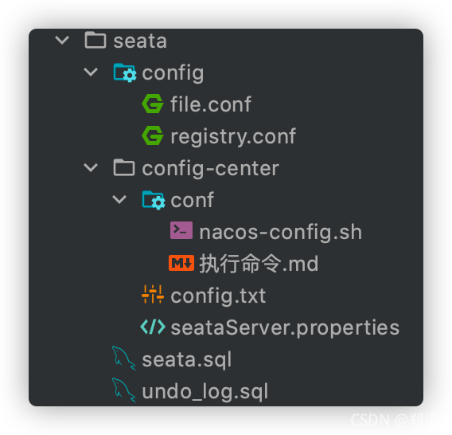
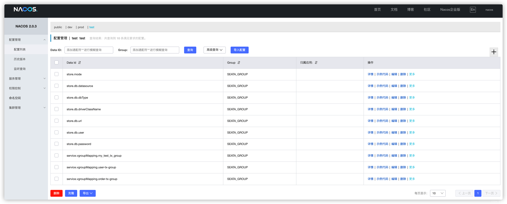
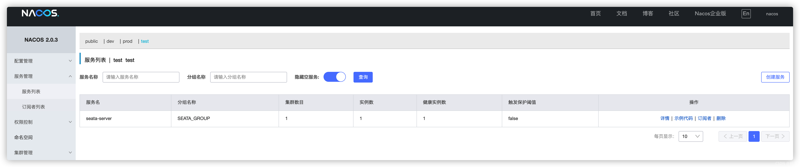
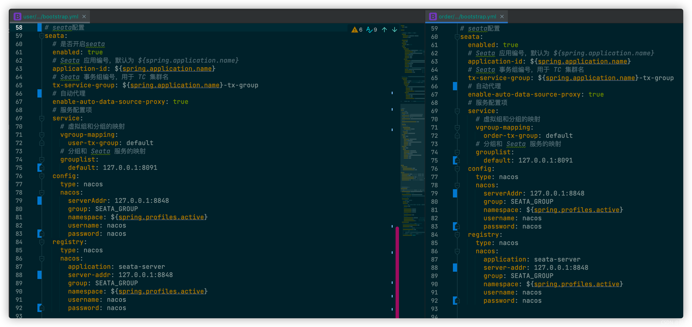
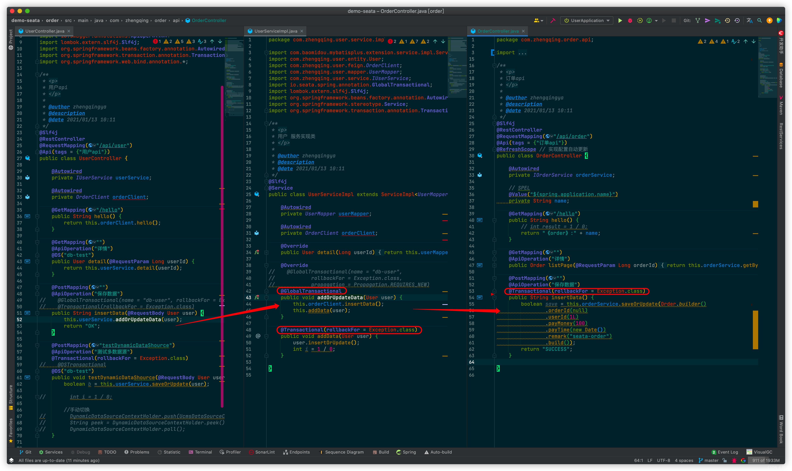
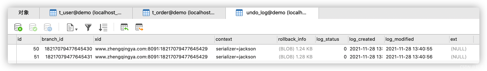

@[TOC](文章目录)

### 一、前言

本文将基于以下环境整合seata实现分布式事务


> 环境：
> 1. spring-boot-dependencies 2.3.2.RELEASE
> 2. spring-cloud-dependencies Hoxton.SR8
> 3. spring-cloud-alibaba-dependencies 2.2.3.RELEASE
> 4. spring-cloud-starter-alibaba-nacos-config 2.2.3.RELEASE
> 5. spring-cloud-starter-alibaba-nacos-discovery 2.2.3.RELEASE
> 6. mysql 5.7

[https://seata.io](https://seata.io)

> tips: 本文属于快速上手入门篇，适用于小白体验seata分布式事务功能`^_^`

### 二、docker-compose部署seata

> tips: 运行seata前需修改相关配置项

```shell
# 准备
git clone https://gitee.com/zhengqingya/docker-compose.git
cd docker-compose/Liunx
# 运行
docker-compose -f docker-compose-seata.yml -p seata up -d
```

#### 相关配置文件



##### docker-compose-seata.yml

```yml
# 可参考 http://seata.io/zh-cn/docs/ops/deploy-by-docker.html
version: '3'

# 网桥 -> 方便相互通讯
networks:
  seata:
    driver: bridge

services:
  seata:
    image: registry.cn-hangzhou.aliyuncs.com/zhengqing/seata-server:1.4.2      # 原镜像`seataio/seata-server:1.4.2`
    container_name: seata_server                                  # 容器名为'seata_server'
    restart: unless-stopped                                       # 指定容器退出后的重启策略为始终重启，但是不考虑在Docker守护进程启动时就已经停止了的容器
    volumes:                                                      # 数据卷挂载路径设置,将本机目录映射到容器目录
      - "./seata/config:/root/seata-config"
      - "./seata/logs:/root/logs"
    environment:                        # 设置环境变量,相当于docker run命令中的-e
      TZ: Asia/Shanghai
      LANG: en_US.UTF-8
      SEATA_IP: www.zhengqingya.com # TODO 指定seata-server启动的IP, 该IP用于向注册中心注册时使用, 如nacos等
      SEATA_PORT: 8091 # 指定seata-server启动的端口, 默认为 8091
#      STORE_MODE: file # 指定seata-server的事务日志存储方式, 支持db ,file,redis(Seata-Server 1.3及以上版本支持), 默认是 file
#      SERVER_NODE: 1 # 指定seata-server节点ID, 如 1,2,3..., 默认为 根据ip生成
#      SEATA_ENV: dev # 指定 seata-server 运行环境, 如 dev, test 等, 服务启动时会使用 registry-dev.conf 这样的配置
      # 指定配置文件位置, 如 file:/root/registry, 将会加载 /root/registry.conf 作为配置文件，
      # 如果需要同时指定 file.conf文件，需要将registry.conf的config.file.name的值改为类似file:/root/file.conf：
      SEATA_CONFIG_NAME: file:/root/seata-config/registry
    ports:                              # 映射端口
      - "8091:8091"
    networks:
      - seata
```

##### 配置 - - seata

###### file.conf

```
## transaction log store, only used in seata-server
store {
  ## store mode: file、db、redis
  mode = "db"
  ## rsa decryption public key
  publicKey = ""
  ## file store property
  file {
    ## store location dir
    dir = "sessionStore"
    # branch session size , if exceeded first try compress lockkey, still exceeded throws exceptions
    maxBranchSessionSize = 16384
    # globe session size , if exceeded throws exceptions
    maxGlobalSessionSize = 512
    # file buffer size , if exceeded allocate new buffer
    fileWriteBufferCacheSize = 16384
    # when recover batch read size
    sessionReloadReadSize = 100
    # async, sync
    flushDiskMode = async
  }

  ## database store property
  db {
    ## the implement of javax.sql.DataSource, such as DruidDataSource(druid)/BasicDataSource(dbcp)/HikariDataSource(hikari) etc.
    datasource = "druid"
    ## mysql/oracle/postgresql/h2/oceanbase etc.
    dbType = "mysql"
    driverClassName = "com.mysql.jdbc.Driver"
    ## if using mysql to store the data, recommend add rewriteBatchedStatements=true in jdbc connection param
    url = "jdbc:mysql://www.zhengqingya.com:3306/seata?rewriteBatchedStatements=true"
    user = "root"
    password = "root"
    minConn = 5
    maxConn = 100
    globalTable = "global_table"
    branchTable = "branch_table"
    lockTable = "lock_table"
    queryLimit = 100
    maxWait = 5000
  }

  ## redis store property
  redis {
    ## redis mode: single、sentinel
    mode = "single"
    ## single mode property
    single {
      host = "127.0.0.1"
      port = "6379"
    }
    ## sentinel mode property
    sentinel {
      masterName = ""
      ## such as "10.28.235.65:26379,10.28.235.65:26380,10.28.235.65:26381"
      sentinelHosts = ""
    }
    password = ""
    database = "0"
    minConn = 1
    maxConn = 10
    maxTotal = 100
    queryLimit = 100
  }
}
```

###### registry.conf

```
registry {
  # file 、nacos 、eureka、redis、zk、consul、etcd3、sofa
  type = "nacos"

  nacos {
    application = "seata-server"
    serverAddr = "www.zhengqingya.com:8848"
    group = "SEATA_GROUP"
    namespace = "test"
    cluster = "default"
    username = "nacos"
    password = "nacos"
  }
  eureka {
    serviceUrl = "http://localhost:8761/eureka"
    application = "default"
    weight = "1"
  }
  redis {
    serverAddr = "localhost:6379"
    db = 0
    password = ""
    cluster = "default"
    timeout = 0
  }
  zk {
    cluster = "default"
    serverAddr = "127.0.0.1:2181"
    sessionTimeout = 6000
    connectTimeout = 2000
    username = ""
    password = ""
  }
  consul {
    cluster = "default"
    serverAddr = "127.0.0.1:8500"
    aclToken = ""
  }
  etcd3 {
    cluster = "default"
    serverAddr = "http://localhost:2379"
  }
  sofa {
    serverAddr = "127.0.0.1:9603"
    application = "default"
    region = "DEFAULT_ZONE"
    datacenter = "DefaultDataCenter"
    cluster = "default"
    group = "SEATA_GROUP"
    addressWaitTime = "3000"
  }
  file {
    name = "file.conf"
  }
}

config {
  # file、nacos 、apollo、zk、consul、etcd3
  type = "nacos"

  nacos {
    serverAddr = "www.zhengqingya.com:8848"
    namespace = "test"
    group = "SEATA_GROUP"
    username = "nacos"
    password = "nacos"
    dataId = "seataServer.properties"
  }
  consul {
    serverAddr = "127.0.0.1:8500"
    aclToken = ""
  }
  apollo {
    appId = "seata-server"
    ## apolloConfigService will cover apolloMeta
    apolloMeta = "http://192.168.1.204:8801"
    apolloConfigService = "http://192.168.1.204:8080"
    namespace = "application"
    apolloAccesskeySecret = ""
    cluster = "seata"
  }
  zk {
    serverAddr = "127.0.0.1:2181"
    sessionTimeout = 6000
    connectTimeout = 2000
    username = ""
    password = ""
    nodePath = "/seata/seata.properties"
  }
  etcd3 {
    serverAddr = "http://localhost:2379"
  }
  file {
    name = "file.conf"
  }
}
```


##### 配置 - - nacos

###### config.txt

> https://github.com/seata/seata/blob/develop/script/config-center/config.txt

```
store.mode=db
store.db.datasource=druid
store.db.dbType=mysql
store.db.driverClassName=com.mysql.jdbc.Driver
store.db.url=jdbc:mysql://www.zhengqingya.com:3306/seata?useUnicode=true&rewriteBatchedStatements=true
store.db.user=root
store.db.password=root
service.vgroupMapping.my_test_tx_group=default
service.vgroupMapping.user-tx-group=default
service.vgroupMapping.order-tx-group=default
```

###### nacos-config.sh

> https://github.com/seata/seata/blob/develop/script/config-center/nacos/nacos-config.sh


```
#!/usr/bin/env bash
# Copyright 1999-2019 Seata.io Group.
#
# Licensed under the Apache License, Version 2.0 (the "License");
# you may not use this file except in compliance with the License.
# You may obtain a copy of the License at、
#
#      http://www.apache.org/licenses/LICENSE-2.0
#
# Unless required by applicable law or agreed to in writing, software
# distributed under the License is distributed on an "AS IS" BASIS,
# WITHOUT WARRANTIES OR CONDITIONS OF ANY KIND, either express or implied.
# See the License for the specific language governing permissions and
# limitations under the License.

while getopts ":h:p:g:t:u:w:" opt
do
  case $opt in
  h)
    host=$OPTARG
    ;;
  p)
    port=$OPTARG
    ;;
  g)
    group=$OPTARG
    ;;
  t)
    tenant=$OPTARG
    ;;
  u)
    username=$OPTARG
    ;;
  w)
    password=$OPTARG
    ;;
  ?)
    echo " USAGE OPTION: $0 [-h host] [-p port] [-g group] [-t tenant] [-u username] [-w password] "
    exit 1
    ;;
  esac
done

urlencode() {
  for ((i=0; i < ${#1}; i++))
  do
    char="${1:$i:1}"
    case $char in
    [a-zA-Z0-9.~_-]) printf $char ;;
    *) printf '%%%02X' "'$char" ;;
    esac
  done
}

if [[ -z ${host} ]]; then
    host=localhost
fi
if [[ -z ${port} ]]; then
    port=8848
fi
if [[ -z ${group} ]]; then
    group="SEATA_GROUP"
fi
if [[ -z ${tenant} ]]; then
    tenant=""
fi
if [[ -z ${username} ]]; then
    username=""
fi
if [[ -z ${password} ]]; then
    password=""
fi

nacosAddr=$host:$port
contentType="content-type:application/json;charset=UTF-8"

echo "set nacosAddr=$nacosAddr"
echo "set group=$group"

failCount=0
tempLog=$(mktemp -u)
function addConfig() {
  curl -X POST -H "${contentType}" "http://$nacosAddr/nacos/v1/cs/configs?dataId=$(urlencode $1)&group=$group&content=$(urlencode $2)&tenant=$tenant&username=$username&password=$password" >"${tempLog}" 2>/dev/null
  if [[ -z $(cat "${tempLog}") ]]; then
    echo " Please check the cluster status. "
    exit 1
  fi
  if [[ $(cat "${tempLog}") =~ "true" ]]; then
    echo "Set $1=$2 successfully "
  else
    echo "Set $1=$2 failure "
    (( failCount++ ))
  fi
}

count=0
for line in $(cat $(dirname "$PWD")/config.txt | sed s/[[:space:]]//g); do
  (( count++ ))
	key=${line%%=*}
    value=${line#*=}
	addConfig "${key}" "${value}"
done

echo "========================================================================="
echo " Complete initialization parameters,  total-count:$count ,  failure-count:$failCount "
echo "========================================================================="

if [[ ${failCount} -eq 0 ]]; then
	echo " Init nacos config finished, please start seata-server. "
else
	echo " init nacos config fail. "
fi
```

运行命令将config.txt配置推送到nacos中

```shell
# -h -p => 指定nacos的ip和端口
# -g    => 指定配置的分组
# -t    => 指定命名空间id
# -u -w => 指定nacos的用户名和密码
sh nacos-config.sh -h 127.0.0.1 -p 8848 -g SEATA_GROUP -t test -u nacos -w nacos
```




##### 配置 - - seata数据库

##### seata.sql

> https://github.com/seata/seata/blob/develop/script/server/db/mysql.sql


```sql
-- -------------------------------- The script used when storeMode is 'db' --------------------------------
-- the table to store GlobalSession data
CREATE TABLE IF NOT EXISTS `global_table`
(
    `xid`                       VARCHAR(128) NOT NULL,
    `transaction_id`            BIGINT,
    `status`                    TINYINT      NOT NULL,
    `application_id`            VARCHAR(32),
    `transaction_service_group` VARCHAR(32),
    `transaction_name`          VARCHAR(128),
    `timeout`                   INT,
    `begin_time`                BIGINT,
    `application_data`          VARCHAR(2000),
    `gmt_create`                DATETIME,
    `gmt_modified`              DATETIME,
    PRIMARY KEY (`xid`),
    KEY `idx_gmt_modified_status` (`gmt_modified`, `status`),
    KEY `idx_transaction_id` (`transaction_id`)
    ) ENGINE = InnoDB
    DEFAULT CHARSET = utf8;

-- the table to store BranchSession data
CREATE TABLE IF NOT EXISTS `branch_table`
(
    `branch_id`         BIGINT       NOT NULL,
    `xid`               VARCHAR(128) NOT NULL,
    `transaction_id`    BIGINT,
    `resource_group_id` VARCHAR(32),
    `resource_id`       VARCHAR(256),
    `branch_type`       VARCHAR(8),
    `status`            TINYINT,
    `client_id`         VARCHAR(64),
    `application_data`  VARCHAR(2000),
    `gmt_create`        DATETIME(6),
    `gmt_modified`      DATETIME(6),
    PRIMARY KEY (`branch_id`),
    KEY `idx_xid` (`xid`)
    ) ENGINE = InnoDB
    DEFAULT CHARSET = utf8;

-- the table to store lock data
CREATE TABLE IF NOT EXISTS `lock_table`
(
    `row_key`        VARCHAR(128) NOT NULL,
    `xid`            VARCHAR(128),
    `transaction_id` BIGINT,
    `branch_id`      BIGINT       NOT NULL,
    `resource_id`    VARCHAR(256),
    `table_name`     VARCHAR(32),
    `pk`             VARCHAR(36),
    `gmt_create`     DATETIME,
    `gmt_modified`   DATETIME,
    PRIMARY KEY (`row_key`),
    KEY `idx_branch_id` (`branch_id`)
    ) ENGINE = InnoDB
    DEFAULT CHARSET = utf8;

CREATE TABLE IF NOT EXISTS `distributed_lock`
(
    `lock_key`       CHAR(20) NOT NULL,
    `lock_value`     VARCHAR(20) NOT NULL,
    `expire`         BIGINT,
    primary key (`lock_key`)
    ) ENGINE = InnoDB
    DEFAULT CHARSET = utf8mb4;

INSERT INTO `distributed_lock` (lock_key, lock_value, expire) VALUES ('AsyncCommitting', ' ', 0);
INSERT INTO `distributed_lock` (lock_key, lock_value, expire) VALUES ('RetryCommitting', ' ', 0);
INSERT INTO `distributed_lock` (lock_key, lock_value, expire) VALUES ('RetryRollbacking', ' ', 0);
INSERT INTO `distributed_lock` (lock_key, lock_value, expire) VALUES ('TxTimeoutCheck', ' ', 0);
```

##### 配置 - - 每个微服务关联数据库

##### undo_log.sql

> tips: 需微服务 - - 每个服务中相应的数据库下存在此表

```sql
CREATE TABLE `undo_log`
(
    `id`            bigint(20) NOT NULL AUTO_INCREMENT,
    `branch_id`     bigint(20) NOT NULL,
    `xid`           varchar(100) NOT NULL,
    `context`       varchar(128) NOT NULL,
    `rollback_info` longblob     NOT NULL,
    `log_status`    int(11) NOT NULL,
    `log_created`   datetime     NOT NULL,
    `log_modified`  datetime     NOT NULL,
    `ext`           varchar(100) DEFAULT NULL,
    PRIMARY KEY (`id`) USING BTREE,
    UNIQUE KEY `ux_undo_log` (`xid`,`branch_id`) USING BTREE
) ENGINE=InnoDB AUTO_INCREMENT=110 DEFAULT CHARSET=utf8 ROW_FORMAT=DYNAMIC;
```

修改配置后，运行seata，查看nacos注册信息




### 三、SpringCloud集成seata

#### 1、`pom.xml`中引入依赖

```xml
<!-- seata -->
<!-- https://mvnrepository.com/artifact/com.alibaba.cloud/spring-cloud-starter-alibaba-seata -->
<dependency>
    <groupId>com.alibaba.cloud</groupId>
    <artifactId>spring-cloud-starter-alibaba-seata</artifactId>
</dependency>
```

#### 2、seata配置



> tips: 这里只贴出其中一个user服务的配置


```yml
# seata配置
seata:
  # 是否开启seata
  enabled: true
  # Seata 应用编号，默认为 ${spring.application.name}
  application-id: ${spring.application.name}
  # Seata 事务组编号，用于 TC 集群名
  tx-service-group: ${spring.application.name}-tx-group
  # 自动代理
  enable-auto-data-source-proxy: true
  # 服务配置项
  service:
    # 虚拟组和分组的映射
    vgroup-mapping:
      user-tx-group: default
    # 分组和 Seata 服务的映射
    grouplist:
      default: 127.0.0.1:8091
  config:
    type: nacos
    nacos:
      serverAddr: 127.0.0.1:8848
      group: SEATA_GROUP
      namespace: ${spring.profiles.active}
      username: nacos
      password: nacos
  registry:
    type: nacos
    nacos:
      application: seata-server
      server-addr: 127.0.0.1:8848
      group: SEATA_GROUP
      namespace: ${spring.profiles.active}
      username: nacos
      password: nacos
```

#### 3、测试分布式事务

在主调用方加上注解`@GlobalTransactional` 即可



可访问接口文档 [http://127.0.0.1:10010/doc.html](http://127.0.0.1:10010/doc.html) 调用测试seata分布式事务

> tips: 小编在测试的时候，发现事务回滚有所延时，即需要等一会儿，因程序异常导致的脏数据才会回滚~



### 本文案例demo源码

[https://gitee.com/zhengqingya/java-workspace](https://gitee.com/zhengqingya/java-workspace)

---

> 今日分享语句：
> 做最好的今天，回顾最好的昨天，迎接最美好的明天。
