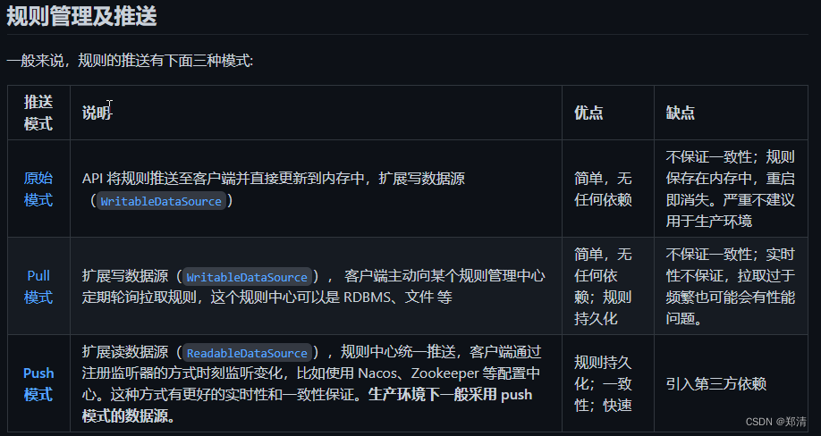
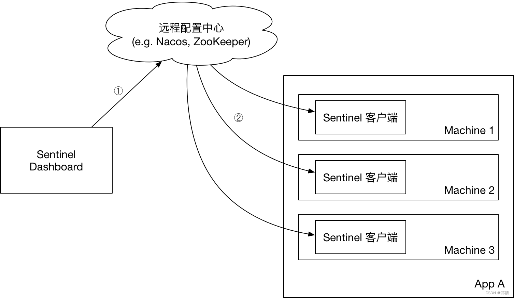
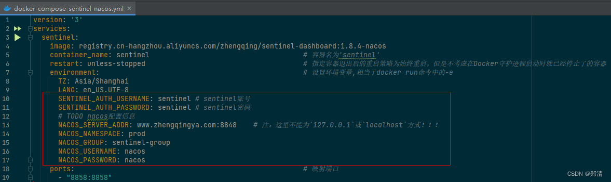
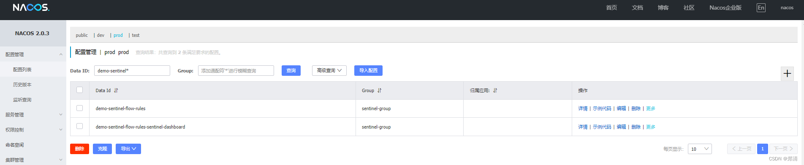
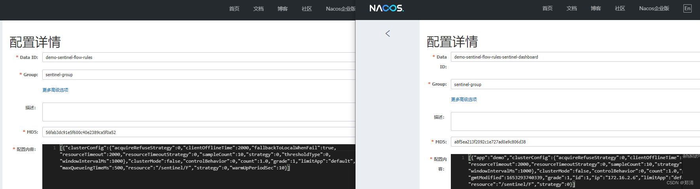
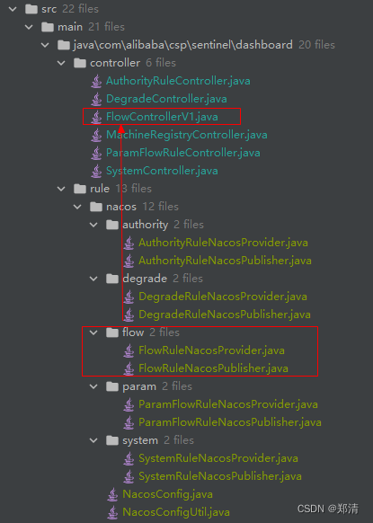

@[TOC](文章目录)

### 一、前言

> [在生产环境中使用 Sentinel](https://github.com/alibaba/Sentinel/wiki/%E5%9C%A8%E7%94%9F%E4%BA%A7%E7%8E%AF%E5%A2%83%E4%B8%AD%E4%BD%BF%E7%94%A8-Sentinel)
> 参考 [https://blog.csdn.net/liuerchong/article/details/123718092](https://blog.csdn.net/liuerchong/article/details/123718092)



下面使用`Push模式`：配置中心控制台/Sentinel 控制台 → 配置中心 → Sentinel 数据源 → Sentinel


### 二、快速体验

#### 1、部署sentinel

小编已经基于Sentinel 1.8.4版本构建好一个docker镜像，修改下相应nacos配置信息即可运行体验一下


```shell
# 环境准备
git clone https://gitee.com/zhengqingya/docker-compose.git
cd docker-compose/Liunx
# 运行
# docker-compose -f docker-compose-sentinel-nacos.yml -p sentinel up -d
```

#### 2、SpringCloud中规则持久化到nacos

添加依赖

```xml
<!-- Sentinel规则持久化至Nacos -->
<dependency>
   <groupId>com.alibaba.csp</groupId>
   <artifactId>sentinel-datasource-nacos</artifactId>
</dependency>
```

添加配置

```yml
spring:
  application:
    name: demo # 应用名称
  cloud:
    sentinel:
      enabled: true # 自动化配置是否生效
      eager: true   # 禁用控制台懒加载
      transport:
        dashboard: www.zhengqingya.com:8858 # 控制台地址
        client-ip: ${spring.cloud.client.ip-address} # 获取本机IP地址
        port: 18719 # 启动该服务，会在应用程序的相应服务器上启动HTTP Server，并且该服务器将与Sentinel dashboard进行交互
      # ============== ↓↓↓↓↓↓ 增加规则持久化配置到nacos ↓↓↓↓↓↓ ==============
      datasource:
        # 流控规则
        flow:
          nacos:
            server-addr: ${spring.cloud.nacos.config.server-addr}
            username: ${spring.cloud.nacos.config.username}
            password: ${spring.cloud.nacos.config.password}
            namespace: ${spring.cloud.nacos.config.namespace}
            group-id: sentinel-group
            data-id: ${spring.application.name}-sentinel-flow-rules
            # 规则类型：flow、degrade、param-flow、system、authority
            rule-type: flow
        # 熔断降级
        degrade:
          nacos:
            server-addr: ${spring.cloud.nacos.config.server-addr}
            username: ${spring.cloud.nacos.config.username}
            password: ${spring.cloud.nacos.config.password}
            namespace: ${spring.cloud.nacos.config.namespace}
            group-id: sentinel-group
            data-id: ${spring.application.name}-sentinel-degrade-rules
            rule-type: degrade
        # 热点规则
        param-flow:
          nacos:
            server-addr: ${spring.cloud.nacos.config.server-addr}
            username: ${spring.cloud.nacos.config.username}
            password: ${spring.cloud.nacos.config.password}
            namespace: ${spring.cloud.nacos.config.namespace}
            group-id: sentinel-group
            data-id: ${spring.application.name}-sentinel-param-flow-rules
            rule-type: param-flow
        # 系统规则
        system:
          nacos:
            server-addr: ${spring.cloud.nacos.config.server-addr}
            username: ${spring.cloud.nacos.config.username}
            password: ${spring.cloud.nacos.config.password}
            namespace: ${spring.cloud.nacos.config.namespace}
            group-id: sentinel-group
            data-id: ${spring.application.name}-sentinel-system-rules
            rule-type: system
        # 授权规则
        authority:
          nacos:
            server-addr: ${spring.cloud.nacos.config.server-addr}
            username: ${spring.cloud.nacos.config.username}
            password: ${spring.cloud.nacos.config.password}
            namespace: ${spring.cloud.nacos.config.namespace}
            group-id: sentinel-group
            data-id: ${spring.application.name}-sentinel-authority-rules
            rule-type: authority
```

#### 3、sentinel控制台操作测试

ex: 在sentinel控制台中添加流控规则会自动在nacos中创建相应配置文件`xxx-sentinel-flow-rules`和`xxx-sentinel-flow-rules-sentinel-dashboard`，用于规则持久化存储数据，sentinel重启或我们的应用app重启，配置都会一直在！



### 三、sentinel-dashboard源码修改

拉取源码 [https://github.com/alibaba/Sentinel](https://github.com/alibaba/Sentinel)，进入`sentinel-dashboard`模块

#### 1、`pom.xml`中添加依赖

```xml
<!--添加Nacos配置中心依赖 -->
<dependency>
    <groupId>com.alibaba.boot</groupId>
    <artifactId>nacos-config-spring-boot-starter</artifactId>
    <version>0.2.10</version>
</dependency>
```

sentinel1.8.4引入springboot版本为`2.5.12`，启动项目会报错`Caused by: java.lang.ClassNotFoundException: org.springframework.boot.context.properties.ConfigurationBeanFactoryMetadata`
原因：在springboot2.4之后删掉了ConfigurationBeanFactoryMetadata
解决：将版本降至`2.3.9.RELEASE`

#### 2、`application.properties`中添加nacos配置

```
# ============== ↓↓↓↓↓↓ 增加配置 -> 规则持久化到nacos ↓↓↓↓↓↓ ==============
server.port=8858
nacos.server-addr=127.0.0.1:8848
nacos.namespace=dev
nacos.group=sentinel-group
nacos.username=nacos
nacos.password=nacos
```

#### 3、nacos配置

###### 新增NacosConfig 

```java
@Configuration
public class NacosConfig {

    @Value("${nacos.server-addr}")
    private String serverAddr;

    @Value("${nacos.namespace}")
    private String namespace;

    @Value("${nacos.group}")
    public String group;

    @Value("${nacos.username}")
    private String username;

    @Value("${nacos.password}")
    private String password;

    @Bean
    public ConfigService nacosConfigService() throws Exception {
        Properties properties = new Properties();
        properties.put(PropertyKeyConst.SERVER_ADDR, this.serverAddr);
        properties.put(PropertyKeyConst.NAMESPACE, this.namespace);
//        properties.put(PropertyKeyConst.GROUP, this.group);
        properties.put(PropertyKeyConst.USERNAME, this.username);
        properties.put(PropertyKeyConst.PASSWORD, this.password);
        return ConfigFactory.createConfigService(properties);
    }
}
```

###### 新增NacosConfigUtil 

```java
@Component
public final class NacosConfigUtil {

    @Resource
    private NacosConfig nacosConfig;

    private static String GROUP_ID = null;

    @PostConstruct
    public void init() {
        GROUP_ID = this.nacosConfig.group;
    }

    public static final String FLOW_DATA_ID_POSTFIX = "-sentinel-flow-rules";
    public static final String DEGRADE_DATA_ID_POSTFIX = "-sentinel-degrade-rules";
    public static final String SYSTEM_DATA_ID_POSTFIX = "-sentinel-system-rules";
    public static final String PARAM_FLOW_DATA_ID_POSTFIX = "-sentinel-param-flow-rules";
    public static final String AUTHORITY_DATA_ID_POSTFIX = "-sentinel-authority-rules";
    public static final String DASHBOARD_POSTFIX = "-sentinel-dashboard";


    private NacosConfigUtil() {
    }

    /**
     * 将规则序列化成JSON文本，存储到Nacos server中
     *
     * @param configService nacos config service
     * @param app           应用名称
     * @param postfix       规则后缀 eg.NacosConfigUtil.FLOW_DATA_ID_POSTFIX
     * @param rules         规则对象
     * @throws NacosException 异常
     */
    public static <T> void setRuleStringToNacos(ConfigService configService, String app, String postfix, List<T> rules) throws NacosException {
        AssertUtil.notEmpty(app, "app name cannot be empty");
        if (rules == null) {
            return;
        }

        List<Rule> ruleForApp = rules.stream()
                .map(rule -> {
                    RuleEntity rule1 = (RuleEntity) rule;
                    System.out.println(rule1.getClass());
                    Rule rule2 = rule1.toRule();
                    System.out.println(rule2.getClass());
                    return rule2;
                })
                .collect(Collectors.toList());

        String dataId = genDataId(app, postfix);
        /**
         * 俩种存储只是入参不同,为了满足功能的实现,存入nacos后,会有俩个配置,以后继续完善
         */
        // 存储，控制微服务使用,即可以起到拦截作用,但是由于无法显示到控制台
        configService.publishConfig(
                dataId,
                NacosConfigUtil.GROUP_ID,
                JSON.toJSONString(ruleForApp)
        );

        // 存储，给控制台显示使用,由于数据太多,会出现转化异常,虽然可以提供控制台显示,但是无法对微服务进行保护
        configService.publishConfig(
                dataId + DASHBOARD_POSTFIX,
                NacosConfigUtil.GROUP_ID,
                JSON.toJSONString(rules)
        );
    }

    /**
     * 从Nacos server中查询响应规则，并将其反序列化成对应Rule实体
     *
     * @param configService nacos config service
     * @param appName       应用名称
     * @param postfix       规则后缀 eg.NacosConfigUtil.FLOW_DATA_ID_POSTFIX
     * @param clazz         类
     * @param <T>           泛型
     * @return 规则对象列表
     * @throws NacosException 异常
     */
    public static <T> List<T> getRuleEntitiesFromNacos(ConfigService configService, String appName, String postfix, Class<T> clazz) throws NacosException {
        String rules = configService.getConfig(
                genDataId(appName, postfix) + DASHBOARD_POSTFIX,
                NacosConfigUtil.GROUP_ID,
                3000
        );
        if (StringUtil.isEmpty(rules)) {
            return new ArrayList<>();
        }
        return JSON.parseArray(rules, clazz);
    }

    private static String genDataId(String appName, String postfix) {
        return appName + postfix;
    }
}
```

#### 4、举例持久化流控规则

> tips: 其它规则持久化参考本文案例源码



###### 新增FlowRuleNacosProvider 

```java
@Component("flowRuleNacosProvider")
public class FlowRuleNacosProvider implements DynamicRuleProvider<List<FlowRuleEntity>> {

    @Autowired
    private ConfigService configService;

    @Override
    public List<FlowRuleEntity> getRules(String appName) throws Exception {
        return NacosConfigUtil.getRuleEntitiesFromNacos(
                this.configService,
                appName,
                NacosConfigUtil.FLOW_DATA_ID_POSTFIX,
                FlowRuleEntity.class
        );
    }
}
```

###### 新增FlowRuleNacosPublisher 

```java
@Component("flowRuleNacosPublisher")
public class FlowRuleNacosPublisher implements DynamicRulePublisher<List<FlowRuleEntity>> {

    @Autowired
    private ConfigService configService;

    @Override
    public void publish(String app, List<FlowRuleEntity> rules) throws Exception {
        NacosConfigUtil.setRuleStringToNacos(
                this.configService,
                app,
                NacosConfigUtil.FLOW_DATA_ID_POSTFIX,
                rules
        );
    }
}
```

###### 修改FlowControllerV1

```java
@RestController
@RequestMapping(value = "/v1/flow")
public class FlowControllerV1 {

    private final Logger logger = LoggerFactory.getLogger(FlowControllerV1.class);

    @Autowired
    private InMemoryRuleRepositoryAdapter<FlowRuleEntity> repository;

//    @Autowired
//    private SentinelApiClient sentinelApiClient;

    @Autowired
    @Qualifier("flowRuleNacosProvider")
    private DynamicRuleProvider<List<FlowRuleEntity>> ruleProvider;
    @Autowired
    @Qualifier("flowRuleNacosPublisher")
    private DynamicRulePublisher<List<FlowRuleEntity>> rulePublisher;

    @GetMapping("/rules")
    @AuthAction(PrivilegeType.READ_RULE)
    public Result<List<FlowRuleEntity>> apiQueryMachineRules(@RequestParam String app,
                                                             @RequestParam String ip,
                                                             @RequestParam Integer port) {

        if (StringUtil.isEmpty(app)) {
            return Result.ofFail(-1, "app can't be null or empty");
        }
        if (StringUtil.isEmpty(ip)) {
            return Result.ofFail(-1, "ip can't be null or empty");
        }
        if (port == null) {
            return Result.ofFail(-1, "port can't be null");
        }
        try {
//            List<FlowRuleEntity> rules = sentinelApiClient.fetchFlowRuleOfMachine(app, ip, port);
            List<FlowRuleEntity> rules = ruleProvider.getRules(app);
            rules = repository.saveAll(rules);
            return Result.ofSuccess(rules);
        } catch (Throwable throwable) {
            logger.error("Error when querying flow rules", throwable);
            return Result.ofThrowable(-1, throwable);
        }
    }

    private <R> Result<R> checkEntityInternal(FlowRuleEntity entity) {
        if (StringUtil.isBlank(entity.getApp())) {
            return Result.ofFail(-1, "app can't be null or empty");
        }
        if (StringUtil.isBlank(entity.getIp())) {
            return Result.ofFail(-1, "ip can't be null or empty");
        }
        if (entity.getPort() == null) {
            return Result.ofFail(-1, "port can't be null");
        }
        if (StringUtil.isBlank(entity.getLimitApp())) {
            return Result.ofFail(-1, "limitApp can't be null or empty");
        }
        if (StringUtil.isBlank(entity.getResource())) {
            return Result.ofFail(-1, "resource can't be null or empty");
        }
        if (entity.getGrade() == null) {
            return Result.ofFail(-1, "grade can't be null");
        }
        if (entity.getGrade() != 0 && entity.getGrade() != 1) {
            return Result.ofFail(-1, "grade must be 0 or 1, but " + entity.getGrade() + " got");
        }
        if (entity.getCount() == null || entity.getCount() < 0) {
            return Result.ofFail(-1, "count should be at lease zero");
        }
        if (entity.getStrategy() == null) {
            return Result.ofFail(-1, "strategy can't be null");
        }
        if (entity.getStrategy() != 0 && StringUtil.isBlank(entity.getRefResource())) {
            return Result.ofFail(-1, "refResource can't be null or empty when strategy!=0");
        }
        if (entity.getControlBehavior() == null) {
            return Result.ofFail(-1, "controlBehavior can't be null");
        }
        int controlBehavior = entity.getControlBehavior();
        if (controlBehavior == 1 && entity.getWarmUpPeriodSec() == null) {
            return Result.ofFail(-1, "warmUpPeriodSec can't be null when controlBehavior==1");
        }
        if (controlBehavior == 2 && entity.getMaxQueueingTimeMs() == null) {
            return Result.ofFail(-1, "maxQueueingTimeMs can't be null when controlBehavior==2");
        }
        if (entity.isClusterMode() && entity.getClusterConfig() == null) {
            return Result.ofFail(-1, "cluster config should be valid");
        }
        return null;
    }

    @PostMapping("/rule")
    @AuthAction(PrivilegeType.WRITE_RULE)
    public Result<FlowRuleEntity> apiAddFlowRule(@RequestBody FlowRuleEntity entity) {
        Result<FlowRuleEntity> checkResult = checkEntityInternal(entity);
        if (checkResult != null) {
            return checkResult;
        }
        entity.setId(null);
        Date date = new Date();
        entity.setGmtCreate(date);
        entity.setGmtModified(date);
        entity.setLimitApp(entity.getLimitApp().trim());
        entity.setResource(entity.getResource().trim());
        try {
            entity = repository.save(entity);

            publishRules(entity.getApp(), entity.getIp(), entity.getPort());
            return Result.ofSuccess(entity);
        } catch (Throwable t) {
            Throwable e = t instanceof ExecutionException ? t.getCause() : t;
            logger.error("Failed to add new flow rule, app={}, ip={}", entity.getApp(), entity.getIp(), e);
            return Result.ofFail(-1, e.getMessage());
        }
    }

    @PutMapping("/save.json")
    @AuthAction(PrivilegeType.WRITE_RULE)
    public Result<FlowRuleEntity> apiUpdateFlowRule(Long id, String app,
                                                  String limitApp, String resource, Integer grade,
                                                  Double count, Integer strategy, String refResource,
                                                  Integer controlBehavior, Integer warmUpPeriodSec,
                                                  Integer maxQueueingTimeMs) {
        if (id == null) {
            return Result.ofFail(-1, "id can't be null");
        }
        FlowRuleEntity entity = repository.findById(id);
        if (entity == null) {
            return Result.ofFail(-1, "id " + id + " dose not exist");
        }
        if (StringUtil.isNotBlank(app)) {
            entity.setApp(app.trim());
        }
        if (StringUtil.isNotBlank(limitApp)) {
            entity.setLimitApp(limitApp.trim());
        }
        if (StringUtil.isNotBlank(resource)) {
            entity.setResource(resource.trim());
        }
        if (grade != null) {
            if (grade != 0 && grade != 1) {
                return Result.ofFail(-1, "grade must be 0 or 1, but " + grade + " got");
            }
            entity.setGrade(grade);
        }
        if (count != null) {
            entity.setCount(count);
        }
        if (strategy != null) {
            if (strategy != 0 && strategy != 1 && strategy != 2) {
                return Result.ofFail(-1, "strategy must be in [0, 1, 2], but " + strategy + " got");
            }
            entity.setStrategy(strategy);
            if (strategy != 0) {
                if (StringUtil.isBlank(refResource)) {
                    return Result.ofFail(-1, "refResource can't be null or empty when strategy!=0");
                }
                entity.setRefResource(refResource.trim());
            }
        }
        if (controlBehavior != null) {
            if (controlBehavior != 0 && controlBehavior != 1 && controlBehavior != 2) {
                return Result.ofFail(-1, "controlBehavior must be in [0, 1, 2], but " + controlBehavior + " got");
            }
            if (controlBehavior == 1 && warmUpPeriodSec == null) {
                return Result.ofFail(-1, "warmUpPeriodSec can't be null when controlBehavior==1");
            }
            if (controlBehavior == 2 && maxQueueingTimeMs == null) {
                return Result.ofFail(-1, "maxQueueingTimeMs can't be null when controlBehavior==2");
            }
            entity.setControlBehavior(controlBehavior);
            if (warmUpPeriodSec != null) {
                entity.setWarmUpPeriodSec(warmUpPeriodSec);
            }
            if (maxQueueingTimeMs != null) {
                entity.setMaxQueueingTimeMs(maxQueueingTimeMs);
            }
        }
        Date date = new Date();
        entity.setGmtModified(date);
        try {
            entity = repository.save(entity);
            if (entity == null) {
                return Result.ofFail(-1, "save entity fail: null");
            }

            publishRules(entity.getApp(), entity.getIp(), entity.getPort());
            return Result.ofSuccess(entity);
        } catch (Throwable t) {
            Throwable e = t instanceof ExecutionException ? t.getCause() : t;
            logger.error("Error when updating flow rules, app={}, ip={}, ruleId={}", entity.getApp(),
                entity.getIp(), id, e);
            return Result.ofFail(-1, e.getMessage());
        }
    }

    @DeleteMapping("/delete.json")
    @AuthAction(PrivilegeType.WRITE_RULE)
    public Result<Long> apiDeleteFlowRule(Long id) {

        if (id == null) {
            return Result.ofFail(-1, "id can't be null");
        }
        FlowRuleEntity oldEntity = repository.findById(id);
        if (oldEntity == null) {
            return Result.ofSuccess(null);
        }

        try {
            repository.delete(id);
        } catch (Exception e) {
            return Result.ofFail(-1, e.getMessage());
        }
        try {
            publishRules(oldEntity.getApp(), oldEntity.getIp(), oldEntity.getPort());
            return Result.ofSuccess(id);
        } catch (Throwable t) {
            Throwable e = t instanceof ExecutionException ? t.getCause() : t;
            logger.error("Error when deleting flow rules, app={}, ip={}, id={}", oldEntity.getApp(),
                oldEntity.getIp(), id, e);
            return Result.ofFail(-1, e.getMessage());
        }
    }

//    private CompletableFuture<Void> publishRules(String app, String ip, Integer port) {
//        List<FlowRuleEntity> rules = repository.findAllByMachine(MachineInfo.of(app, ip, port));
//        return sentinelApiClient.setFlowRuleOfMachineAsync(app, ip, port, rules);
//    }
    private void publishRules(String app, String ip, Integer port) {
//        List<AuthorityRuleEntity> rules = repository.findAllByMachine(MachineInfo.of(app, ip, port));
//        return sentinelApiClient.setAuthorityRuleOfMachine(app, ip, port, rules);
        List<FlowRuleEntity> rules = repository.findAllByApp(app);
        try {
            rulePublisher.publish(app, rules);
        } catch (Exception e) {
            e.printStackTrace();
        }
    }
}
```

### 四、本文案例源码

[https://gitee.com/zhengqingya/java-workspace](https://gitee.com/zhengqingya/java-workspace)


--- 

> 今日分享语句：
> 鸡蛋，从外打破是食物，从内打破是生命，人生也是如此，从外打破是压力，从内打破是成长。

