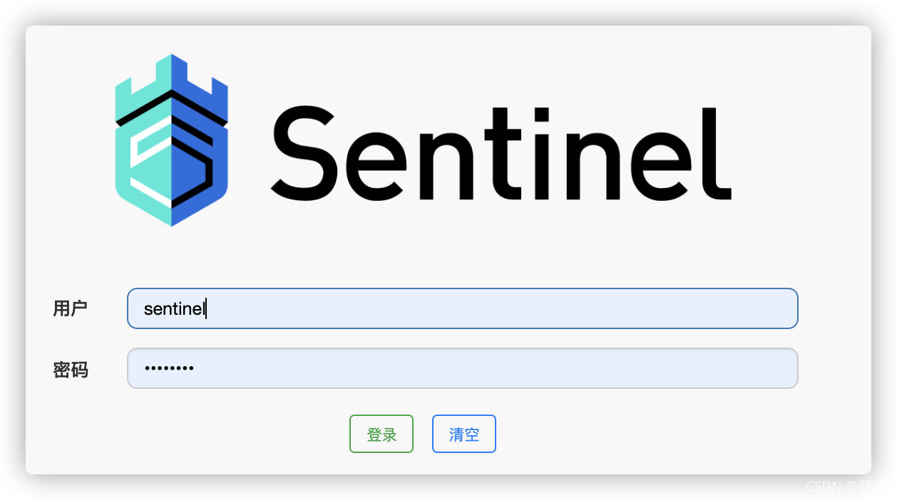
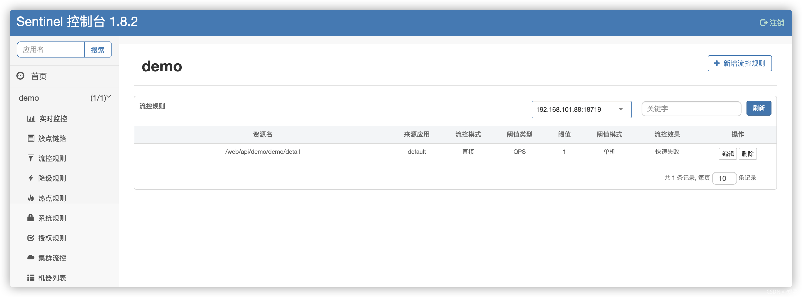
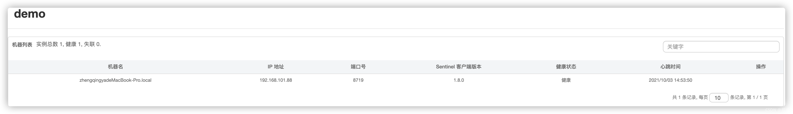
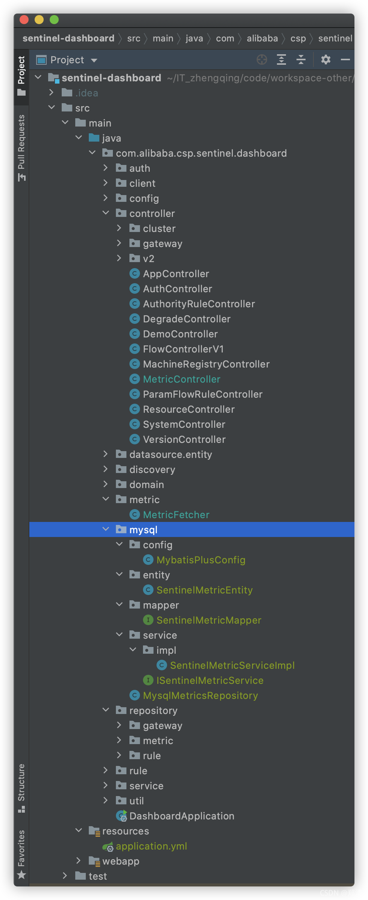
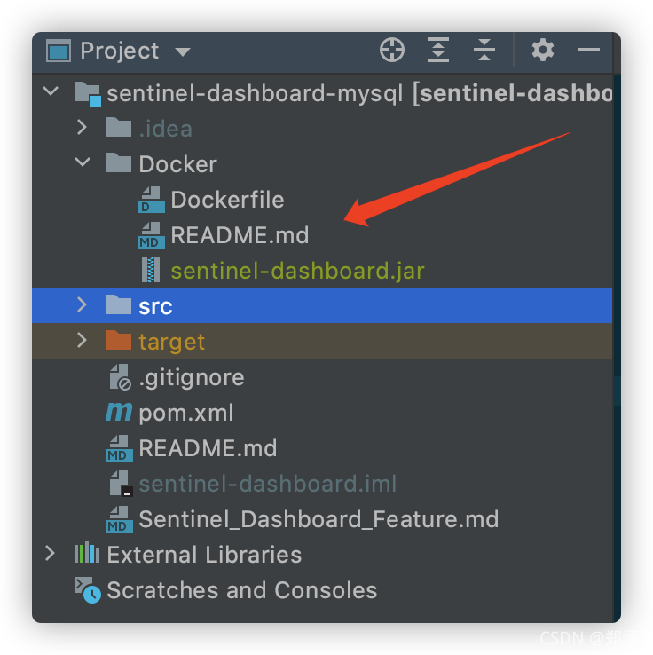

# Sentinel 控制台

> 源码地址： https://github.com/alibaba/Sentinel

### 一、前言

本文将修改`sentinel-dashboard`源码，集成`mybatis-plus`，持久化配置到`mysql`，然后制作docker版的sentinel镜像，方便后期快速部署sentinel-mysql。

1. Docker version 20.10.8, build 3967b7d
2. docker-compose version 1.29.2, build 5becea4c
3. sentinel-dashboard:1.8.2
4. mybatis-plus-boot-starter:3.4.3.4
5. mysql5.7

### 二、docker-compose快速部署Sentinel - MySQL版

> 可参考 [https://gitee.com/zhengqingya/docker-compose](https://gitee.com/zhengqingya/docker-compose)

```shell
# 准备
git clone https://gitee.com/zhengqingya/docker-compose.git
cd docker-compose/Liunx
# 运行
docker-compose -f docker-compose-sentinel-mysql.yml -p sentinel up -d
```

### 三、访问测试

访问 [http://127.0.0.1:8858/#/dashboard](http://127.0.0.1:8858/#/dashboard)




如果sentinel日志报错如下

```
2021-10-03 13:05:47.493 ERROR 1 --- [pool-2-thread-1] c.a.c.s.dashboard.metric.MetricFetcher   : Failed to fetch metric from <http://192.168.101.88:8719/metric?startTime=1633237412000&endTime=1633237418000&refetch=false> (ConnectionException: Connection timed out)
```

解决：让sentinel所在机器能够访问sentinel客户端ip和端口，即上面日志中的`192.168.101.88:8719`



### 四、sentinel-dashboard源码修改

sentinel源码下载  [https://github.com/alibaba/Sentinel](https://github.com/alibaba/Sentinel)
进入`sentinel-dashboard`模块



#### 1、新增如下依赖

```xml
 <!-- ========================= 数据库相关 ========================== -->
<dependency>
    <groupId>mysql</groupId>
    <artifactId>mysql-connector-java</artifactId>
    <version>5.1.40</version>
</dependency>
        <!-- mybatis-plus -->
        <!-- https://mvnrepository.com/artifact/com.baomidou/mybatis-plus-boot-starter -->
<dependency>
<groupId>com.baomidou</groupId>
<artifactId>mybatis-plus-boot-starter</artifactId>
<version>3.4.3.4</version>
<exclusions>
    <exclusion>
        <groupId>org.springframework.boot</groupId>
        <artifactId>spring-boot-autoconfigure</artifactId>
    </exclusion>
    <exclusion>
        <groupId>org.springframework</groupId>
        <artifactId>spring-jdbc</artifactId>
    </exclusion>
</exclusions>
</dependency>
        <!-- https://mvnrepository.com/artifact/org.springframework/spring-jdbc -->
<dependency>
<groupId>org.springframework</groupId>
<artifactId>spring-jdbc</artifactId>
<version>5.0.9.RELEASE</version>
</dependency>

        <!-- lombok插件 -->
        <!-- https://mvnrepository.com/artifact/org.projectlombok/lombok -->
<dependency>
<groupId>org.projectlombok</groupId>
<artifactId>lombok</artifactId>
<version>1.18.20</version>
<scope>provided</scope>
</dependency>
```

#### 2、application.yml配置

> 温馨小提示：源码对应为`application.properties`文件，被我修改为`application.yml`了
> mysql相关信息自行修改即可

```yml
auth:
  # auth settings
  filter:
    exclude-url-suffixes: htm,html,js,css,map,ico,ttf,woff,png
    exclude-urls: /,/auth/login,/auth/logout,/registry/machine,/version
  # If auth.enabled=false, Sentinel console disable login
  password: sentinel
  username: sentinel

# logging settings
logging:
  file: ${user.home}/logs/csp/sentinel-dashboard.log
  level:
    org:
      springframework:
        web: INFO
  pattern:
    file: '%d{yyyy-MM-dd HH:mm:ss} [%thread] %-5level %logger{36} - %msg%n'
#    console: %d{yyyy-MM-dd HH:mm:ss} [%thread] %-5level %logger{36} - %msg%n

# Inject the dashboard version. It's required to enable
# filtering in pom.xml for this resource file.
sentinel:
  dashboard:
    version: '@project.version@'

# cookie name setting
server:
  servlet:
    session:
      cookie:
        name: sentinel_dashboard_cookie
  port: 8858

# mysql setting
mysql:
  host: 127.0.0.1
  port: 3306
  username: root
  password: root
  db-name: sentinel

# spring settings
spring:
  http:
    encoding:
      charset: UTF-8
      enabled: true
      force: true

  # 配置数据源
  datasource:
    url: jdbc:mysql://${mysql.host}:${mysql.port}/${mysql.db-name}?allowMultiQueries=true&useUnicode=true&characterEncoding=UTF8&zeroDateTimeBehavior=convertToNull&useSSL=false # MySQL在高版本需要指明是否进行SSL连接 解决则加上 &useSSL=false
    username: ${mysql.username}
    password: ${mysql.password}
    driver-class-name: com.mysql.jdbc.Driver


# mybatis-plus相关配置
mybatis-plus:
  # xml扫描，多个目录用逗号或者分号分隔（告诉 Mapper 所对应的 XML 文件位置）
  mapper-locations: classpath:**/*Mapper.xml
  # 实体扫描，多个package用逗号或者分号分隔
  typeAliasesPackage: com.alibaba.csp.sentinel.dashboard.mysql.entity
  # 以下配置均有默认值,可以不设置
  global-config:
    # 关闭MP3.0+自带的banner
    banner: false
    db-config:
      # 主键类型  0:"数据库ID自增", 1:"不操作", 2:"用户输入ID",3:"数字型snowflake", 4:"全局唯一ID UUID", 5:"字符串型snowflake";
      id-type: auto
      # 字段策略
      insert-strategy: not_null
      update-strategy: not_null
      select-strategy: not_null
      # 驼峰下划线转换
      table-underline: true
      # 逻辑删除配置
      logic-delete-field: isDeleted    # 全局逻辑删除的实体字段名
      logic-delete-value: 1          # 逻辑删除全局值（1表示已删除，默认为 1）
      logic-not-delete-value: 0      # 逻辑未删除全局值（0表示未删除，默认为 0）
  configuration:
    # 是否开启自动驼峰命名规则映射:从数据库列名到Java属性驼峰命名的类似映射
    map-underscore-to-camel-case: true
    cache-enabled: false
    # 如果查询结果中包含空值的列，则 MyBatis 在映射的时候，不会映射这个字段
    call-setters-on-nulls: true
    # 这个配置会将执行的sql打印出来，在开发或测试的时候可以用
    #    log-impl: org.apache.ibatis.logging.stdout.StdOutImpl
    # 解决oracle更新数据为null时无法转换报错，mysql不会出现此情况
    jdbc-type-for-null: 'null'
```

#### 3、数据库表准备

新建数据库`sentinel-dashboard` & 新建表`sentinel-dashboard`

```sql
CREATE TABLE `t_sentinel_metric`
(
    `id`            int(11) NOT NULL AUTO_INCREMENT COMMENT 'id，主键',
    `gmt_create`    datetime     DEFAULT NULL COMMENT '创建时间',
    `gmt_modified`  datetime     DEFAULT NULL COMMENT '修改时间',
    `app`           varchar(100) DEFAULT NULL COMMENT '应用名称',
    `timestamp`     datetime     DEFAULT NULL COMMENT '统计时间',
    `resource`      varchar(500) DEFAULT NULL COMMENT '资源名称',
    `pass_qps`      int(11) DEFAULT NULL COMMENT '通过qps',
    `success_qps`   int(11) DEFAULT NULL COMMENT '成功qps',
    `block_qps`     int(11) DEFAULT NULL COMMENT '限流qps',
    `exception_qps` int(11) DEFAULT NULL COMMENT '发送异常的次数',
    `rt`            double       DEFAULT NULL COMMENT '所有successQps的rt的和',
    `count`         int(11) DEFAULT NULL COMMENT '本次聚合的总条数',
    `resource_code` int(11) DEFAULT NULL COMMENT '资源的hashCode',
    PRIMARY KEY (`id`),
    KEY             `app_idx` (`app`) USING BTREE,
    KEY             `resource_idx` (`resource`) USING BTREE,
    KEY             `timestamp_idx` (`timestamp`) USING BTREE
) ENGINE=InnoDB AUTO_INCREMENT=25 DEFAULT CHARSET=utf8 COMMENT='Sentinel';
```

#### 4、MybatisPlus配置类

```java

@EnableTransactionManagement
@Configuration
@MapperScan("com.alibaba.csp.sentinel.dashboard.mysql.mapper")
public class MybatisPlusConfig {

    /**
     * mybatis-plus分页插件<br>
     * 文档：https://mp.baomidou.com/guide/page.html <br>
     */
    @Bean
    public MybatisPlusInterceptor mybatisPlusInterceptor() {
        MybatisPlusInterceptor interceptor = new MybatisPlusInterceptor();
        interceptor.addInnerInterceptor(new PaginationInnerInterceptor(DbType.MYSQL));
        return interceptor;
    }

}
```

#### 5、SentinelMetricEntity

```java

@Data
@EqualsAndHashCode(callSuper = true)
@Builder
@AllArgsConstructor
@NoArgsConstructor
@TableName("t_sentinel_metric")
public class SentinelMetricEntity extends Model<SentinelMetricEntity> {

    @TableId(value = "id", type = IdType.AUTO)
    private Long id;
    private Date gmtCreate;
    private Date gmtModified;
    private String app;
    private Date timestamp;
    private String resource;
    private Long passQps;
    private Long successQps;
    private Long blockQps;
    private Long exceptionQps;
    private double rt;
    private int count;
    private int resourceCode;

}
```

#### 6、SentinelMetricMapper

```java

@MapperScan
public interface SentinelMetricMapper extends BaseMapper<SentinelMetricEntity> {
}
```

#### 7、ISentinelMetricService

```java
public interface ISentinelMetricService extends IService<SentinelMetricEntity> {
}
```

#### 8、SentinelMetricServiceImpl

```java

@Slf4j
@Service
public class SentinelMetricServiceImpl extends ServiceImpl<SentinelMetricMapper, SentinelMetricEntity> implements ISentinelMetricService {
}
```

#### 9、Sentinel mysql持久化

> 可参考内存持久化类 `com.alibaba.csp.sentinel.dashboard.repository.metric.InMemoryMetricsRepository`

```java

@Slf4j
@Repository("MysqlMetricsRepository")
public class MysqlMetricsRepository implements MetricsRepository<MetricEntity> {

    @Autowired
    private ISentinelMetricService sentinelMetricService;

    @Override
    @Transactional(rollbackFor = Exception.class)
    public void save(MetricEntity metric) {
        if (metric == null || StringUtil.isBlank(metric.getApp())) {
            return;
        }
//        log.info("MysqlMetricsRepository save: {}", metric);
        this.sentinelMetricService.save(this.copyProperties(metric, SentinelMetricEntity.class));
    }

    @Override
    @Transactional(rollbackFor = Exception.class)
    public void saveAll(Iterable<MetricEntity> metrics) {
        if (metrics == null) {
            return;
        }
        metrics.forEach(this::save);
    }

    @Override
    public List<MetricEntity> queryByAppAndResourceBetween(String app, String resource, long startTime, long endTime) {
        List<MetricEntity> resultList = new ArrayList<>();
        if (StringUtil.isBlank(app)) {
            return resultList;
        }
        if (StringUtil.isBlank(resource)) {
            return resultList;
        }
        List<SentinelMetricEntity> sentinelMetricEntityList = this.sentinelMetricService.list(
                new LambdaQueryWrapper<SentinelMetricEntity>()
                        .eq(SentinelMetricEntity::getApp, app)
                        .eq(SentinelMetricEntity::getResource, resource)
                        .ge(SentinelMetricEntity::getTimestamp, Date.from(Instant.ofEpochMilli(startTime)))
                        .le(SentinelMetricEntity::getTimestamp, Date.from(Instant.ofEpochMilli(endTime)))
        );
//        log.info("MysqlMetricsRepository queryByAppAndResourceBetween: {}", sentinelMetricEntityList);
        return this.copyList(sentinelMetricEntityList, MetricEntity.class);
    }

    @Override
    public List<String> listResourcesOfApp(String app) {
        List<String> resultList = new ArrayList<>();
        if (StringUtil.isBlank(app)) {
            return resultList;
        }
        final long startTime = System.currentTimeMillis() - 1000 * 60;
        List<SentinelMetricEntity> metricList = this.sentinelMetricService.list(
                new LambdaQueryWrapper<SentinelMetricEntity>()
                        .eq(SentinelMetricEntity::getApp, app)
                        .ge(SentinelMetricEntity::getTimestamp, Date.from(Instant.ofEpochMilli(startTime)))
        );
        if (CollectionUtils.isEmpty(metricList)) {
            return resultList;
        }

        Map<String, MetricEntity> resourceCount = new HashMap<>(32);
        metricList.forEach(newEntity -> {
            String resource = newEntity.getResource();
            if (resourceCount.containsKey(resource)) {
                MetricEntity oldEntity = resourceCount.get(resource);
                oldEntity.addPassQps(newEntity.getPassQps());
                oldEntity.addRtAndSuccessQps(newEntity.getRt(), newEntity.getSuccessQps());
                oldEntity.addBlockQps(newEntity.getBlockQps());
                oldEntity.addExceptionQps(newEntity.getExceptionQps());
                oldEntity.addCount(1);
            } else {
                newEntity.setResource(newEntity.getResource());
                resourceCount.put(resource, this.copyProperties(newEntity, MetricEntity.class));
            }
        });

        // Order by last minute b_qps DESC.
        return resourceCount.entrySet()
                .stream()
                .sorted((o1, o2) -> {
                    MetricEntity e1 = o1.getValue();
                    MetricEntity e2 = o2.getValue();
                    int t = e2.getBlockQps().compareTo(e1.getBlockQps());
                    if (t != 0) {
                        return t;
                    }
                    return e2.getPassQps().compareTo(e1.getPassQps());
                })
                .map(Map.Entry::getKey)
                .collect(Collectors.toList());
    }

    /**
     * 对象属性拷贝 : 将源对象的属性拷贝到目标对象
     *
     * @param source 源对象
     * @param clz    目标对象class
     * @return 对象数据
     */
    private <T> T copyProperties(Object source, Class<T> clz) {
        if (source == null) {
            return null;
        }
        T target = BeanUtils.instantiate(clz);
        try {
            BeanUtils.copyProperties(source, target);
        } catch (BeansException e) {
            log.error("BeanUtil property copy  failed :BeansException", e);
        } catch (Exception e) {
            log.error("BeanUtil property copy failed:Exception", e);
        }
        return target;
    }

    /**
     * 拷贝list
     *
     * @param inList 输入list
     * @param outClz 输出目标对象class
     * @return 返回集合
     */
    private <E, T> List<T> copyList(List<E> inList, Class<T> outClz) {
        List<T> output = new ArrayList<>();
        if (!CollectionUtils.isEmpty(inList)) {
            for (E source : inList) {
                T target = BeanUtils.instantiate(outClz);
                BeanUtils.copyProperties(source, target);
                output.add(target);
            }
        }
        return output;
    }

}
```

#### 10、修改内存持久方式为mysql方式

修改以下2个文件

1. com.alibaba.csp.sentinel.dashboard.controller.MetricController
2. com.alibaba.csp.sentinel.dashboard.metric.MetricFetcher

```java
// 将之前的
@Autowired
private MetricsRepository<MetricEntity> metricStore;

// 修改为
@Autowired
@Qualifier("MysqlMetricsRepository")
private MetricsRepository<MetricEntity> metricStore;
```

到此，修改完成，可运行项目查看是否生效 `^_^`
小编运行、停止、再运行`sentinel-dashboard`发现配置是可以保存到mysql和从mysql恢复的，但sentinel客户端所在项目如果重启，配置是无法保留的！

#### 11、修改案例源码地址

[https://gitee.com/zhengqingya/sentinel-dashboard-mysql](https://gitee.com/zhengqingya/sentinel-dashboard-mysql)

#### 12、sentinel客户端配置

pom.xml

```xml
<!-- Sentinel -->
<dependency>
    <groupId>com.alibaba.cloud</groupId>
    <artifactId>spring-cloud-starter-alibaba-sentinel</artifactId>
    <exclusions>
        <exclusion>
            <artifactId>fastjson</artifactId>
            <groupId>com.alibaba</groupId>
        </exclusion>
    </exclusions>
</dependency>
<dependency>
<groupId>com.alibaba.csp</groupId>
<artifactId>sentinel-datasource-nacos</artifactId>
</dependency>
```

bootstrap.yml

```yml
spring:
  cloud:
    sentinel:
      enabled: true # 自动化配置是否生效
      eager: true   # 禁用控制台懒加载
      transport:
        dashboard: www.zhengqingya.com:8858 # 控制台地址
        client-ip: ${spring.cloud.client.ip-address} # 获取本机IP地址
        port: 18719 # 启动该服务，会在应用程序的相应服务器上启动HTTP Server，并且该服务器将与Sentinel dashboard进行交互
```

### 五、自制sentinel-docker镜像



Dockerfile

```
FROM openjdk:8-jre-alpine

MAINTAINER zhengqingya

# 解决时差8小时问题
ENV TZ=Asia/Shanghai
RUN ln -snf /usr/share/zoneinfo/$TZ /etc/localtime && echo $TZ > /etc/timezone

# 设置环境变量-运行时也可传参进来耍哈
ENV MYSQL_SERVICE_HOST 127.0.0.1
ENV MYSQL_SERVICE_PORT 3306
ENV MYSQL_SERVICE_USER root
ENV MYSQL_SERVICE_PASSWORD root
ENV MYSQL_SERVICE_DB_NAME sentinel

# 添加jar包到容器中
ADD sentinel-dashboard.jar /app.jar

# 对外暴漏的端口号
EXPOSE 8858

# 运行🏃🏃🏃
CMD echo "****** start run ... " & \
    java -Djava.security.egd=file:/dev/./urandom -Dmysql.host=${MYSQL_SERVICE_HOST} -Dmysql.port=${MYSQL_SERVICE_PORT} -Dmysql.username=${MYSQL_SERVICE_USER} -Dmysql.password=${MYSQL_SERVICE_PASSWORD} -Dmysql.db-name=${MYSQL_SERVICE_DB_NAME} -Dserver.port=8858 -Dcsp.sentinel.api.port=8719 -Dcsp.sentinel.dashboard.server=localhost:8858 -Dproject.name=sentinel-dashboard -jar /app.jar
```

sentinel-dashboard项目打包

```shell
 mvn clean package -DskipTests
```

将`sentinel-dashboard.jar`放至`Dockerfile`同级路径

制作镜像

```shell
# 构建镜像
docker build -t registry.cn-hangzhou.aliyuncs.com/zhengqing/sentinel-dashboard:1.8.2-mysql . --no-cache
# 推送镜像
docker push registry.cn-hangzhou.aliyuncs.com/zhengqing/sentinel-dashboard:1.8.2-mysql
```

至此，镜像制作完成 `^_^`

### 六、docker-compose-sentinel-mysql.yml

```yml
version: '3'
services:
  sentinel:
    image: registry.cn-hangzhou.aliyuncs.com/zhengqing/sentinel-dashboard:1.8.2-mysql
    container_name: sentinel                                     # 容器名为'sentinel'
    restart: unless-stopped                                      # 指定容器退出后的重启策略为始终重启，但是不考虑在Docker守护进程启动时就已经停止了的容器
    environment: # 设置环境变量,相当于docker run命令中的-e
      TZ: Asia/Shanghai
      LANG: en_US.UTF-8
      # TODO mysql配置信息
      MYSQL_SERVICE_HOST: www.zhengqingya.com    # 注：这里不能为`127.0.0.1`或`localhost`方式！！！
      MYSQL_SERVICE_DB_NAME: sentinel
      MYSQL_SERVICE_PORT: 3306
      MYSQL_SERVICE_USER: root
      MYSQL_SERVICE_PASSWORD: root
    ports: # 映射端口
      - "8858:8858"
```

---

> 今日分享语句：
> 如果放弃太早,你永远都不知道自己会错过什么。
