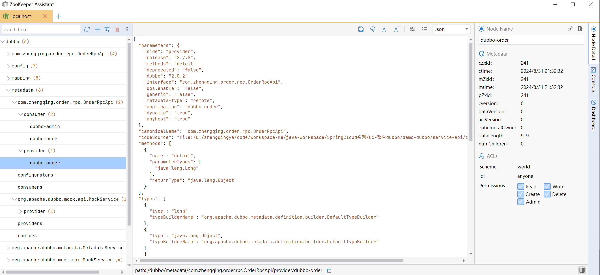

# 集成dubbo

https://github.com/apache/dubbo-samples/tree/master/1-basic/dubbo-samples-spring-boot

### 一、依赖引入

```
<dependency>
    <groupId>org.apache.dubbo</groupId>
    <artifactId>dubbo-spring-boot-starter</artifactId>
    <version>2.7.8</version>
</dependency>
<dependency>
    <groupId>org.apache.dubbo</groupId>
    <artifactId>dubbo-registry-zookeeper</artifactId>
    <version>2.7.8</version>
</dependency>
```

### 二、yml配置

生产者和消费者配置根据需求配置，我这里配置除了`dubbo.protocol.port`都是一样的

```yml
dubbo:
  application:
    name: dubbo-${spring.application.name} # 注册服务名
  registry:
    address: zookeeper://127.0.0.1:2181 # 注册中心
  protocol:
    name: dubbo # 通信协议
    port: 20880
  consumer:
    timeout: 60000 # 调用接口的超时时间（单位：毫秒）
    check: false   # 服务启动时检查依赖的服务是否可用
  scan:
    base-packages: com.zhengqing.*.rpc # 包扫描，可代替启动类上的 @EnableDubbo 注解
```

### 三、代码

#### 1、生产者 provider

```java
public interface OrderRpcApi {
    Object detail(Long id);
}
```

```java
import lombok.RequiredArgsConstructor;
import lombok.extern.slf4j.Slf4j;
import org.apache.dubbo.config.annotation.DubboService;

@Slf4j
@DubboService
@RequiredArgsConstructor
public class OrderRpcService implements OrderRpcApi {
    @Override
    public Object detail(Long id) {
        log.info("rpc id:{}", id);
        return id;
    }
}
```

#### 2、消费者 consumer

```java
import com.zhengqing.order.rpc.OrderRpcApi;
import io.swagger.annotations.Api;
import lombok.RequiredArgsConstructor;
import lombok.extern.slf4j.Slf4j;
import org.apache.dubbo.config.annotation.DubboReference;
import org.springframework.web.bind.annotation.GetMapping;
import org.springframework.web.bind.annotation.RequestMapping;
import org.springframework.web.bind.annotation.RequestParam;
import org.springframework.web.bind.annotation.RestController;

@Slf4j
@RestController
@RequiredArgsConstructor
@RequestMapping("/api/user")
@Api(tags = {"用户api"})
public class UserController {

    @DubboReference
    private OrderRpcApi orderRpcApi;

    @GetMapping("/hello")
    public Object hello(@RequestParam Long id) {
        return this.orderRpcApi.detail(id);
    }

}
```

### zookeeper



