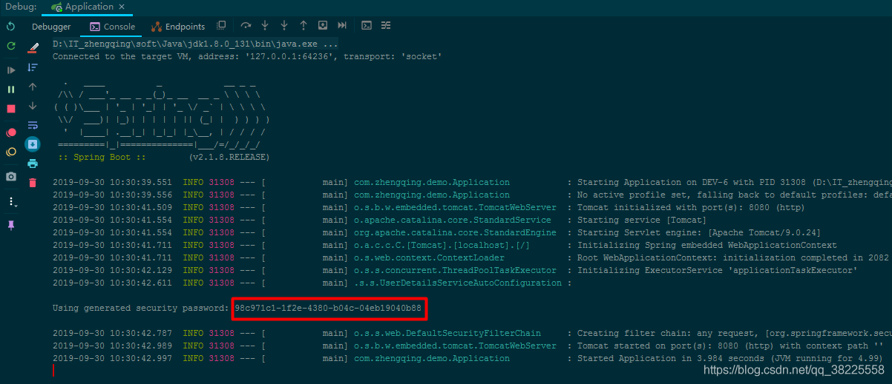
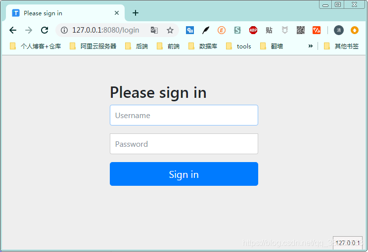
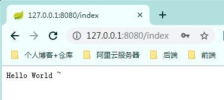

### 一、前言

`Spring Security` 和 `Apache Shiro` 都是安全框架，为Java应用程序提供身份认证和授权。

###### 二者区别
1. Spring Security：`重`量级安全框架
2. Apache Shiro：`轻`量级安全框架


关于shiro的权限认证与授权可参考小编的另外一篇文章 ： [SpringBoot集成Shiro 实现动态加载权限](https://blog.csdn.net/qq_38225558/article/details/101616759)

> https://blog.csdn.net/qq_38225558/article/details/101616759

### 二、SpringBoot集成Spring Security入门体验

###### 基本环境 ： springboot 2.1.8

#### 1、引入Spring Security依赖

```xml
<dependency>
    <groupId>org.springframework.boot</groupId>
    <artifactId>spring-boot-starter-security</artifactId>
</dependency>
```

#### 2、新建一个controller测试访问

```java
@RestController
public class IndexController {
    @GetMapping("/index")
    public String index() {
        return "Hello World ~";
    }
}
```

#### 3、运行项目访问 [http://127.0.0.1:8080/index](http://127.0.0.1:8080/index)

**温馨小提示**：在不进行任何配置的情况下，Spring Security 给出的默认用户名为`user` 密码则是项目在启动运行时随机生成的一串字符串，会打印在控制台，如下图： 

当我们访问index首页的时候，系统会默认跳转到login页面进行登录认证


认证成功之后才会跳转到我们的index页面


### 三、Spring Security用户密码配置

除了上面Spring Security在不进行任何配置下默认给出的用户`user` 密码随项目启动生成随机字符串，我们还可以通过以下方式配置

#### 1、springboot配置文件中配置

```yml
spring:
  security:
    user:
      name: admin  # 用户名
      password: 123456  # 密码
```

#### 2、java代码在内存中配置

新建Security 核心配置类继承`WebSecurityConfigurerAdapter `

```java
@Configuration
@EnableWebSecurity // 启用Spring Security的Web安全支持
public class SecurityConfig extends WebSecurityConfigurerAdapter {

    /**
     * 将用户设置在内存中
     * @param auth
     * @throws Exception
     */
    @Autowired
    public void config(AuthenticationManagerBuilder auth) throws Exception {
        // 在内存中配置用户，配置多个用户调用`and()`方法
        auth.inMemoryAuthentication()
                .passwordEncoder(passwordEncoder()) // 指定加密方式
                .withUser("admin").password(passwordEncoder().encode("123456")).roles("ADMIN")
                .and()
                .withUser("test").password(passwordEncoder().encode("123456")).roles("USER");
    }

    @Bean
    public PasswordEncoder passwordEncoder() {
        // BCryptPasswordEncoder：Spring Security 提供的加密工具，可快速实现加密加盐
        return new BCryptPasswordEncoder();
    }

}
```

#### 3、从数据库中获取用户账号、密码信息

这种方式也就是我们项目中通常使用的方式，这个留到后面的文章再说

### 四、Spring Security 登录处理 与 忽略拦截
> 相关代码都有注释相信很容易理解

```java
@Configuration
@EnableWebSecurity
public class SecurityConfig extends WebSecurityConfigurerAdapter {

    /**
     * 登录处理
     * @param http
     * @throws Exception
     */
    @Override
    protected void configure(HttpSecurity http) throws Exception {
        // 开启登录配置
        http.authorizeRequests()
                // 标识访问 `/index` 这个接口，需要具备`ADMIN`角色
                .antMatchers("/index").hasRole("ADMIN")
                // 允许匿名的url - 可理解为放行接口 - 多个接口使用,分割
                .antMatchers("/", "/home").permitAll()
                // 其余所有请求都需要认证
                .anyRequest().authenticated()
                .and()
                // 设置登录认证页面
                .formLogin().loginPage("/login")
                // 登录成功后的处理接口 - 方式①
                .loginProcessingUrl("/home")
                // 自定义登陆用户名和密码属性名，默认为 username和password
                .usernameParameter("username")
                .passwordParameter("password")
                // 登录成功后的处理器  - 方式②
//                .successHandler((req, resp, authentication) -> {
//                    resp.setContentType("application/json;charset=utf-8");
//                    PrintWriter out = resp.getWriter();
//                    out.write("登录成功...");
//                    out.flush();
//                })
                // 配置登录失败的回调
                .failureHandler((req, resp, exception) -> {
                    resp.setContentType("application/json;charset=utf-8");
                    PrintWriter out = resp.getWriter();
                    out.write("登录失败...");
                    out.flush();
                })
                .permitAll()//和表单登录相关的接口统统都直接通过
                .and()
                .logout().logoutUrl("/logout")
                // 配置注销成功的回调
                .logoutSuccessHandler((req, resp, authentication) -> {
                    resp.setContentType("application/json;charset=utf-8");
                    PrintWriter out = resp.getWriter();
                    out.write("注销成功...");
                    out.flush();
                })
                .permitAll()
                .and()
                .httpBasic()
                .and()
                // 关闭CSRF跨域
                .csrf().disable();

    }

    /**
     * 忽略拦截
     * @param web
     * @throws Exception
     */
    @Override
    public void configure(WebSecurity web) throws Exception {
        // 设置拦截忽略url - 会直接过滤该url - 将不会经过Spring Security过滤器链
        web.ignoring().antMatchers("/getUserInfo");
        // 设置拦截忽略文件夹，可以对静态资源放行
        web.ignoring().antMatchers("/css/**", "/js/**");
    }

}
```

### 五、总结

1. 项目引入Spring Security依赖
2. 自定义Security核心配置类继承`WebSecurityConfigurerAdapter`
3. 账号密码配置
4. 登录处理
5. 忽略拦截

######  案例demo源码

[https://gitee.com/zhengqingya/java-workspace](https://gitee.com/zhengqingya/java-workspace)


