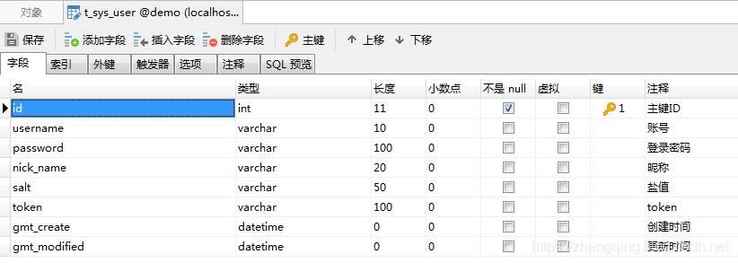
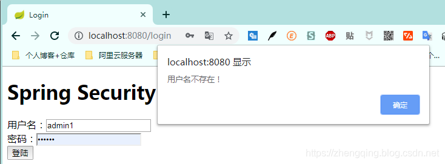
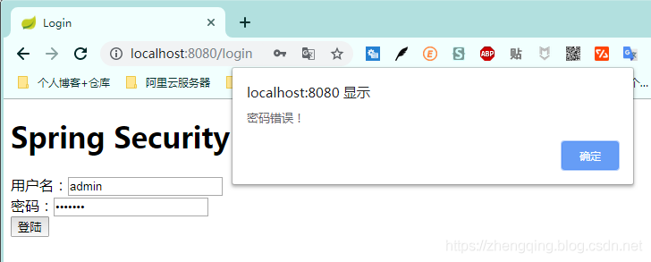
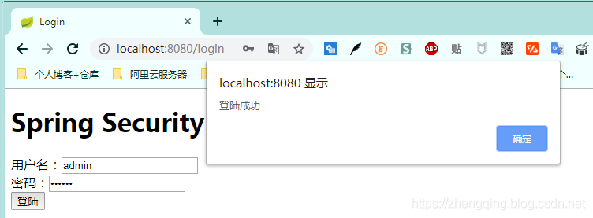
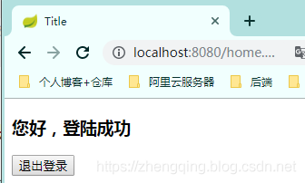
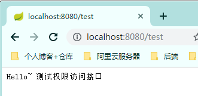
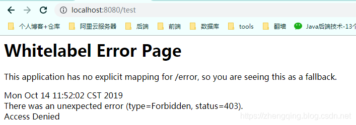
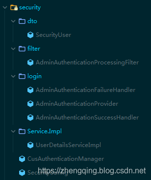

### 一、前言

本篇文章将讲述`Spring Security自定义登录认证校验用户名、密码，自定义密码加密方式，以及在前后端分离的情况下认证失败或成功处理返回json格式数据`

**温馨小提示**：Spring Security中有默认的密码加密方式以及登录用户认证校验，但小编这里选择自定义是为了方便以后业务扩展，比如系统默认带一个超级管理员，当认证时识别到是超级管理员账号登录访问时给它赋予最高权限，可以访问系统所有api接口，或在登录认证成功后存入token以便用户访问系统其它接口时通过token认证用户权限等

###### Spring Security入门学习可参考之前文章：

SpringBoot集成Spring Security入门体验（一）

> [https://blog.csdn.net/qq_38225558/article/details/101754743](https://blog.csdn.net/qq_38225558/article/details/101754743)

### 二、Spring Security 自定义登录认证处理

###### 基本环境

1. spring-boot 2.1.8
2. mybatis-plus 2.2.0
3. mysql 
4. maven项目

数据库用户信息表`t_sys_user`


> 案例中关于对该`t_sys_user`用户表相关的增删改查代码就不贴出来了，如有需要可参考文末提供的案例demo源码

#### 1、Security 核心配置类

 配置用户密码校验过滤器

```java
@Configuration
@EnableWebSecurity
@EnableGlobalMethodSecurity(prePostEnabled = true)
public class SecurityConfig extends WebSecurityConfigurerAdapter {

    /**
     * 用户密码校验过滤器
     */
    private final AdminAuthenticationProcessingFilter adminAuthenticationProcessingFilter;

    public SecurityConfig(AdminAuthenticationProcessingFilter adminAuthenticationProcessingFilter) {
        this.adminAuthenticationProcessingFilter = adminAuthenticationProcessingFilter;
    }

    /**
     * 权限配置
     * @param http
     * @throws Exception
     */
    @Override
    protected void configure(HttpSecurity http) throws Exception {
        ExpressionUrlAuthorizationConfigurer<HttpSecurity>.ExpressionInterceptUrlRegistry registry = http.antMatcher("/**").authorizeRequests();

        // 禁用CSRF 开启跨域
        http.csrf().disable().cors();

        // 登录处理 - 前后端一体的情况下
//        registry.and().formLogin().loginPage("/login").defaultSuccessUrl("/").permitAll()
//                // 自定义登陆用户名和密码属性名，默认为 username和password
//                .usernameParameter("username").passwordParameter("password")
//                // 异常处理
//                .failureUrl("/login/error").permitAll()
//                // 退出登录
//                .and().logout().permitAll();

        // 标识只能在 服务器本地ip[127.0.0.1或localhost] 访问`/home`接口，其他ip地址无法访问
        registry.antMatchers("/home").hasIpAddress("127.0.0.1");
        // 允许匿名的url - 可理解为放行接口 - 多个接口使用,分割
        registry.antMatchers("/login", "/index").permitAll();
        // OPTIONS(选项)：查找适用于一个特定网址资源的通讯选择。 在不需执行具体的涉及数据传输的动作情况下， 允许客户端来确定与资源相关的选项以及 / 或者要求， 或是一个服务器的性能
        registry.antMatchers(HttpMethod.OPTIONS, "/**").denyAll();
        // 自动登录 - cookie储存方式
        registry.and().rememberMe();
        // 其余所有请求都需要认证
        registry.anyRequest().authenticated();
        // 防止iframe 造成跨域
        registry.and().headers().frameOptions().disable();

        // 自定义过滤器认证用户名密码
        http.addFilterAt(adminAuthenticationProcessingFilter, UsernamePasswordAuthenticationFilter.class);
    }
}
```

#### 2、自定义用户密码校验过滤器

```java
@Slf4j
@Component
public class AdminAuthenticationProcessingFilter extends AbstractAuthenticationProcessingFilter {

    /**
     * @param authenticationManager:             认证管理器
     * @param adminAuthenticationSuccessHandler: 认证成功处理
     * @param adminAuthenticationFailureHandler: 认证失败处理
     */
    public AdminAuthenticationProcessingFilter(CusAuthenticationManager authenticationManager, AdminAuthenticationSuccessHandler adminAuthenticationSuccessHandler, AdminAuthenticationFailureHandler adminAuthenticationFailureHandler) {
        super(new AntPathRequestMatcher("/login", "POST"));
        this.setAuthenticationManager(authenticationManager);
        this.setAuthenticationSuccessHandler(adminAuthenticationSuccessHandler);
        this.setAuthenticationFailureHandler(adminAuthenticationFailureHandler);
    }

    @Override
    public Authentication attemptAuthentication(HttpServletRequest request, HttpServletResponse response) throws AuthenticationException {
        if (request.getContentType() == null || !request.getContentType().contains(Constants.REQUEST_HEADERS_CONTENT_TYPE)) {
            throw new AuthenticationServiceException("请求头类型不支持: " + request.getContentType());
        }

        UsernamePasswordAuthenticationToken authRequest;
        try {
            MultiReadHttpServletRequest wrappedRequest = new MultiReadHttpServletRequest(request);
            // 将前端传递的数据转换成jsonBean数据格式
            User user = JSONObject.parseObject(wrappedRequest.getBodyJsonStrByJson(wrappedRequest), User.class);
            authRequest = new UsernamePasswordAuthenticationToken(user.getUsername(), user.getPassword(), null);
            authRequest.setDetails(authenticationDetailsSource.buildDetails(wrappedRequest));
        } catch (Exception e) {
            throw new AuthenticationServiceException(e.getMessage());
        }
        return this.getAuthenticationManager().authenticate(authRequest);
    }
}
```

#### 3、自定义认证管理器

```java
@Component
public class CusAuthenticationManager implements AuthenticationManager {

    private final AdminAuthenticationProvider adminAuthenticationProvider;

    public CusAuthenticationManager(AdminAuthenticationProvider adminAuthenticationProvider) {
        this.adminAuthenticationProvider = adminAuthenticationProvider;
    }

    @Override
    public Authentication authenticate(Authentication authentication) throws AuthenticationException {
        Authentication result = adminAuthenticationProvider.authenticate(authentication);
        if (Objects.nonNull(result)) {
            return result;
        }
        throw new ProviderNotFoundException("Authentication failed!");
    }
}
```

#### 4、自定义认证处理

这里的密码加密验证工具类`PasswordUtils`可在文末源码中查看

```java
@Component
public class AdminAuthenticationProvider implements AuthenticationProvider {

    @Autowired
    UserDetailsServiceImpl userDetailsService;
    @Autowired
    private UserMapper userMapper;

    @Override
    public Authentication authenticate(Authentication authentication) throws AuthenticationException {
        // 获取前端表单中输入后返回的用户名、密码
        String userName = (String) authentication.getPrincipal();
        String password = (String) authentication.getCredentials();

        SecurityUser userInfo = (SecurityUser) userDetailsService.loadUserByUsername(userName);

        boolean isValid = PasswordUtils.isValidPassword(password, userInfo.getPassword(), userInfo.getCurrentUserInfo().getSalt());
        // 验证密码
        if (!isValid) {
            throw new BadCredentialsException("密码错误！");
        }

        // 前后端分离情况下 处理逻辑...
        // 更新登录令牌 - 之后访问系统其它接口直接通过token认证用户权限...
        String token = PasswordUtils.encodePassword(System.currentTimeMillis() + userInfo.getCurrentUserInfo().getSalt(), userInfo.getCurrentUserInfo().getSalt());
        User user = userMapper.selectById(userInfo.getCurrentUserInfo().getId());
        user.setToken(token);
        userMapper.updateById(user);
        userInfo.getCurrentUserInfo().setToken(token);
        return new UsernamePasswordAuthenticationToken(userInfo, password, userInfo.getAuthorities());
    }

    @Override
    public boolean supports(Class<?> aClass) {
        return true;
    }
}
```

其中小编自定义了一个`UserDetailsServiceImpl`类去实现`UserDetailsService`类 -> 用于认证用户详情
和自定义一个`SecurityUser`类实现`UserDetails`类 -> 安全认证用户详情信息

```java
@Service("userDetailsService")
public class UserDetailsServiceImpl implements UserDetailsService {

    @Autowired
    private UserMapper userMapper;

    /***
     * 根据账号获取用户信息
     * @param username:
     * @return: org.springframework.security.core.userdetails.UserDetails
     */
    @Override
    public UserDetails loadUserByUsername(String username) throws UsernameNotFoundException {
        // 从数据库中取出用户信息
        List<User> userList = userMapper.selectList(new EntityWrapper<User>().eq("username", username));
        User user;
        // 判断用户是否存在
        if (!CollectionUtils.isEmpty(userList)){
            user = userList.get(0);
        } else {
            throw new UsernameNotFoundException("用户名不存在！");
        }
        // 返回UserDetails实现类
        return new SecurityUser(user);
    }
}
```

安全认证用户详情信息

```java
@Data
@Slf4j
public class SecurityUser implements UserDetails {
    /**
     * 当前登录用户
     */
    private transient User currentUserInfo;

    public SecurityUser() {
    }

    public SecurityUser(User user) {
        if (user != null) {
            this.currentUserInfo = user;
        }
    }

    @Override
    public Collection<? extends GrantedAuthority> getAuthorities() {
        Collection<GrantedAuthority> authorities = new ArrayList<>();
        SimpleGrantedAuthority authority = new SimpleGrantedAuthority("admin");
        authorities.add(authority);
        return authorities;
    }

    @Override
    public String getPassword() {
        return currentUserInfo.getPassword();
    }

    @Override
    public String getUsername() {
        return currentUserInfo.getUsername();
    }

    @Override
    public boolean isAccountNonExpired() {
        return true;
    }

    @Override
    public boolean isAccountNonLocked() {
        return true;
    }

    @Override
    public boolean isCredentialsNonExpired() {
        return true;
    }

    @Override
    public boolean isEnabled() {
        return true;
    }
}
```

#### 5、自定义认证成功或失败处理方式

1. 认证成功处理类实现`AuthenticationSuccessHandler`类重写`onAuthenticationSuccess`方法
2. 认证失败处理类实现`AuthenticationFailureHandler`类重写`onAuthenticationFailure`方法

> 在前后端分离情况下小编认证成功和失败都返回json数据格式 

认证成功后这里小编只返回了一个token给前端，其它信息可根据个人业务实际处理

```java
@Component
public class AdminAuthenticationSuccessHandler implements AuthenticationSuccessHandler {
    @Override
    public void onAuthenticationSuccess(HttpServletRequest httpServletRequest, HttpServletResponse response, Authentication auth) throws IOException, ServletException {
        User user = new User();
        SecurityUser securityUser = ((SecurityUser) auth.getPrincipal());
        user.setToken(securityUser.getCurrentUserInfo().getToken());
        ResponseUtils.out(response, ApiResult.ok("登录成功!", user));
    }
}
```

认证失败捕捉异常自定义错误信息返回给前端

```java
@Slf4j
@Component
public class AdminAuthenticationFailureHandler implements AuthenticationFailureHandler {
    @Override
    public void onAuthenticationFailure(HttpServletRequest httpServletRequest, HttpServletResponse response, AuthenticationException e) throws IOException, ServletException {
        ApiResult result;
        if (e instanceof UsernameNotFoundException || e instanceof BadCredentialsException) {
            result = ApiResult.fail(e.getMessage());
        } else if (e instanceof LockedException) {
            result = ApiResult.fail("账户被锁定，请联系管理员!");
        } else if (e instanceof CredentialsExpiredException) {
            result = ApiResult.fail("证书过期，请联系管理员!");
        } else if (e instanceof AccountExpiredException) {
            result = ApiResult.fail("账户过期，请联系管理员!");
        } else if (e instanceof DisabledException) {
            result = ApiResult.fail("账户被禁用，请联系管理员!");
        } else {
            log.error("登录失败：", e);
            result = ApiResult.fail("登录失败!");
        }
        ResponseUtils.out(response, result);
    }
}
```

###### 温馨小提示：

前后端一体的情况下可通过在`Spring Security核心配置类`中配置异常处理接口然后通过如下方式获取异常信息

```
AuthenticationException e = (AuthenticationException) request.getSession().getAttribute("SPRING_SECURITY_LAST_EXCEPTION");
System.out.println(e.getMessage());
```

### 三、前端页面

这里2个简单的html页面模拟前后端分离情况下登陆处理场景

###### 1、登陆页

login.html

```html
<!DOCTYPE html>
<html lang="en">
<head>
    <meta charset="UTF-8">
    <title>Login</title>
</head>
<body>
<h1>Spring Security</h1>
<form method="post" action="" onsubmit="return false">
    <div>
        用户名：<input type="text" name="username" id="username">
    </div>
    <div>
        密码：<input type="password" name="password" id="password">
    </div>
    <div>
<!--        <label><input type="checkbox" name="remember-me" id="remember-me"/>自动登录</label>-->
        <button onclick="login()">登陆</button>
    </div>
</form>
</body>
<script src="http://libs.baidu.com/jquery/1.9.0/jquery.js" type="text/javascript"></script>
<script type="text/javascript">
    function login() {
        var username = document.getElementById("username").value;
        var password = document.getElementById("password").value;
        // var rememberMe = document.getElementById("remember-me").value;
        $.ajax({
            async: false,
            type: "POST",
            dataType: "json",
            url: '/login',
            contentType: "application/json",
            data: JSON.stringify({
                "username": username,
                "password": password
                // "remember-me": rememberMe
            }),
            success: function (result) {
                console.log(result)
                if (result.code == 200) {
                    alert("登陆成功");
                    window.location.href = "../home.html";
                } else {
                    alert(result.message)
                }
            }
        });
    }
</script>
</html>
```

###### 2、首页 

home.html

```html
<!DOCTYPE html>
<html lang="en">
<head>
    <meta charset="UTF-8">
    <title>Title</title>
</head>
<body>
<h3>您好，登陆成功</h3>
<button onclick="window.location.href='/logout'">退出登录</button>
</body>
</html>
```

### 四、测试接口

```java
@Slf4j
@RestController
public class IndexController {

    @GetMapping("/")
    public ModelAndView showHome() {
        return new ModelAndView("home.html");
    }

    @GetMapping("/index")
    public String index() {
        return "Hello World ~";
    }

    @GetMapping("/login")
    public ModelAndView login() {
        return new ModelAndView("login.html");
    }

    @GetMapping("/home")
    public String home() {
        String name = SecurityContextHolder.getContext().getAuthentication().getName();
        log.info("登陆人：" + name);
        return "Hello~ " + name;
    }

    @GetMapping(value ="/admin")
    // 访问路径`/admin` 具有`crud`权限
    @PreAuthorize("hasPermission('/admin','crud')")
    public String admin() {
        return "Hello~ 管理员";
    }

    @GetMapping("/test")
//    @PreAuthorize("hasPermission('/test','t')")
    public String test() {
        return "Hello~ 测试权限访问接口";
    }

    /**
     * 登录异常处理 - 前后端一体的情况下
     * @param request
     * @param response
     */
    @RequestMapping("/login/error")
    public void loginError(HttpServletRequest request, HttpServletResponse response) {
        AuthenticationException e = (AuthenticationException) request.getSession().getAttribute("SPRING_SECURITY_LAST_EXCEPTION");
        log.error(e.getMessage());
        ResponseUtils.out(response, ApiResult.fail(e.getMessage()));
    }
}
```

### 五、测试访问效果

数据库账号:admin 密码:123456

###### 1. 输入错误用户名提示该用户不存在



###### 2. 输入错误密码提示密码错误



###### 3. 输入正确用户名和账号，提示登陆成功，然后跳转到首页



登陆成功后即可正常访问其他接口，如果是未登录情况下将访问不了



> 温馨小提示：这里在未登录时或访问未授权的接口时，后端暂时没有做处理，相关案例将会放在后面的权限控制案例教程中讲解



### 六、总结

1. 在`Spring Security核心配置类`中设置自定义的用户密码校验`过滤器(AdminAuthenticationProcessingFilter)`
2. 在自定义的用户密码校验过滤器中配置`认证管理器(CusAuthenticationManager)`、`认证成功处理(AdminAuthenticationSuccessHandler)`和`认证失败处理(AdminAuthenticationFailureHandler)`等
3. 在自定义的认证管理器中配置自定义的`认证处理(AdminAuthenticationProvider)`
4. 然后就是在认证处理中实现自己的相应业务逻辑等

###### Security相关代码结构：


### 本文案例源码

[https://gitee.com/zhengqingya/java-workspace](https://gitee.com/zhengqingya/java-workspace)
