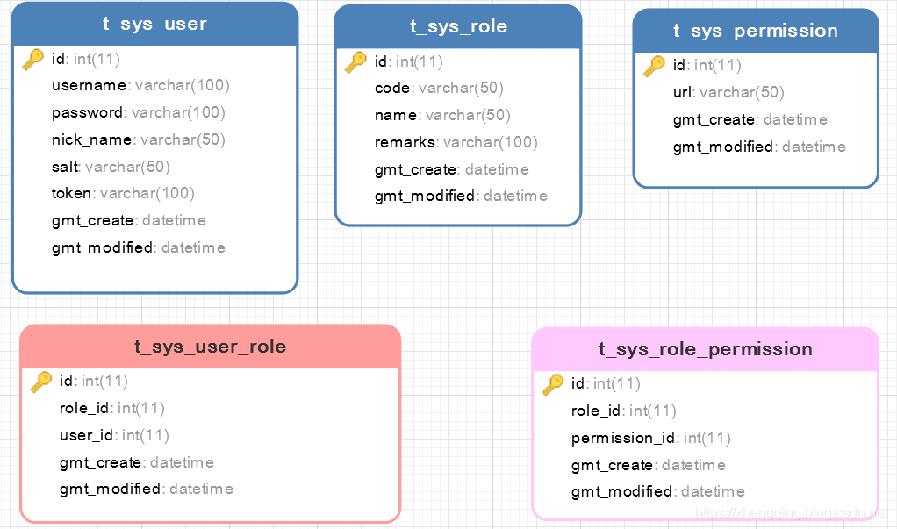
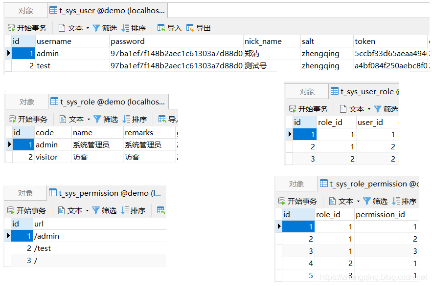
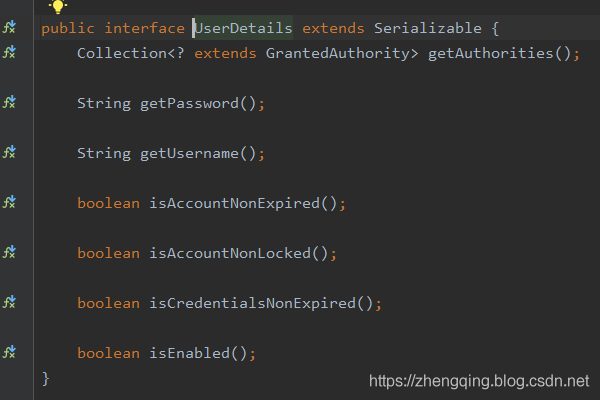
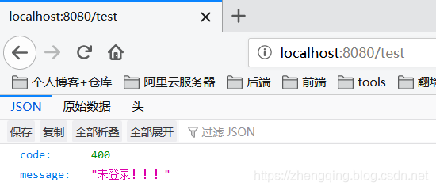
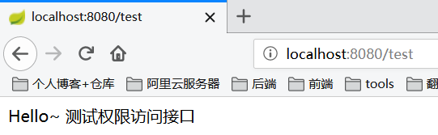
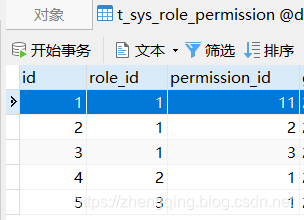
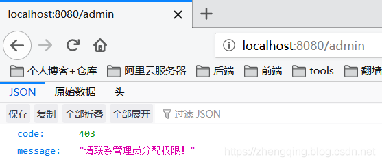
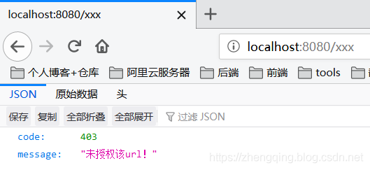
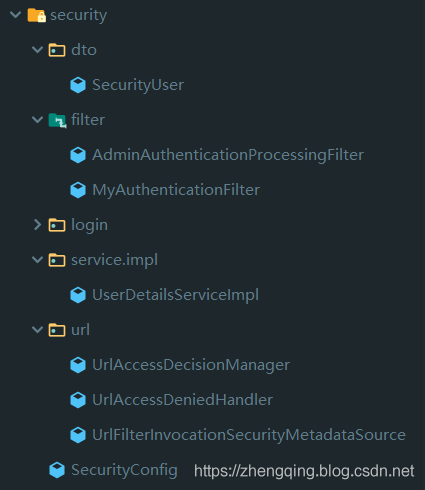

### 一、前言
本篇文章将讲述`Spring Security 动态分配url权限，未登录权限控制，登录过后根据登录用户角色授予访问url权限`

###### 基本环境

1. spring-boot 2.1.8
2. mybatis-plus 2.2.0
3. mysql 数据库
4. maven项目

###### Spring Security入门学习可参考之前文章：

1. SpringBoot集成Spring Security入门体验（一）
    [https://blog.csdn.net/qq_38225558/article/details/101754743](https://blog.csdn.net/qq_38225558/article/details/101754743)
2. Spring Security 自定义登录认证（二）
    [https://blog.csdn.net/qq_38225558/article/details/102542072](https://blog.csdn.net/qq_38225558/article/details/102542072)

### 二、数据库建表


###### 表关系简介：

1. 用户表`t_sys_user` 关联 角色表`t_sys_role` 两者建立中间关系表`t_sys_user_role`
2. 角色表`t_sys_role` 关联 权限表`t_sys_permission` 两者建立中间关系表`t_sys_role_permission`
3. 最终体现效果为当前登录用户所具备的角色关联能访问的所有url，只要给角色分配相应的url权限即可

> **温馨小提示**：这里逻辑根据个人业务来定义，小编这里讲解案例只给用户对应的角色分配访问权限，像其它的 直接给用户分配权限等等可以自己实现

###### 表模拟数据如下：

### 三、Spring Security 动态权限控制

#### 1、未登录访问权限控制

自定义`AdminAuthenticationEntryPoint`类实现`AuthenticationEntryPoint`类

这里是认证权限入口 -> 即在未登录的情况下访问所有接口都会拦截到此（除了放行忽略接口）

> **温馨小提示**：`ResponseUtils`和`ApiResult`是小编这里模拟前后端分离情况下返回json格式数据所使用工具类，具体实现可参考文末给出的demo源码

```java
@Component
public class AdminAuthenticationEntryPoint implements AuthenticationEntryPoint {
    @Override
    public void commence(HttpServletRequest request, HttpServletResponse response, AuthenticationException e) {
        ResponseUtils.out(response, ApiResult.fail("未登录！！！"));
    }
}
```

#### 2、自定义过滤器`MyAuthenticationFilter`继承`OncePerRequestFilter`实现访问鉴权

每次访问接口都会经过此，我们可以在这里记录请求参数、响应内容，或者处理前后端分离情况下，以token换用户权限信息，token是否过期，请求头类型是否正确，防止非法请求等等

1. `logRequestBody()`方法：记录请求消息体
2. `logResponseBody()`方法：记录响应消息体

【注：请求的`HttpServletRequest流只能读一次`，下一次就不能读取了，因此这里要使用自定义的`MultiReadHttpServletRequest`工具解决流只能读一次的问题，响应同理，具体可参考文末demo源码实现】
 
```java
@Slf4j
@Component
public class MyAuthenticationFilter extends OncePerRequestFilter {

    private final UserDetailsServiceImpl userDetailsService;

    protected MyAuthenticationFilter(UserDetailsServiceImpl userDetailsService) {
        this.userDetailsService = userDetailsService;
    }

    @Override
    protected void doFilterInternal(HttpServletRequest request, HttpServletResponse response, FilterChain filterChain) throws ServletException, IOException {
        System.out.println("请求头类型： " + request.getContentType());
        if ((request.getContentType() == null && request.getContentLength() > 0) || (request.getContentType() != null && !request.getContentType().contains(Constants.REQUEST_HEADERS_CONTENT_TYPE))) {
            filterChain.doFilter(request, response);
            return;
        }

        MultiReadHttpServletRequest wrappedRequest = new MultiReadHttpServletRequest(request);
        MultiReadHttpServletResponse wrappedResponse = new MultiReadHttpServletResponse(response);
        StopWatch stopWatch = new StopWatch();
        try {
            stopWatch.start();
            // 记录请求的消息体
            logRequestBody(wrappedRequest);

//            String token = "123";
            // 前后端分离情况下，前端登录后将token储存在cookie中，每次访问接口时通过token去拿用户权限
            String token = wrappedRequest.getHeader(Constants.REQUEST_HEADER);
            log.debug("后台检查令牌:{}", token);
            if (StringUtils.isNotBlank(token)) {
                // 检查token
                SecurityUser securityUser = userDetailsService.getUserByToken(token);
                if (securityUser == null || securityUser.getCurrentUserInfo() == null) {
                    throw new AccessDeniedException("TOKEN已过期，请重新登录！");
                }
                UsernamePasswordAuthenticationToken authentication = new UsernamePasswordAuthenticationToken(securityUser, null, securityUser.getAuthorities());
                // 全局注入角色权限信息和登录用户基本信息
                SecurityContextHolder.getContext().setAuthentication(authentication);
            }
            filterChain.doFilter(wrappedRequest, wrappedResponse);
        } finally {
            stopWatch.stop();
            long usedTimes = stopWatch.getTotalTimeMillis();
            // 记录响应的消息体
            logResponseBody(wrappedRequest, wrappedResponse, usedTimes);
        }

    }

    private String logRequestBody(MultiReadHttpServletRequest request) {
        MultiReadHttpServletRequest wrapper = request;
        if (wrapper != null) {
            try {
                String bodyJson = wrapper.getBodyJsonStrByJson(request);
                String url = wrapper.getRequestURI().replace("//", "/");
                System.out.println("-------------------------------- 请求url: " + url + " --------------------------------");
                Constants.URL_MAPPING_MAP.put(url, url);
                log.info("`{}` 接收到的参数: {}",url , bodyJson);
                return bodyJson;
            } catch (Exception e) {
                e.printStackTrace();
            }
        }
        return null;
    }

    private void logResponseBody(MultiReadHttpServletRequest request, MultiReadHttpServletResponse response, long useTime) {
        MultiReadHttpServletResponse wrapper = response;
        if (wrapper != null) {
            byte[] buf = wrapper.getBody();
            if (buf.length > 0) {
                String payload;
                try {
                    payload = new String(buf, 0, buf.length, wrapper.getCharacterEncoding());
                } catch (UnsupportedEncodingException ex) {
                    payload = "[unknown]";
                }
                log.info("`{}`  耗时:{}ms  返回的参数: {}", Constants.URL_MAPPING_MAP.get(request.getRequestURI()), useTime, payload);
            }
        }
    }

}
```

#### 3、自定义`UserDetailsServiceImpl`实现`UserDetailsService` 和 自定义`SecurityUser`实现`UserDetails` 认证用户详情
这个在上一篇文章中也提及过，但上次未做角色权限处理，这次我们来一起加上吧

```java
@Service("userDetailsService")
public class UserDetailsServiceImpl implements UserDetailsService {

    @Autowired
    private UserMapper userMapper;
    @Autowired
    private RoleMapper roleMapper;
    @Autowired
    private UserRoleMapper userRoleMapper;

    /***
     * 根据账号获取用户信息
     * @param username:
     * @return: org.springframework.security.core.userdetails.UserDetails
     */
    @Override
    public UserDetails loadUserByUsername(String username) throws UsernameNotFoundException {
        // 从数据库中取出用户信息
        List<User> userList = userMapper.selectList(new EntityWrapper<User>().eq("username", username));
        User user;
        // 判断用户是否存在
        if (!CollectionUtils.isEmpty(userList)) {
            user = userList.get(0);
        } else {
            throw new UsernameNotFoundException("用户名不存在！");
        }
        // 返回UserDetails实现类
        return new SecurityUser(user, getUserRoles(user.getId()));
    }

    /***
     * 根据token获取用户权限与基本信息
     *
     * @param token:
     * @return: com.zhengqing.config.security.dto.SecurityUser
     */
    public SecurityUser getUserByToken(String token) {
        User user = null;
        List<User> loginList = userMapper.selectList(new EntityWrapper<User>().eq("token", token));
        if (!CollectionUtils.isEmpty(loginList)) {
            user = loginList.get(0);
        }
        return user != null ? new SecurityUser(user, getUserRoles(user.getId())) : null;
    }

    /**
     * 根据用户id获取角色权限信息
     *
     * @param userId
     * @return
     */
    private List<Role> getUserRoles(Integer userId) {
        List<UserRole> userRoles = userRoleMapper.selectList(new EntityWrapper<UserRole>().eq("user_id", userId));
        List<Role> roleList = new LinkedList<>();
        for (UserRole userRole : userRoles) {
            Role role = roleMapper.selectById(userRole.getRoleId());
            roleList.add(role);
        }
        return roleList;
    }

}
```

这里再说下自定义`SecurityUser `是因为Spring Security自带的 `UserDetails` （存储当前用户基本信息） 有时候可能不满足我们的需求，因此我们可以自己定义一个来扩展我们的需求

`getAuthorities()`方法：即授予当前用户角色权限信息

```java
@Data
@Slf4j
public class SecurityUser implements UserDetails {
    /**
     * 当前登录用户
     */
    private transient User currentUserInfo;
    /**
     * 角色
     */
    private transient List<Role> roleList;

    public SecurityUser() { }

    public SecurityUser(User user) {
        if (user != null) {
            this.currentUserInfo = user;
        }
    }

    public SecurityUser(User user, List<Role> roleList) {
        if (user != null) {
            this.currentUserInfo = user;
            this.roleList = roleList;
        }
    }

    /**
     * 获取当前用户所具有的角色
     *
     * @return
     */
    @Override
    public Collection<? extends GrantedAuthority> getAuthorities() {
        Collection<GrantedAuthority> authorities = new ArrayList<>();
        if (!CollectionUtils.isEmpty(this.roleList)) {
            for (Role role : this.roleList) {
                SimpleGrantedAuthority authority = new SimpleGrantedAuthority(role.getCode());
                authorities.add(authority);
            }
        }
        return authorities;
    }

    @Override
    public String getPassword() {
        return currentUserInfo.getPassword();
    }

    @Override
    public String getUsername() {
        return currentUserInfo.getUsername();
    }

    @Override
    public boolean isAccountNonExpired() {
        return true;
    }

    @Override
    public boolean isAccountNonLocked() {
        return true;
    }

    @Override
    public boolean isCredentialsNonExpired() {
        return true;
    }

    @Override
    public boolean isEnabled() {
        return true;
    }
}
```

#### 4、自定义`UrlFilterInvocationSecurityMetadataSource`实现`FilterInvocationSecurityMetadataSource`重写`getAttributes()`方法 获取访问该url所需要的角色权限信息
执行完之后到 下一步 `UrlAccessDecisionManager` 中认证权限

```java
@Component
public class UrlFilterInvocationSecurityMetadataSource implements FilterInvocationSecurityMetadataSource {

    @Autowired
    PermissionMapper permissionMapper;
    @Autowired
    RolePermissionMapper rolePermissionMapper;
    @Autowired
    RoleMapper roleMapper;

    /***
     * 返回该url所需要的用户权限信息
     *
     * @param object: 储存请求url信息
     * @return: null：标识不需要任何权限都可以访问
     */
    @Override
    public Collection<ConfigAttribute> getAttributes(Object object) throws IllegalArgumentException {
        // 获取当前请求url
        String requestUrl = ((FilterInvocation) object).getRequestUrl();
        // TODO 忽略url请放在此处进行过滤放行
        if ("/login".equals(requestUrl) || requestUrl.contains("logout")) {
            return null;
        }

        // 数据库中所有url
        List<Permission> permissionList = permissionMapper.selectList(null);
        for (Permission permission : permissionList) {
            // 获取该url所对应的权限
            if (requestUrl.equals(permission.getUrl())) {
                List<RoleMenu> permissions = rolePermissionMapper.selectList(new EntityWrapper<RoleMenu>().eq("permission_id", permission.getId()));
                List<String> roles = new LinkedList<>();
                if (!CollectionUtils.isEmpty(permissions)){
                    Integer roleId = permissions.get(0).getRoleId();
                    Role role = roleMapper.selectById(roleId);
                    roles.add(role.getCode());
                }
                // 保存该url对应角色权限信息
                return SecurityConfig.createList(roles.toArray(new String[roles.size()]));
            }
        }
        // 如果数据中没有找到相应url资源则为非法访问，要求用户登录再进行操作
        return SecurityConfig.createList(Constants.ROLE_LOGIN);
    }

    @Override
    public Collection<ConfigAttribute> getAllConfigAttributes() {
        return null;
    }

    @Override
    public boolean supports(Class<?> aClass) {
        return FilterInvocation.class.isAssignableFrom(aClass);
    }
}
```

#### 5、自定义`UrlAccessDecisionManager`实现`AccessDecisionManager`重写`decide()`方法 对访问url进行权限认证处理

此处小编的处理逻辑是只要包含其中一个角色即可访问

```java
@Component
public class UrlAccessDecisionManager implements AccessDecisionManager {

    /**
     * @param authentication: 当前登录用户的角色信息
     * @param object: 请求url信息
     * @param collection: `UrlFilterInvocationSecurityMetadataSource`中的getAttributes方法传来的，表示当前请求需要的角色（可能有多个）
     * @return: void
     */
    @Override
    public void decide(Authentication authentication, Object object, Collection<ConfigAttribute> collection) throws AccessDeniedException, AuthenticationException {
        // 遍历角色
        for (ConfigAttribute ca : collection) {
            // ① 当前url请求需要的权限
            String needRole = ca.getAttribute();
            if (Constants.ROLE_LOGIN.equals(needRole)) {
                if (authentication instanceof AnonymousAuthenticationToken) {
                    throw new BadCredentialsException("未登录!");
                } else {
                    throw new AccessDeniedException("未授权该url！");
                }
            }

            // ② 当前用户所具有的角色
            Collection<? extends GrantedAuthority> authorities = authentication.getAuthorities();
            for (GrantedAuthority authority : authorities) {
                // 只要包含其中一个角色即可访问
                if (authority.getAuthority().equals(needRole)) {
                    return;
                }
            }
        }
        throw new AccessDeniedException("请联系管理员分配权限！");
    }

    @Override
    public boolean supports(ConfigAttribute configAttribute) {
        return true;
    }

    @Override
    public boolean supports(Class<?> aClass) {
        return true;
    }
}
```

#### 6、自定义无权限处理器 `UrlAccessDeniedHandler`实现`AccessDeniedHandler`重写`handle()`方法
在这里自定义403无权限响应内容，登录过后的权限处理 
【 **注**：要和未登录时的权限处理区分开哦~ 】

```java
@Component
public class UrlAccessDeniedHandler implements AccessDeniedHandler {
    @Override
    public void handle(HttpServletRequest request, HttpServletResponse response, AccessDeniedException e) throws IOException, ServletException {
        ResponseUtils.out(response, ApiResult.fail(403, e.getMessage()));
    }
}
```

#### 7、最后在`Security 核心配置类`中配置以上处理

```java
@Configuration
@EnableWebSecurity
@EnableGlobalMethodSecurity(prePostEnabled = true)
public class SecurityConfig extends WebSecurityConfigurerAdapter {

    /**
     * 访问鉴权 - 认证token、签名...
     */
    private final MyAuthenticationFilter myAuthenticationFilter;
    /**
     * 访问权限认证异常处理
     */
    private final AdminAuthenticationEntryPoint adminAuthenticationEntryPoint;
    /**
     * 用户密码校验过滤器
     */
    private final AdminAuthenticationProcessingFilter adminAuthenticationProcessingFilter;

    // 上面是登录认证相关  下面为url权限相关 - ========================================================================================

    /**
     * 获取访问url所需要的角色信息
     */
    private final UrlFilterInvocationSecurityMetadataSource urlFilterInvocationSecurityMetadataSource;
    /**
     * 认证权限处理 - 将上面所获得角色权限与当前登录用户的角色做对比，如果包含其中一个角色即可正常访问
     */
    private final UrlAccessDecisionManager urlAccessDecisionManager;
    /**
     * 自定义访问无权限接口时403响应内容
     */
    private final UrlAccessDeniedHandler urlAccessDeniedHandler;

    public SecurityConfig(MyAuthenticationFilter myAuthenticationFilter, AdminAuthenticationEntryPoint adminAuthenticationEntryPoint, AdminAuthenticationProcessingFilter adminAuthenticationProcessingFilter, UrlFilterInvocationSecurityMetadataSource urlFilterInvocationSecurityMetadataSource, UrlAccessDeniedHandler urlAccessDeniedHandler, UrlAccessDecisionManager urlAccessDecisionManager) {
        this.myAuthenticationFilter = myAuthenticationFilter;
        this.adminAuthenticationEntryPoint = adminAuthenticationEntryPoint;
        this.adminAuthenticationProcessingFilter = adminAuthenticationProcessingFilter;
        this.urlFilterInvocationSecurityMetadataSource = urlFilterInvocationSecurityMetadataSource;
        this.urlAccessDeniedHandler = urlAccessDeniedHandler;
        this.urlAccessDecisionManager = urlAccessDecisionManager;
    }


    /**
     * 权限配置
     * @param http
     * @throws Exception
     */
    @Override
    protected void configure(HttpSecurity http) throws Exception {
        ExpressionUrlAuthorizationConfigurer<HttpSecurity>.ExpressionInterceptUrlRegistry registry = http.antMatcher("/**").authorizeRequests();

        // 禁用CSRF 开启跨域
        http.csrf().disable().cors();

        // 未登录认证异常
        http.exceptionHandling().authenticationEntryPoint(adminAuthenticationEntryPoint);
        // 登录过后访问无权限的接口时自定义403响应内容
        http.exceptionHandling().accessDeniedHandler(urlAccessDeniedHandler);

        // url权限认证处理
        registry.withObjectPostProcessor(new ObjectPostProcessor<FilterSecurityInterceptor>() {
            @Override
            public <O extends FilterSecurityInterceptor> O postProcess(O o) {
                o.setSecurityMetadataSource(urlFilterInvocationSecurityMetadataSource);
                o.setAccessDecisionManager(urlAccessDecisionManager);
                return o;
            }
        });

        // 不创建会话 - 即通过前端传token到后台过滤器中验证是否存在访问权限
//        http.sessionManagement().sessionCreationPolicy(SessionCreationPolicy.STATELESS);

        // 标识访问 `/home` 这个接口，需要具备`ADMIN`角色
//        registry.antMatchers("/home").hasRole("ADMIN");
        // 标识只能在 服务器本地ip[127.0.0.1或localhost] 访问 `/home` 这个接口，其他ip地址无法访问
        registry.antMatchers("/home").hasIpAddress("127.0.0.1");
        // 允许匿名的url - 可理解为放行接口 - 多个接口使用,分割
        registry.antMatchers("/login", "/index").permitAll();
//        registry.antMatchers("/**").access("hasAuthority('admin')");
        // OPTIONS(选项)：查找适用于一个特定网址资源的通讯选择。 在不需执行具体的涉及数据传输的动作情况下， 允许客户端来确定与资源相关的选项以及 / 或者要求， 或是一个服务器的性能
        registry.antMatchers(HttpMethod.OPTIONS, "/**").denyAll();
        // 自动登录 - cookie储存方式
        registry.and().rememberMe();
        // 其余所有请求都需要认证
        registry.anyRequest().authenticated();
        // 防止iframe 造成跨域
        registry.and().headers().frameOptions().disable();

        // 自定义过滤器在登录时认证用户名、密码
        http.addFilterAt(adminAuthenticationProcessingFilter, UsernamePasswordAuthenticationFilter.class)
            .addFilterBefore(myAuthenticationFilter, BasicAuthenticationFilter.class);
    }

    /**
     * 忽略拦截url或静态资源文件夹 - web.ignoring(): 会直接过滤该url - 将不会经过Spring Security过滤器链
     *                             http.permitAll(): 不会绕开springsecurity验证，相当于是允许该路径通过
     * @param web
     * @throws Exception
     */
    @Override
    public void configure(WebSecurity web) throws Exception {
        web.ignoring().antMatchers(HttpMethod.GET,
                "/favicon.ico",
                "/*.html",
                "/**/*.css",
                "/**/*.js");
    }

}
```

### 四、编写测试代码

控制层：

```java
@Slf4j
@RestController
public class IndexController {

    @GetMapping("/")
    public ModelAndView showHome() {
        return new ModelAndView("home.html");
    }

    @GetMapping("/index")
    public String index() {
        return "Hello World ~";
    }

    @GetMapping("/login")
    public ModelAndView login() {
        return new ModelAndView("login.html");
    }

    @GetMapping("/home")
    public String home() {
        String name = SecurityContextHolder.getContext().getAuthentication().getName();
        log.info("登陆人：" + name);
        return "Hello~ " + name;
    }

    @GetMapping(value ="/admin")
    // 访问路径`/admin` 具有`ADMIN`角色权限   【这种是写死方式】
//    @PreAuthorize("hasPermission('/admin','ADMIN')")
    public String admin() {
        return "Hello~ 管理员";
    }

    @GetMapping("/test")
    public String test() {
        return "Hello~ 测试权限访问接口";
    }
    
}
```

页面和其它相关代码这里就不贴出来了，具体可参考文末demo源码


### 五、运行访问测试效果

###### 1、未登录时

###### 2、登录过后如果有权限则正常访问

###### 3、登录过后，没有权限
这里我们可以修改数据库角色权限关联表`t_sys_role_permission`来进行测试哦 ~

`Security 动态url权限也就是依赖这张表来判断的，只要修改这张表分配角色对应url权限资源，用户访问url时就会动态的去判断，无需做其他处理，如果是将权限信息放在了缓存中，修改表数据时及时更新缓存即可！`




###### 4、登录过后，访问数据库中没有配置的url 并且 在Security中没有忽略拦截的url时

### 六、总结

1. 自定义未登录权限处理器`AdminAuthenticationEntryPoint` - 自定义未登录时访问无权限url响应内容
2. 自定义访问鉴权过滤器`MyAuthenticationFilter` - 记录请求响应日志、是否合法访问，验证token过期等
3. 自定义`UrlFilterInvocationSecurityMetadataSource` - 获取访问该url所需要的角色权限
4. 自定义`UrlAccessDecisionManager` - 对访问url进行权限认证处理
5. 自定义`UrlAccessDeniedHandler` - 登录过后访问无权限url失败处理器 - 自定义403无权限响应内容
6. 在`Security核心配置类`中配置以上处理器和过滤器

###### Security动态权限相关代码：


#### 本文案例demo源码

[https://gitee.com/zhengqingya/java-workspace](https://gitee.com/zhengqingya/java-workspace)
