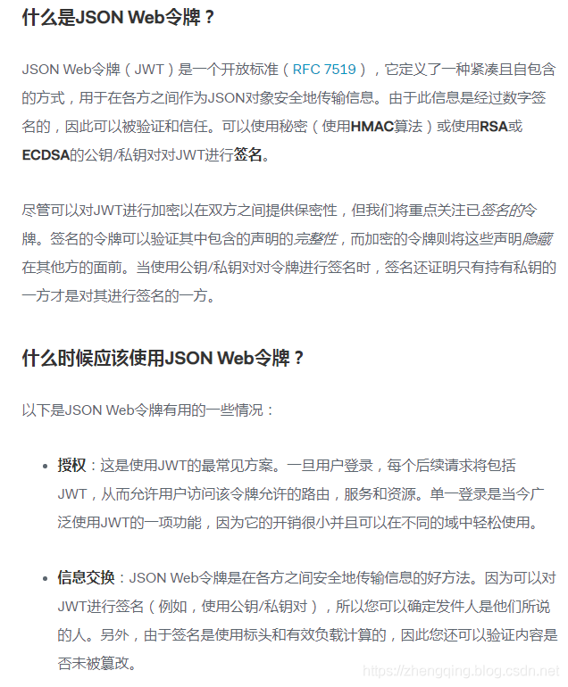
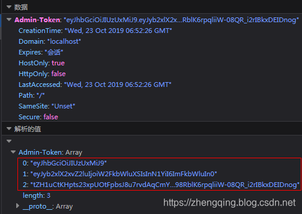

### 一、前言
本篇文章将讲述`Spring Security 简单整合JWT 处理认证授权`

###### 基本环境

1. spring-boot 2.1.8
2. mybatis-plus 2.2.0
3. mysql 数据库
4. maven项目

###### Spring Security入门学习可参考之前文章：

1. SpringBoot集成Spring Security入门体验（一）
    [https://blog.csdn.net/qq_38225558/article/details/101754743](https://blog.csdn.net/qq_38225558/article/details/101754743)
2. Spring Security 自定义登录认证（二）
    [https://blog.csdn.net/qq_38225558/article/details/102542072](https://blog.csdn.net/qq_38225558/article/details/102542072)
3. Spring Security 动态url权限控制（三）
    [https://blog.csdn.net/qq_38225558/article/details/102637637](https://blog.csdn.net/qq_38225558/article/details/102637637)

### 二、 Spring Security 简单整合 JWT 

有关`JWT`不了解的可以看下官网文档：[https://jwt.io/introduction/](https://jwt.io/introduction/)

#### 1、引入jwt依赖

```xml
 <!-- jwt依赖: https://mvnrepository.com/artifact/io.jsonwebtoken/jjwt -->
 <dependency>
     <groupId>io.jsonwebtoken</groupId>
     <artifactId>jjwt</artifactId>
     <version>0.9.1</version>
 </dependency>
```

#### 2、在Security登录认证成功后生成jwt令牌返回给前端保存

jwt生成令牌代码如下：

```java
// 生成jwt访问令牌
String jwtToken = Jwts.builder()
        // 用户角色
        .claim("ROLE_LOGIN", "ADMIN")
        // 主题 - 存用户名
        .setSubject("张三")
        // 过期时间 - 30分钟
        .setExpiration(new Date(System.currentTimeMillis() + 30 * 60 * 1000))
        // 加密算法和密钥
        .signWith(SignatureAlgorithm.HS512, "helloworld")
        .compact();
```

这里贴出小编文末案例demo源码中关于登录认证处理中的使用

```java
@Component
public class AdminAuthenticationProvider implements AuthenticationProvider {

    @Autowired
    UserDetailsServiceImpl userDetailsService;
    @Autowired
    private UserMapper userMapper;

    @Override
    public Authentication authenticate(Authentication authentication) throws AuthenticationException {
        // 获取前端表单中输入后返回的用户名、密码
        String userName = (String) authentication.getPrincipal();
        String password = (String) authentication.getCredentials();

        SecurityUser userInfo = (SecurityUser) userDetailsService.loadUserByUsername(userName);

        boolean isValid = PasswordUtils.isValidPassword(password, userInfo.getPassword(), userInfo.getCurrentUserInfo().getSalt());
        // 验证密码
        if (!isValid) {
            throw new BadCredentialsException("密码错误！");
        }

        // 前后端分离情况下 处理逻辑...
        // 更新登录令牌
        // 当前用户所拥有角色代码
        String roleCodes = userInfo.getRoleCodes();
        // 生成jwt访问令牌
        String jwt = Jwts.builder()
                // 用户角色
                .claim(Constants.ROLE_LOGIN, roleCodes)
                // 主题 - 存用户名
                .setSubject(authentication.getName())
                // 过期时间 - 30分钟
                .setExpiration(new Date(System.currentTimeMillis() + 30 * 60 * 1000))
                // 加密算法和密钥
                .signWith(SignatureAlgorithm.HS512, Constants.SALT)
                .compact();


        User user = userMapper.selectById(userInfo.getCurrentUserInfo().getId());
        user.setToken(jwt);
        userMapper.updateById(user);
        userInfo.getCurrentUserInfo().setToken(jwt);
        return new UsernamePasswordAuthenticationToken(userInfo, password, userInfo.getAuthorities());
    }

    @Override
    public boolean supports(Class<?> aClass) {
        return true;
    }
}
```

前端页面保存的jwt令牌格式如下：


#### 3、Security访问鉴权中认证用户信息

我们在访问每一个url请求的时候，在统一认证的地方获取jwt中我们需要的信息然后认证即可，【注： `Claims` 中存放着我们需要的信息】
例如： 我们可以将用户名、密码存放jwt中，然后在认证的时候读取到其中的用户信息，然后查询数据库认证用户，如果满足条件即成功访问，如果不满足条件即抛出异常处理

> **温馨小提示**：如果jwt令牌过期，会抛出`ExpiredJwtException`异常，我们需要拦截到，然后交给认证失败处理器中处理，然后返回给前端，这里根据个人业务实际处理即可~

```java
// 获取jwt中的信息
Claims claims = Jwts.parser().setSigningKey("helloworld").parseClaimsJws(jwtToken.replace("Bearer", "")).getBody();
// 获取当前登录用户名
System.out.println("获取当前登录用户名: " + claims.getSubject());
```

小编项目中认证过滤器中的使用如下:

```java
@Slf4j
@Component
public class MyAuthenticationFilter extends OncePerRequestFilter {

    @Autowired
    AdminAuthenticationEntryPoint authenticationEntryPoint;

    private final UserDetailsServiceImpl userDetailsService;

    protected MyAuthenticationFilter(UserDetailsServiceImpl userDetailsService) {
        this.userDetailsService = userDetailsService;
    }

    @Override
    protected void doFilterInternal(HttpServletRequest request, HttpServletResponse response, FilterChain filterChain) throws ServletException, IOException {
        MultiReadHttpServletRequest wrappedRequest = new MultiReadHttpServletRequest(request);
        MultiReadHttpServletResponse wrappedResponse = new MultiReadHttpServletResponse(response);
        StopWatch stopWatch = new StopWatch();
        try {
            stopWatch.start();
            // 前后端分离情况下，前端登录后将token储存在cookie中，每次访问接口时通过token去拿用户权限
            String jwtToken = wrappedRequest.getHeader(Constants.REQUEST_HEADER);
            log.debug("后台检查令牌:{}", jwtToken);
            if (StringUtils.isNotBlank(jwtToken)) {
                // JWT相关start ===========================================
                // 获取jwt中的信息
                Claims claims = Jwts.parser().setSigningKey(Constants.SALT).parseClaimsJws(jwtToken.replace("Bearer", "")).getBody();
                // 获取当前登录用户名
                System.out.println("获取当前登录用户名: " + claims.getSubject());
                // TODO 如需使用jwt特性在此做处理~
                // JWT相关end ===========================================

                // 检查token
                SecurityUser securityUser = userDetailsService.getUserByToken(jwtToken);
                if (securityUser == null || securityUser.getCurrentUserInfo() == null) {
                    throw new BadCredentialsException("TOKEN已过期，请重新登录！");
                }
                UsernamePasswordAuthenticationToken authentication = new UsernamePasswordAuthenticationToken(securityUser, null, securityUser.getAuthorities());
                // 全局注入角色权限信息和登录用户基本信息
                SecurityContextHolder.getContext().setAuthentication(authentication);
            }
            filterChain.doFilter(wrappedRequest, wrappedResponse);
        } catch (ExpiredJwtException e) {
            // jwt令牌过期
            SecurityContextHolder.clearContext();
            this.authenticationEntryPoint.commence(wrappedRequest, response, null);
        } catch (AuthenticationException e) {
            SecurityContextHolder.clearContext();
            this.authenticationEntryPoint.commence(wrappedRequest, response, e);
        } finally {
            stopWatch.stop();
        }
    }

}
```

简单的入门使用就是这样了

### 三、总结

1. 引入`jwt依赖`
2. 登录系统成功后`生成jwt令牌`返回给前端保存到`浏览器请求头`中
3. 在每一次请求访问系统url时，在统一认证过滤器中获取到请求头中jwt令牌中保存的`用户信息`然后做`认证处理`，如果满足条件成功访问，如果不满足交给认证失败处理器返回指定内容给前端

#### 本文案例demo源码

[https://gitee.com/zhengqingya/java-workspace](https://gitee.com/zhengqingya/java-workspace)


