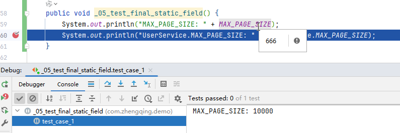

# final静态字段

修改final静态字段值

### 场景

```java
import org.springframework.stereotype.Service;

@Service
public class UserService {
    private static final int MAX_PAGE_SIZE = 10000;

    public void _05_test_final_static_field() {
        System.out.println("MAX_PAGE_SIZE: " + MAX_PAGE_SIZE);
        System.out.println("UserService.MAX_PAGE_SIZE: " + UserService.MAX_PAGE_SIZE);
    }
}
```

### 单测

```java
package com.zhengqing.demo;

import cn.hutool.core.util.ReflectUtil;
import com.zhengqing.demo.service.UserService;
import lombok.extern.slf4j.Slf4j;
import org.junit.Before;
import org.junit.Test;
import org.junit.jupiter.api.TestInstance;
import org.mockito.InjectMocks;
import org.mockito.MockitoAnnotations;
import org.powermock.reflect.Whitebox;

import java.lang.reflect.Field;

@Slf4j
@TestInstance(TestInstance.Lifecycle.PER_CLASS)
public class _05_test_final_static_field {
    @InjectMocks
    private UserService userService;

    @Before
    public void init() {
        MockitoAnnotations.openMocks(this);
    }

    // ==================== ↓↓↓↓↓↓ 单测case ↓↓↓↓↓↓=======================

    @Test
    public void test_case_1() throws Exception {
        // 获取MAX_PAGE_SIZE字段
        Field field = UserService.class.getDeclaredField("MAX_PAGE_SIZE");

        // 设置字段可访问
        field.setAccessible(true);

        // 移除final修饰符
        Field modifiersField = Field.class.getDeclaredField("modifiers");
        modifiersField.setAccessible(true);
        modifiersField.setInt(field, field.getModifiers() & ~java.lang.reflect.Modifier.FINAL);

        // 修改字段值
        field.setInt(null, 666);

        userService._05_test_final_static_field();
    }

    @Test
    public void test_case_2() throws Exception {
        // 报错：java.lang.IllegalAccessException: Can not set static final int field com.zhengqing.demo.service.UserService.MAX_PAGE_SIZE to (int)100
        Field field = ReflectUtil.getField(UserService.class, "MAX_PAGE_SIZE");
        field.setAccessible(true);
        field.setInt(null, 100);
        userService._05_test_final_static_field();
    }

    @Test
    public void test_case_3() throws Exception {
        // 使用 PowerMockito 中的 Whitebox 修改 static final 字段。 （需要引入相关依赖）
        Whitebox.setInternalState(UserService.class, "MAX_PAGE_SIZE", 10);
        // PowerMockito.field(UserService.class, "MAX_PAGE_SIZE").setInt(UserService.class, 5000); // 这种方式会报错：java.lang.IllegalAccessException: Can not set static final int field com.zhengqing.demo.service.UserService.MAX_PAGE_SIZE to (int)5000
        userService._05_test_final_static_field();
    }

}
```

注：虽然debug看见值已经被修改了，但是在单元测试中还是取不到修改后的值... 即最终无法修改final静态字段值


