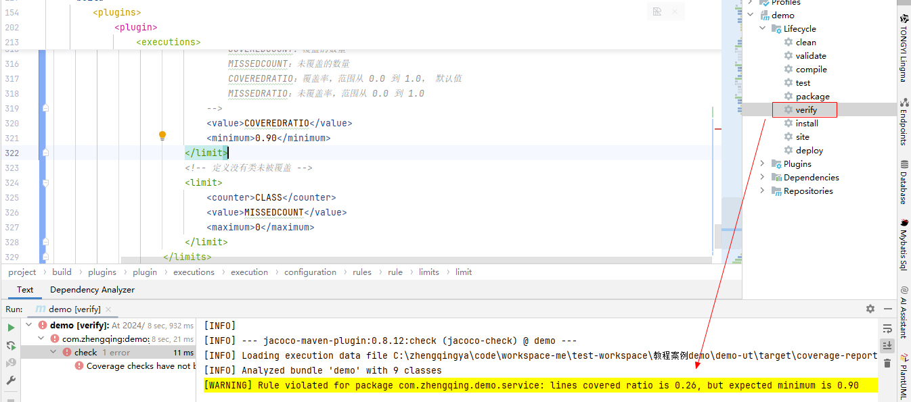
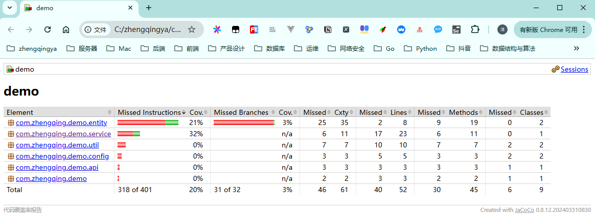

# 代码覆盖率统计

`pom.xml`中引入jacoco插件，用于代码覆盖率分析，生成测试报告。

> tips: 项目路径不要含有中文，否则会导致无法正常生成 .exec 文件；
> 控制台提示： Skipping JaCoCo execution due to missing execution data file:C:\单元测试\demo-ut\target\coverage-reports\jacoco-unit.exec

[pom.xml](../pom.xml)

```xml

<plugins>
    <!--
    引入jacoco插件，用于代码覆盖率分析，生成测试报告
            运行测试：运行命令 mvn clean verify，Maven 会在运行测试时自动启动 Jacoco 代理并生成覆盖率数据。
            查看报告：在 target/site/jacoco/ 下查看生成的报告。可以直接打开 HTML 文件查看详细的覆盖率信息。
            跳过测试：mvn clean install -DskipTests
            跳过 Jacoco 覆盖率报告：mvn clean install -Djacoco.skip=true
     -->
    <plugin>
        <!-- https://mvnrepository.com/artifact/org.jacoco/jacoco-maven-plugin -->
        <groupId>org.jacoco</groupId>
        <artifactId>jacoco-maven-plugin</artifactId>
        <version>0.8.12</version>
        <configuration>
            <!--指定生成 .exec 文件的存放位置-->
            <destFile>target/coverage-reports/jacoco-unit.exec</destFile>
            <!--Jacoco 是根据 .exec 文件生成最终的报告，所以需指定 .exec 的存放路径-->
            <dataFile>target/coverage-reports/jacoco-unit.exec</dataFile>
        </configuration>
        <executions>
            <!--
            1、准备覆盖率数据：prepare-agent
                通过 prepare-agent 目标，Jacoco 插件会在 JVM 中注入一个代理，以便在测试期间收集覆盖率数据。它是必须的步骤，用于在后续生成覆盖率报告。
                作用：确保 JVM 在运行测试时记录覆盖率数据。
                结果：生成 .exec 文件，存储了覆盖率信息，默认路径为 target/jacoco.exec。
                注意：项目所在路径不能有中文，否则会导致无法正常生成 .exec 文件！！！
            -->
            <execution>
                <id>prepare-agent</id>
                <goals>
                    <goal>prepare-agent</goal>
                </goals>
                <configuration>
                    <propertyName>jacocoArgLine</propertyName>
                </configuration>
            </execution>
            <!--
            2、生成覆盖率报告：report
                report 目标会使用 prepare-agent 生成的 .exec 文件，结合源码和编译后的字节码，生成详细的覆盖率报告，支持多种格式（HTML、XML、CSV）。
                作用：生成测试覆盖率的可视化报告。
                结果：在 target/site/jacoco 目录下生成 HTML 报告（index.html）及 XML 报告。
                常用格式：
                    HTML：用于人类阅读的报告，包含图表和详细的覆盖率信息。
                    XML：可以用于集成工具（如 SonarQube）。
                    CSV：提供原始的覆盖率数据，用于自定义分析。
             -->
            <execution>
                <id>jacoco-report</id>
                <goals>
                    <goal>report</goal>
                </goals>
                <configuration>
                    <outputDirectory>target/jacoco-report</outputDirectory>
                    <footer>代码覆盖率报告</footer>
                    <formats>
                        <format>HTML</format>
                        <format>XML</format>
                    </formats>
                </configuration>
                <phase>verify</phase>
            </execution>
            <!--
            3、合并多模块的覆盖率报告：report-aggregate
                对于多模块项目，Jacoco 提供了 report-aggregate 目标，用于将多个模块的覆盖率数据合并生成一份报告。
                作用：将子模块的测试覆盖率合并，生成一份聚合报告。
                结果：在父项目的 target/site/jacoco-aggregate/ 生成合并后的覆盖率报告。
            -->
            <execution>
                <id>report-aggregate</id>
                <goals>
                    <goal>report-aggregate</goal>
                </goals>
            </execution>
            <!--
            4、设置覆盖率阈值：check
                check 目标可以设定代码覆盖率的阈值，如果不满足要求，构建会失败。这对于确保代码质量非常有用。
                作用：定义测试覆盖率的最低阈值标准。
                结果：当代码覆盖率低于 90% 时，构建失败。
            -->
            <execution>
                <id>jacoco-check</id>
                <goals>
                    <goal>check</goal>
                </goals>
                <configuration>
                    <rules>
                        <rule>
                            <!-- 规则配置，可参考官方文档：https://www.jacoco.org/jacoco/trunk/doc/check-mojo.html -->
                            <!--
                            element 定义了规则对应的范围
                                BUNDLE：表示整个模块，默认值
                                PACKAGE：表示代码包
                                CLASS：表示类
                                SOURCEFILE：源文件
                                METHOD：表示方法
                            -->
                            <element>PACKAGE</element>
                            <includes>
                                <!-- 指定包 -->
                                <include>com.zhengqing.demo.service</include>
                            </includes>
                            <excludes>
                                <!-- 排除包 -->
                                <exclude>com.zhengqing.demo.util</exclude>
                            </excludes>
                            <limits>
                                <!-- 指定行覆盖率（最低要求 90%） -->
                                <limit>
                                    <!--
                                    每个规则可以定义多条限制（limit），每个限制有一个特定的指标
                                        INSTRUCTION：字节码指令，是最细粒度的指标，默认值
                                        LINE：代码行，一行代码可能有多个字节码指令
                                        BRANCH：分支，if 或 switch 包含了多个分支
                                        COMPLEXITY：圈复杂度，是代码复杂度的衡量标准，简单来说越大越复杂，需要的测试用例越多，详细算法可参考百科
                                        METHOD：方法
                                        CLASS：类
                                    -->
                                    <counter>LINE</counter>
                                    <!--
                                    为每个指标的值定义一个最大值或最小值。
                                        TOTALCOUNT：总数
                                        COVEREDCOUNT：覆盖的数量
                                        MISSEDCOUNT：未覆盖的数量
                                        COVEREDRATIO：覆盖率，范围从 0.0 到 1.0， 默认值
                                        MISSEDRATIO：未覆盖率，范围从 0.0 到 1.0
                                    -->
                                    <value>COVEREDRATIO</value>
                                    <minimum>0.90</minimum>
                                </limit>
                                <!-- 定义没有类未被覆盖 -->
                                <limit>
                                    <counter>CLASS</counter>
                                    <value>MISSEDCOUNT</value>
                                    <maximum>0</maximum>
                                </limit>
                            </limits>
                        </rule>
                    </rules>
                </configuration>
            </execution>
        </executions>
    </plugin>

    <!-- maven里执行测试用例的插件，默认使用JUnit并执行测试用例（如果配置jacocoArgLine，则此插件配置要在最后，否则获取不到配置项） -->
    <plugin>
        <groupId>org.apache.maven.plugins</groupId>
        <artifactId>maven-surefire-plugin</artifactId>
        <version>2.22.2</version>
        <configuration>
            <!-- 是否跳过测试 -->
            <skipTests>false</skipTests>
            <!--忽略测试失败配置：继续打印报告及执行其它module的测试-->
            <testFailureIgnore>true</testFailureIgnore>
            <!--
            argLine作用指定VM参数
                ${jacocoArgLine}：用于在运行测试时收集代码覆盖率数据，解决 jacoco 覆盖率为0的问题
                -Duser.timezone=Asia/Shanghai：确保 JVM 在运行测试时使用亚洲/上海时区，这对于处理日期和时间相关的测试用例尤为重要。
             -->
            <argLine>-Dfile.encoding=UTF-8 ${jacocoArgLine} -Duser.timezone=Asia/Shanghai</argLine>

            <includes>
                <!-- 匹配所有测试类 -->
                <include>**\*</include>
            </includes>
        </configuration>
    </plugin>
</plugins>
```

覆盖率检查：通过 check 目标，可以设定覆盖率的最低要求，确保代码质量。


满足目标后，可查看生成报告 [`target/jacoco-report/index.html`](../target/jacoco-report/index.html)

