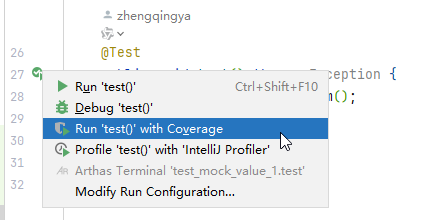

# 前言

### mock定义

模拟任何 Spring 管理的 Bean、模拟方法的返回值、模拟抛出异常等，避免为了测试一个方法，却要自行构建整个bean的依赖链。

### 单测覆盖率

单元测试覆盖率是指通过单元测试覆盖的代码比例。提高单元测试覆盖率有助于确保代码的质量和稳定性。

单元测试覆盖率类型

1. 行覆盖率（Line Coverage）：
    - 衡量代码中的每一行是否都被执行过。
    - 确保每行代码都至少被执行一次。
2. 函数覆盖率（Function Coverage）：
    - 衡量代码中的每个函数是否都被调用过。
    - 确保每个函数至少被调用一次。
3. 条件覆盖率（Condition Coverage）：
    - 衡量代码中的每个布尔表达式的每个条件是否都被评估为真和假。
    - 确保每个条件的真假情况都被测试到。
4. 判定覆盖 / 分支覆盖 (Decision Coverage/Branch Coverage)：
    - 衡量代码中的每个条件分支是否都被执行过。
    - 确保每个 if、else、switch 等条件语句的所有可能路径都被测试到。

在 IDE 中查看覆盖率报告。

#### 提高覆盖率的建议

1. 编写全面的测试用例：
    - 确保每个函数、每个分支、每个条件都有对应的测试用例。
    - 考虑边界条件和异常情况。
2. 使用 mocking 工具：
    - 使用 Mockito 等工具模拟依赖对象，确保测试的独立性和准确性。
3. 持续集成：
    - 将代码覆盖率检查集成到 CI/CD 流程中，确保每次提交都能达到预期的覆盖率标准。
4. 代码审查：
    - 在代码审查过程中关注测试覆盖率，确保新提交的代码有相应的测试用例。

通过这些方法和工具，可以有效地提高单元测试覆盖率，从而提升代码质量和稳定性。