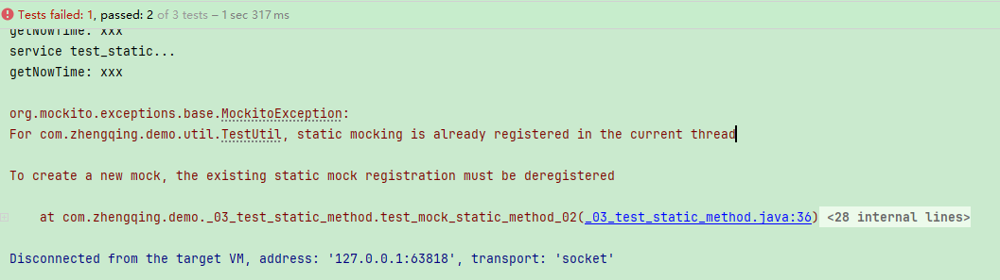

# 静态方法

mock静态方法调用，需要使用`Mockito.mockStatic()`

### 场景

```java
import org.springframework.stereotype.Service;

@Service
public class UserService {
    public void _03_test_static_method() {
        System.out.println("service test_static...");
        TestUtil.doNothing();
        System.out.println("getNowTime: " + TestUtil.getNowTime(1));
    }
}
```

```java
public class TestUtil {
    public static void doNothing() {
        System.out.println("[静态方法-无返回值] TestUtil.doNothing...");
    }

    public static String getNowTime(Integer num) {
        System.out.println("[静态方法-带返回值] TestUtil.getNowTime..." + num);
        return DateUtil.now();
    }
}
```

### 单测

#### 方式1

```java
package com.zhengqing.demo;

import com.zhengqing.demo.service.UserService;
import com.zhengqing.demo.util.TestUtil;
import lombok.extern.slf4j.Slf4j;
import org.junit.Before;
import org.junit.Test;
import org.mockito.InjectMocks;
import org.mockito.Mockito;
import org.mockito.MockitoAnnotations;

@Slf4j
public class _03_test_static_method {
    @InjectMocks
    private UserService userService;

    @Before
    public void init() {
        MockitoAnnotations.openMocks(this);
    }

    // ==================== ↓↓↓↓↓↓ 单测case ↓↓↓↓↓↓=======================

    @Test
    public void test_mock_static_method_1_01() throws Exception {
        MockedStatic<TestUtil> mockStatic = Mockito.mockStatic(TestUtil.class);// 不需要返回值的话，这个就可以模拟静态方法执行了...
        // 模拟静态方法返回值
        Mockito.when(TestUtil.getNowTime(Mockito.anyInt())).thenReturn("xxx");
        userService._03_test_static_method();
        mockStatic.close();
    }

    @Test
    public void test_mock_static_method_1_02() throws Exception {
        MockedStatic<TestUtil> mockStatic = Mockito.mockStatic(TestUtil.class);// 不需要返回值的话，这个就可以模拟静态方法执行了...
        // 模拟静态方法返回值
        Mockito.when(TestUtil.getNowTime(Mockito.anyInt())).thenReturn("xxx");
        userService._03_test_static_method();
        mockStatic.close();
    }

}
```

##### 问题

注：多次使用`Mockito.mockStatic`，会报错：`To create a new mock, the existing static mock registration must be deregistered`


解决：

1. 每次使用`MockedStatic<TestUtil> mockStatic = Mockito.mockStatic(TestUtil.class);` 后及时关闭 `mockStatic.close()`
2. 使用 `try-with-resources` 确保资源自动关闭

#### 方式2

```java

@Test
public void test_mock_static_method_2() throws Exception {
    // 创建静态方法的模拟对象
    try (MockedStatic<TestUtil> theMock = Mockito.mockStatic(TestUtil.class)) {
        // 指定静态方法的返回值
        theMock.when(() -> TestUtil.getNowTime(Mockito.anyInt())).thenReturn("xxx");
        userService._03_test_static_method();
    }
}
```
