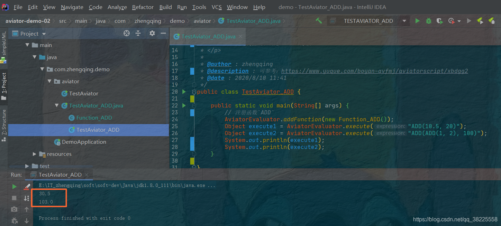

### 一、前言

1. [Aviator(1) SpringBoot整合Aviator入门体验](https://zhengqing.blog.csdn.net/article/details/107913810)
2. 自定义函数和调用Java方法可参考：[https://www.yuque.com/boyan-avfmj/aviatorscript/xbdgg2](https://www.yuque.com/boyan-avfmj/aviatorscript/xbdgg2)

### 二、Aviator 自定义函数`ADD`

```java
public class TestAviator_ADD {

    public static void main(String[] args) {
        // 注册函数`ADD`
        AviatorEvaluator.addFunction(new Function_ADD());
        Object execute1 = AviatorEvaluator.execute("ADD(10.5, 20)");
        Object execute2 = AviatorEvaluator.execute("ADD(ADD(1, 2), 100)");
        System.out.println(execute1);
        System.out.println(execute2);
    }

}

/**
 * <p>
 * 自定义函数`ADD`
 * </p>
 *
 * @author : zhengqing
 * @description : 继承`com.googlecode.aviator.runtime.function.AbstractFunction`,并覆写对应参数个数的方法即可
 * @date : 2020/8/10 21:30
 */
class Function_ADD extends AbstractFunction {

    /**
     * 实现将两个参数相加，返回浮点结果 AviatorDouble
     *
     * @param env:当前执行的上下文
     * @param arg1:
     *            左参数
     * @param arg2:
     *            右参数
     * @return: com.googlecode.aviator.runtime.type.AviatorObject
     * @date : 2020/8/10 21:33
     */
    @Override
    public AviatorObject call(Map<String, Object> env, AviatorObject arg1, AviatorObject arg2) {
        Number left = FunctionUtils.getNumberValue(arg1, env);
        Number right = FunctionUtils.getNumberValue(arg2, env);
        return new AviatorDouble(left.doubleValue() + right.doubleValue());
    }

    /**
     * 返回方法名
     */
    @Override
    public String getName() {
        return "ADD";
    }

}
```

运行结果如下：



---

### 本文案例demo源码地址

[https://gitee.com/zhengqingya/java-workspace](https://gitee.com/zhengqingya/java-workspace)

---

> 今日分享语句：
> 人生每天都要笑，生活的下一秒发生什么，我们谁也不知道。所以，放下心里的纠结，放下脑中的烦恼，放下生活的不愉快，活在当下。人生喜怒哀乐，百般形态，不如在心里全部淡然处之，轻轻一笑，让心更自在，生命更恒久。积极者相信只有推动自己才能推动世界，只要推动自己就能推动世界。
