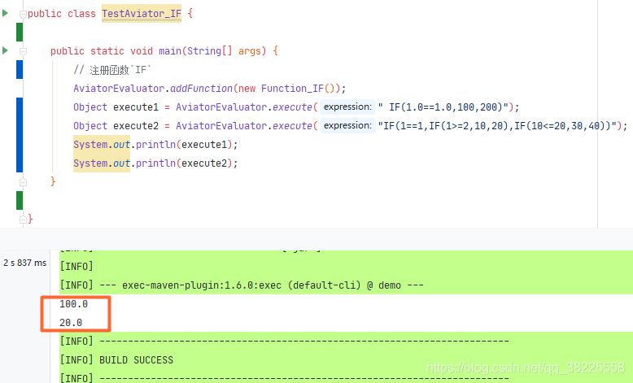

### 一、前言

1. [Aviator(1) SpringBoot整合Aviator入门体验](https://zhengqing.blog.csdn.net/article/details/107913810)
2. [Aviator(2) 自定义函数ADD](https://zhengqing.blog.csdn.net/article/details/107921112)
3. 自定义函数和调用Java方法可参考：[https://www.yuque.com/boyan-avfmj/aviatorscript/xbdgg2](https://www.yuque.com/boyan-avfmj/aviatorscript/xbdgg2)

### 二、Aviator 自定义函数`IF`

```java
public class TestAviator_IF {

    public static void main(String[] args) {
        // 注册函数`IF`
        AviatorEvaluator.addFunction(new Function_IF());
        Object execute1 = AviatorEvaluator.execute(" IF(1.0==1.0,100,200)");
        Object execute2 = AviatorEvaluator.execute("IF(1==1,IF(1>=2,10,20),IF(10<=20,30,40))");
        System.out.println(execute1);
        System.out.println(execute2);
    }

}

/**
 * <p>
 * Aviator 自定义函数`IF`
 * </p>
 *
 * @author : zhengqing
 * @description : 继承`com.googlecode.aviator.runtime.function.AbstractFunction`,并覆写对应参数个数的方法即可
 * @date : 2020/8/11 9:15
 */
class Function_IF extends AbstractFunction {

    /**
     * IF函数实现逻辑处理
     *
     * @param env:
     *            当前执行的上下文
     * @param arg1:
     *            if函数中的判断逻辑
     * @param arg2:
     *            arg1为true时的结果
     * @param arg3:
     *            arg1为false时的结果
     * @return: com.googlecode.aviator.runtime.type.AviatorObject
     * @author : zhengqing
     * @date : 2020/8/11 9:17
     */
    @Override
    public AviatorObject call(Map<String, Object> env, AviatorObject arg1, AviatorObject arg2, AviatorObject arg3) {
        Boolean ifResult = FunctionUtils.getBooleanValue(arg1, env);
        Number ifTrue = FunctionUtils.getNumberValue(arg2, env);
        Number ifFalse = FunctionUtils.getNumberValue(arg3, env);
        if (ifResult) {
            return new AviatorDouble(ifTrue.doubleValue());
        } else {
            return new AviatorDouble(ifFalse.doubleValue());
        }
    }

    /**
     * 返回方法名
     */
    @Override
    public String getName() {
        return "IF";
    }

}
```

运行结果如下：



---

### 本文案例demo源码地址

[https://gitee.com/zhengqingya/java-workspace](https://gitee.com/zhengqingya/java-workspace)

---

> 今日分享语句：
> 当热诚变成习惯，恐惧和忧虑即无处容身。缺乏热诚的人也没有明确的目标。热诚使想象的轮子转动。一个人缺乏热诚就象汽车没有汽油。善于安排玩乐和工作，两者保持热诚，就是最快乐的人。热诚使平凡的话题变得生动。
