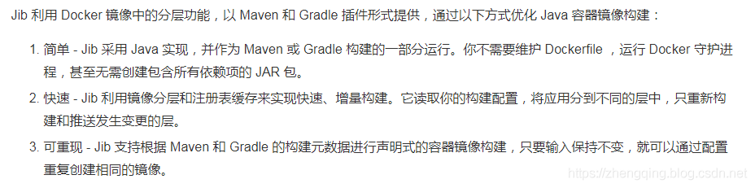
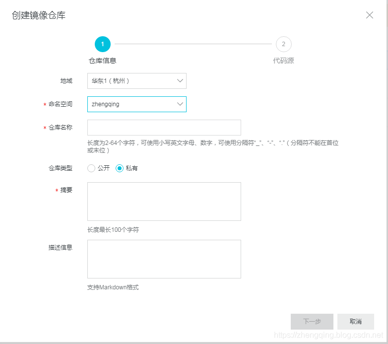
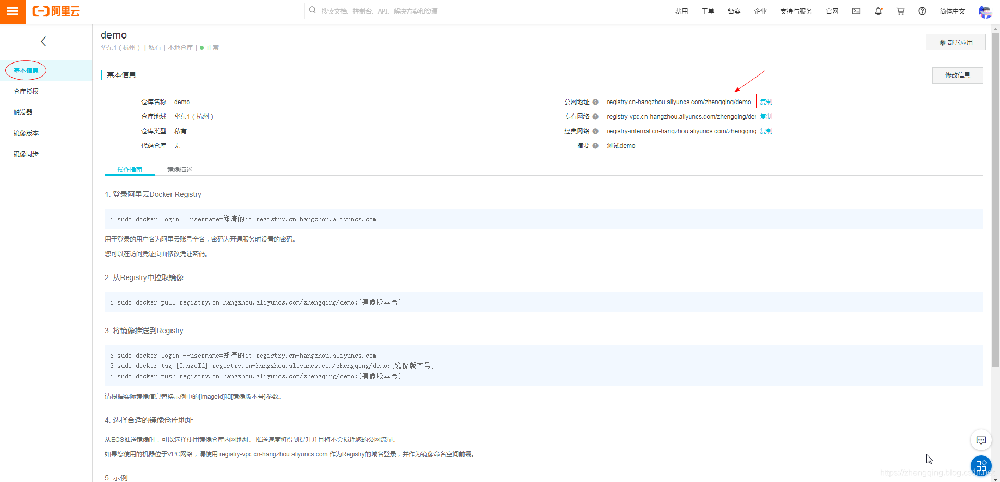
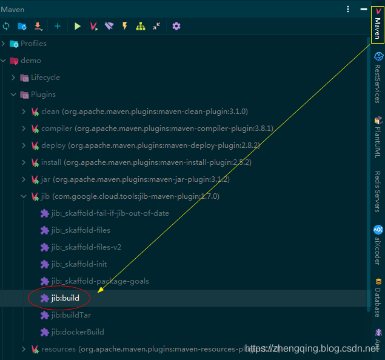
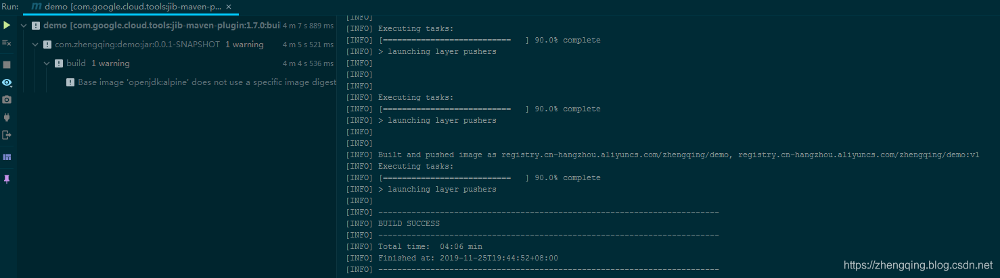
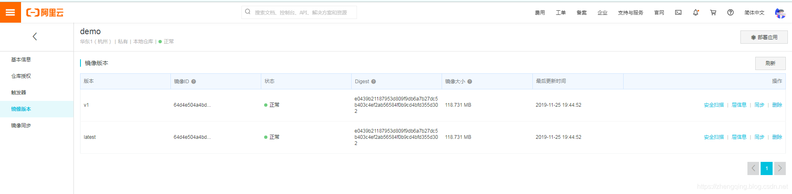
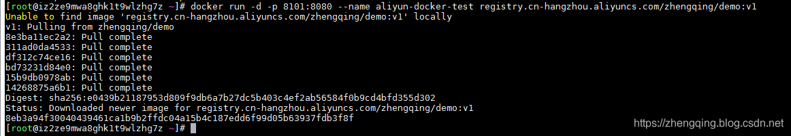
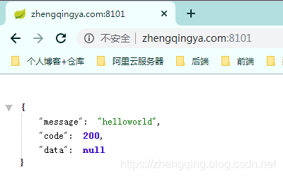

### 一、前言

###### `Jib`：Google开源的Java容器化工具

可作为插件快速集成到项目中，构建镜像，实现 Java 应用容器化

> 下面贴出一张从网上看到的Jib描述~



### 二、利用Jib插件构建镜像push到阿里云镜像仓库

###### 1、首先创建镜像仓库

1. 阿里云镜像仓库地址：[https://cr.console.aliyun.com/repository](https://cr.console.aliyun.com/repository)
2. Docker Hub地址：[https://www.docker.com/](https://www.docker.com/)



创建成功后，我们可以在基本信息中获取到我们所需要的镜像地址，然后通过Jib去构建push了




> 温馨小提示： 小编这里只是简单的演示一下如何集成到`maven项目`中

###### 2、在 `pom.xml` 中新增 `Jib插件` ：

```xml
<plugins>
    <!-- Jib插件 -->
    <plugin>
        <groupId>com.google.cloud.tools</groupId>
        <artifactId>jib-maven-plugin</artifactId>
        <version>1.7.0</version>
        <configuration>
            <!-- 拉取所需的基础镜像 - 这里用于运行springboot项目 -->
            <from>
                <image>openjdk:alpine</image>
            </from>
            <!-- 最后生成的镜像配置 -->
            <to>
                <!-- push到阿里云镜像仓库，如果是其它镜像仓库，将下面地址替换掉即可，ex: `Docker Hub` 的 `docker.io/zhengqing/xxx` -->
                <image>registry.cn-hangzhou.aliyuncs.com/zhengqing/demo</image>
                <!-- 镜像版本号 -->
                <tags>
                    <tag>v1</tag>
                </tags>
                <auth>
                    <username>账号</username>
                    <password>密码</password>
                </auth>
            </to>
        </configuration>
        <executions>
            <execution>
                <phase>package</phase>
                <goals>
                    <goal>build</goal>
                </goals>
            </execution>
        </executions>
    </plugin>
</plugins>
```

###### 3、上传镜像

项目根目录下执行命令 `mvn compile jib:build` 或者 通过idea的maven插件工具双击直接运行


上传成功如下：


###### 4、到阿里云镜像仓库中查看上传信息



### 三、docker拉取镜像运行

```shell
docker run -d -p 8101:8080 --name aliyun-docker-test registry.cn-hangzhou.aliyuncs.com/zhengqing/demo:v1
```

如果是`Docker Hub`镜像，示例如下：

```shell
docker run -d --name docker-test -p 3001:8080 docker.io/zhengqing/镜像名xx:v1
```



###### 运行成功后，浏览器测试访问

[http://zhengqingya.com:8101/](http://zhengqingya.com:8101/)




### 四、总结

通过Jib构建镜像到阿里云仓库，非常简单，基于maven项目只需要引入所需Jib插件即可~
需要注意的是，如果新建的阿里云镜像仓库是私有的需要先登录哦，这一点在阿里云官网上有示例，就不说了
其次，如果需要将镜像构建到本地docker环境中，执行命令 `mvn compile jib:dockerBuild` 即可

###### 本文案例代码

[https://gitee.com/zhengqingya/java-workspace](https://gitee.com/zhengqingya/java-workspace)
