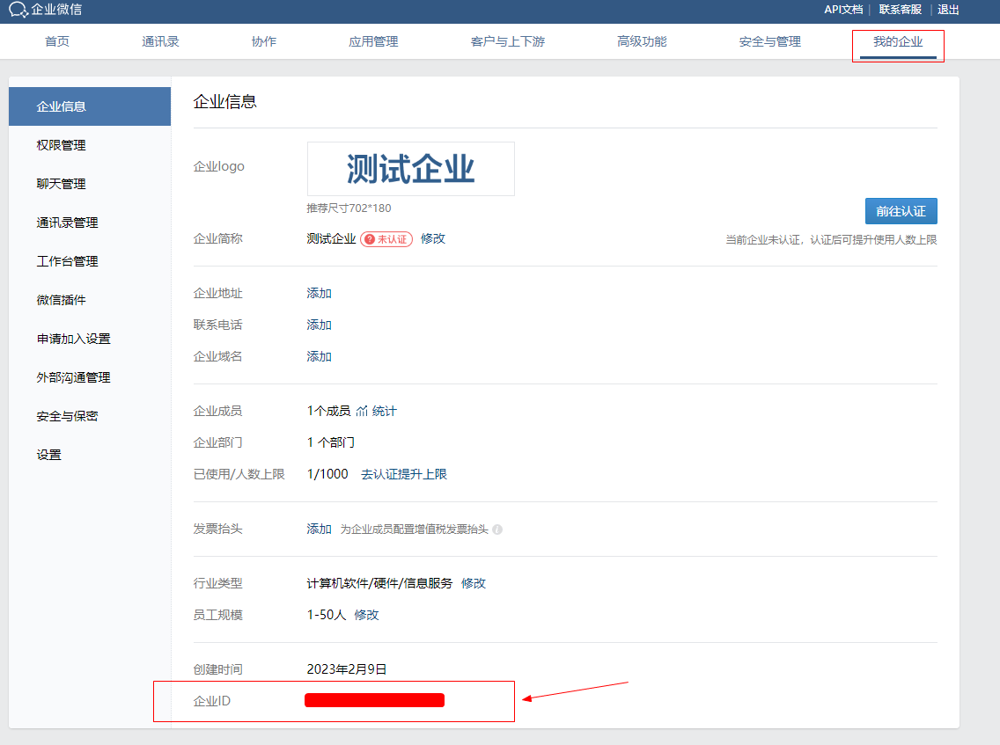
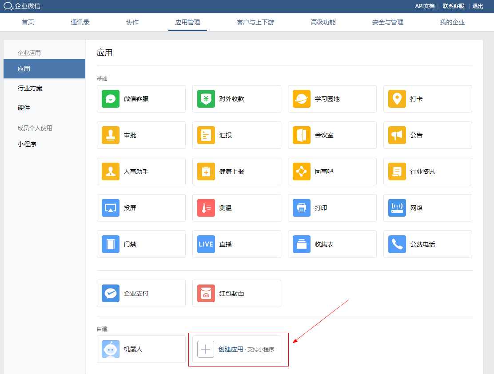
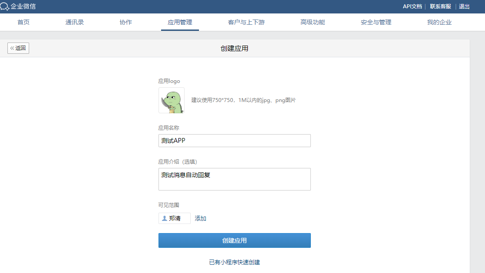
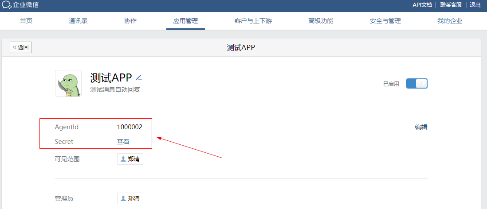
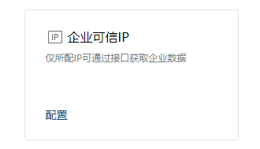
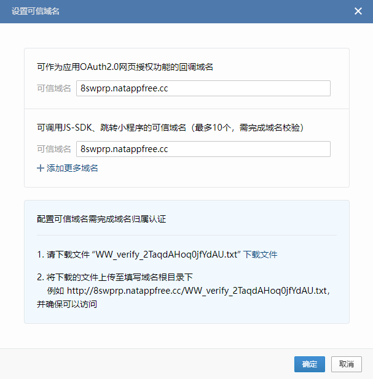
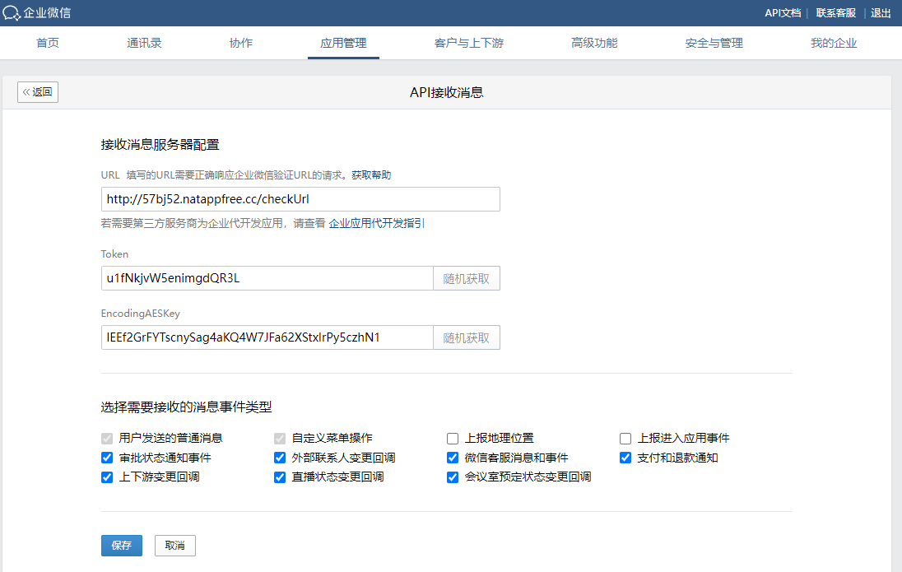

# 企业微信 - 自建应用

> demo版，暂无实际应用场景

### 拿到企业ID

https://work.weixin.qq.com/wework_admin/frame#profile

### 应用管理 -> 应用 -> 创建应用

拿到`AgentId`和`Secret`

### 应用 -> 开发者接口 -> 企业可信IP -> 配置 -> 设置可信域名

### 接收消息服务器配置

