### 一、前言

本系列教程将基于`springboot2.1.8.RELEASE`完成

本文将实现

1. 注册账号
2. 接入微信
3. 认证成为开发者

###  二、进入微信公众平台注册账号

> [https://mp.weixin.qq.com/](https://mp.weixin.qq.com/)

个人用户建议注册订阅号
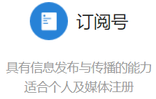
最后注册成功如下：
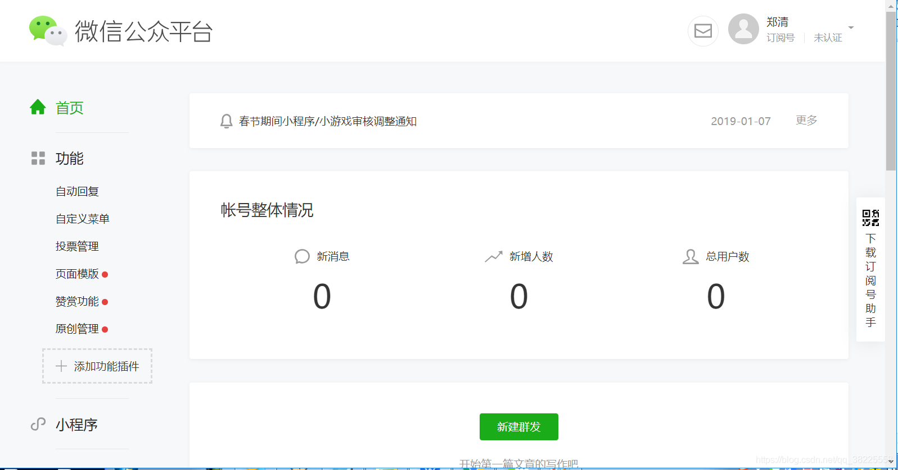
### 三、接入认证成为开发者

> 可参考微信官方开发文档：[https://mp.weixin.qq.com/wiki?t=resource/res_main&id=mp1421135319](https://mp.weixin.qq.com/wiki?t=resource/res_main&id=mp1421135319)

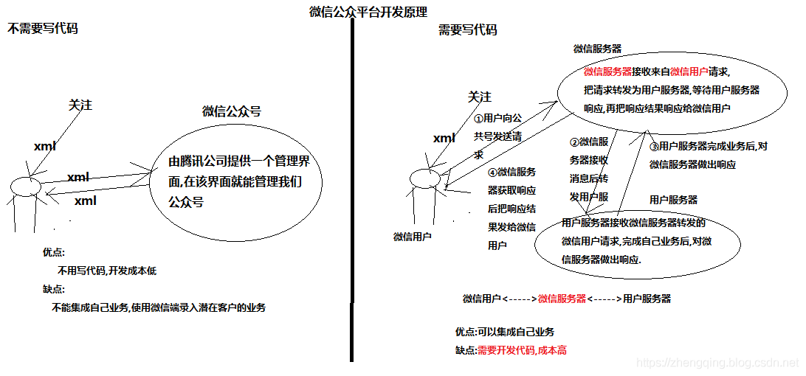

#### 1、填写服务器配置


选择左下方的开发者工具，进入测试账号开发

> why？  
> 测试账号的权限多点，如果已经认证了的账号可不需要利用测试账号开发

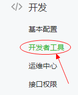
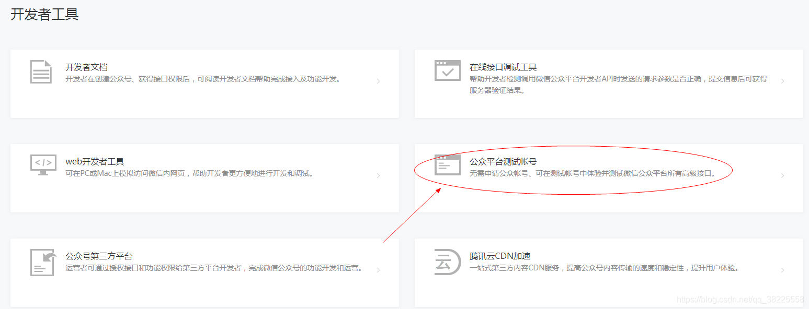
登录进去
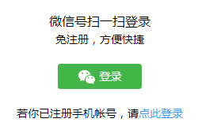

填写服务器 `URL` 和自定义的校验`Token`
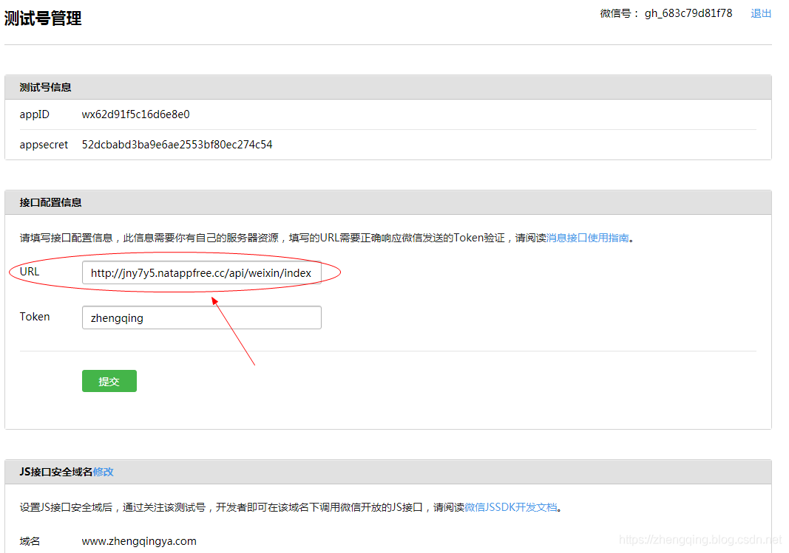

> 温馨小提示：
> 1. 微信公众号接口必须以http://或https://开头，分别支持80端口和443端口！
> 2. 这里的url可以选择自己买的服务器地址，记得必须开放80端口去使用！
或者使用内网映射外网工具生成一个域名地址供给你开发使用，此方法自行百度，如下就是其中一种使用~
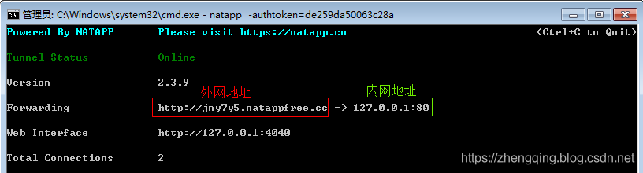

#### 2、提交验证URL有效性

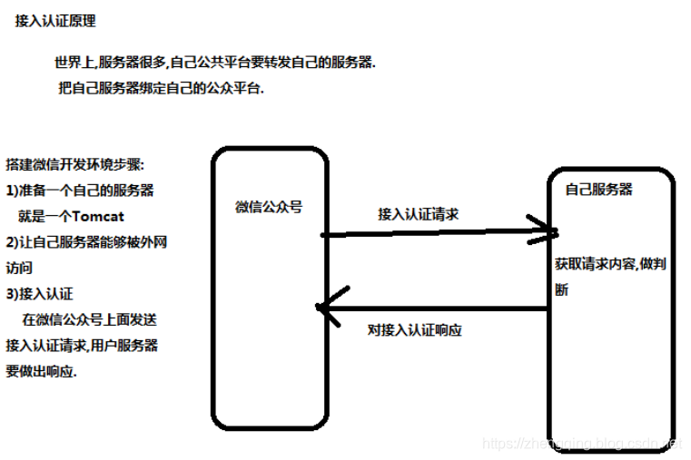

配置好后，点击提交，微信服务器会发送一个`GET`请求到我们配置的地址上，在后台通过get请求的方式获取，请求的时候会传入几个参数
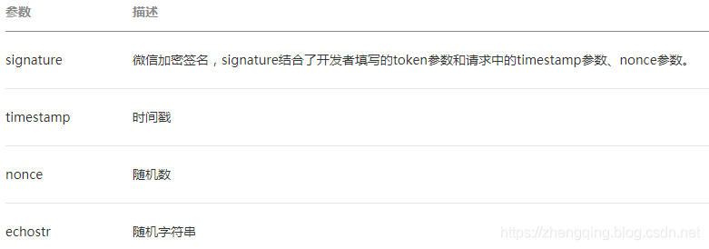
回到项目中，处理微信认证，然后启动项目测试

> 温馨小提示：这里小编将自己的内网映射到外网了，方便本地测试~

```java
@Slf4j
@RestController
@RequestMapping("/api/weixin/index")
@Api(tags = "微信 - 接口")
public class IndexController extends BaseController {

    // TODO 这里的token是微信公众平台上自己所配的！
    private static final String token = "zhengqing";

    /**
     * 处理微信认证：验证服务器地址的有效性，get提交
     * signature: 微信加密签名，signature结合了开发者填写的token参数和请求中的timestamp参数、nonce参数。
     * timestamp 时间戳
     * nonce: 随机数
     * echostr: 随机字符串
     */
    @GetMapping
    public void checkSignature(HttpServletRequest request, HttpServletResponse response) throws IOException {
        System.out.println("============= 处理微信认证 ===============");
        // 拿到微信的请求参数
        String signature = request.getParameter("signature");
        String timestamp = request.getParameter("timestamp");
        String nonce = request.getParameter("nonce");
        String echostr = request.getParameter("echostr");

        // ① 将token、timestamp、nonce三个参数进行字典序排序 b a d c h ==>a b c d h
        String[] strArr = {token, timestamp, nonce};
        // 字典排序
        Arrays.sort(strArr);
        // ② 将三个参数字符串拼接成一个字符串进行sha1加密
        StringBuffer sb = new StringBuffer();
        // 字符串拼接
        for (String str : strArr) {
            sb.append(str);
        }
        // 加密
        String sha1Str = SecurityUtil.sha1(sb.toString());
        // ③ 开发者获得加密后的字符串可与signature对比，标识该请求来源于微信
        if (sha1Str.equals(signature)) {
            // 如果相等，就是来自微信请求
            // 若确认此次GET请求来自微信服务器，原样返回echostr参数内容，则接入生效
            response.getWriter().println(echostr);
        }
    }

}
```

其中sha1加密工具类

```java
public class SecurityUtil {
	public static String sha1(String str) {
		try {
			StringBuilder sb = new StringBuilder();
			MessageDigest digest = MessageDigest.getInstance("sha1");
			// 放入加密字符串
			digest.update(str.getBytes());
			// 进行加密
			byte[] digestMsg = digest.digest();
			// byte转换16进制
			for (byte b : digestMsg) {
				sb.append(String.format("%02x", b));
			}
			return sb.toString();
		} catch (NoSuchAlgorithmException e) {
			e.printStackTrace();
		}
		return str;
	}
}
```

注意端口必须为80端口哦！！！
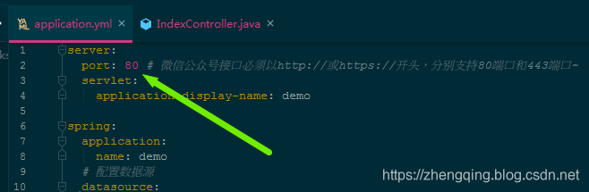

#### 3、测试接入认证

启动项目后，回到微信公众平台，提交发送接入认证请求，如果配置正确，会提示配置成功，并保存配置信息

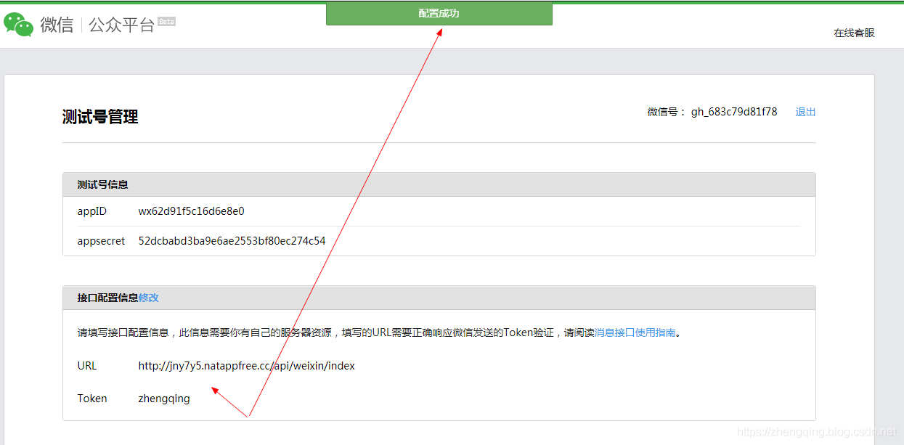

就这样，我们简单的完成了微信认证成为开发者 ~

### 本文案例demo源码

[https://gitee.com/zhengqingya/java-workspace](https://gitee.com/zhengqingya/java-workspace)

