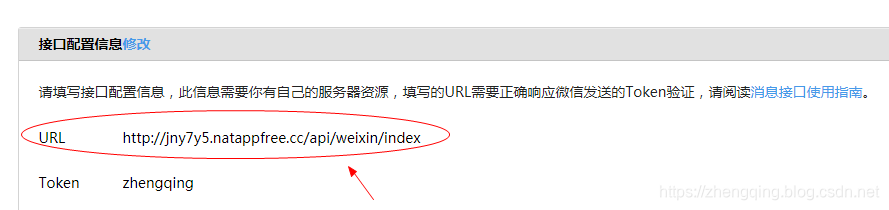
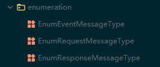
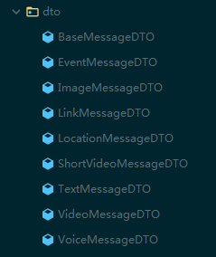
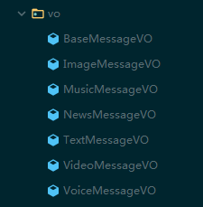
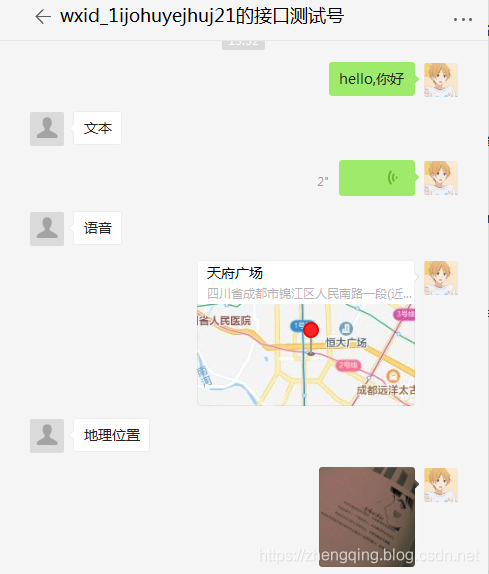
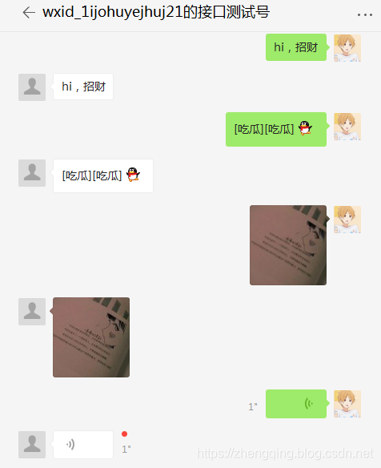

### 一、前言

[微信公众号开发 (1) 微信接入认证成为开发者](https://zhengqing.blog.csdn.net/article/details/86311495)

本文将实现

1. 接收消息
2. 回复消息

###  二、消息接收

消息接收`POST`和微信认证`GET`是同一个接口（开发者填写的URL）


```java
@Slf4j
@RestController
@RequestMapping("/api/weixin/index")
@Api(tags = "微信 - 接口")
public class IndexController extends BaseController {

    /**
     * 解析请求消息，post请求
     */
    @PostMapping
    public void msgProcess(HttpServletRequest request, HttpServletResponse response) throws Exception {
        // 获取请求的字节流
        ServletInputStream inputStream = request.getInputStream();
        // 转换为字符流， 得到缓冲流
        InputStreamReader inputStreamReader = new InputStreamReader(inputStream, StandardCharsets.UTF_8);
        BufferedReader reader = new BufferedReader(inputStreamReader);
        String content = null;
        // 读取消息内容
        while ((content = reader.readLine()) != null) {
            System.out.println(content);
        }
    }

}
```

接收到的`文本消息`格式如下

> 其它消息格式可查看微信开放文档：[https://developers.weixin.qq.com/doc/offiaccount/Message_Management/Receiving_standard_messages.html](https://developers.weixin.qq.com/doc/offiaccount/Message_Management/Receiving_standard_messages.html)

```xml
<xml>
	<ToUserName><![CDATA[gh_683c79d81f78]]></ToUserName>
	<FromUserName><![CDATA[Wy5wvH9zSaQZSZcV7wZE18D]]></FromUserName>
	<CreateTime>1578996487</CreateTime>
	<MsgType><![CDATA[text]]></MsgType>
	<Content><![CDATA[测试]]></Content>
	<MsgId>22605792697428179</MsgId>
</xml>
```

| 参数         | 描述                     |
| ------------ | ------------------------ |
| ToUserName   | 开发者微信号             |
| FromUserName | 发送方帐号（一个OpenID） |
| CreateTime   | 消息创建时间 （整型）    |
| MsgType      | 消息类型，文本为text     |
| Content      | 文本消息内容             |
| MsgId        | 消息id，64位整型         |

### 三、消息处理

当用户发送消息给公众号时（或某些特定的用户操作引发的事件推送时），会产生一个POST请求，开发者可以在响应包（Get）中返回特定XML结构，来对该消息进行响应（现支持回复`文本`、`图片`、`图文`、`语音`、`视频`、`音乐`）。

> 温馨小提示：这里的消息封装可根据[微信开放文档](https://developers.weixin.qq.com/doc/offiaccount/Message_Management/Receiving_standard_messages.html)中给出的消息格式自行封装，完整代码可参考文末给出的源码哦~ 

#### 1、封装消息类型枚举类



###### ① 请求消息类型

```java
public enum EnumRequestMessageType {
    // 请求消息类型
    TEXT("text", "文本"),
    IMAGE("image", "图片"),
    VOICE("voice", "语音"),
    VIDEO("video", "视频"),
    SHORTVIDEO("shortvideo", "小视频"),
    LOCATION("location", "地理位置"),
    LINK("link", "链接"),
    // 事件推送
    EVENT("event", "推送");
}
```

###### ② 事件推送类型

```java
public enum EnumEventMessageType {
    SUBSCRIBE("subscribe", "订阅"),
    UNSUBSCRIBE("unsubscribe", "取消订阅"),
    CLICK("CLICK", "自定义菜单点击事件"),
    SCAN("SCAN", "用户已关注时的事件推送");
}
```

###### ③ 响应消息类型

```java
public enum EnumResponseMessageType {
    TEXT("text", "文本"),
    IMAGE("image", "图片"),
    VOICE("voice", "语音"),
    VIDEO("video", "视频"),
    MUSIC("music", "音乐"),
    NEWS("news", "图文");
}
```

#### 2、封装请求消息



###### ① 请求消息基类

```java
@Data
@ApiModel(description = "请求消息-基类")
public class BaseMessageDTO {

    @ApiModelProperty(value = "开发者微信号")
    private String ToUserName;

    @ApiModelProperty(value = "发送方帐号（一个OpenID）")
    private String FromUserName;

    @ApiModelProperty(value = "消息创建时间 （整型）")
    private long CreateTime;

    @ApiModelProperty(value = "消息id，64位整型")
    private long MsgId;

}
```

###### ② 事件推送

```java
@Data
@ApiModel(description = "事件推送")
public class EventMessageDTO extends BaseMessageDTO {

    @ApiModelProperty(value = "消息类型", hidden = true)
    private String MsgType = EnumRequestMessageType.EVENT.getType();

    @ApiModelProperty(value = "文本消息内容")
    private String Event;

}
```

###### ③ 图片消息

```java
@Data
@ApiModel(description = "图片消息")
public class ImageMessageDTO extends BaseMessageDTO {

    @ApiModelProperty(value = "消息类型", hidden = true)
    private String MsgType = EnumRequestMessageType.IMAGE.getType();

    @ApiModelProperty(value = "图片链接（由系统生成）")
    private String PicUrl;

    @ApiModelProperty(value = "图片消息媒体id，可以调用获取临时素材接口拉取数据")
    private String MediaId;

}
```

###### ④ 链接消息

```java
@Data
@ApiModel(description = "链接消息")
public class LinkMessageDTO extends BaseMessageDTO {

	@ApiModelProperty(value = "消息类型", hidden = true)
	private String MsgType = EnumRequestMessageType.LINK.getType();

	@ApiModelProperty(value = "消息标题")
	private String Title;

	@ApiModelProperty(value = "消息描述")
	private String Description;

	@ApiModelProperty(value = "消息链接")
	private String Url;

}
```

###### ⑤ 地理位置消息

```java
@Data
@ApiModel(description = "地理位置消息")
public class LocationMessageDTO extends BaseMessageDTO {

    @ApiModelProperty(value = "消息类型", hidden = true)
    private String MsgType = EnumRequestMessageType.LOCATION.getType();

    @ApiModelProperty(value = "地理位置维度")
    private String Location_X;

    @ApiModelProperty(value = "地理位置经度")
    private String Location_Y;

    @ApiModelProperty(value = "地图缩放大小")
    private String Scale;

    @ApiModelProperty(value = "地理位置信息")
    private String Label;

}
```

###### ⑥ 小视频消息

```java
@Data
@ApiModel(description = "小视频消息")
public class ShortVideoMessageDTO extends BaseMessageDTO {

    @ApiModelProperty(value = "消息类型", hidden = true)
    private String MsgType = EnumRequestMessageType.SHORTVIDEO.getType();

    @ApiModelProperty(value = "视频消息媒体id，可以调用获取临时素材接口拉取数据")
    private String MediaId;

    @ApiModelProperty(value = "视频消息缩略图的媒体id，可以调用获取临时素材接口拉取数据")
    private String ThumbMediaId;

}
```

###### ⑦ 文本消息

```java
@Data
@ApiModel(description = "文本消息")
public class TextMessageDTO extends BaseMessageDTO {

    @ApiModelProperty(value = "消息类型", hidden = true)
    private String MsgType = EnumRequestMessageType.TEXT.getType();

    @ApiModelProperty(value = "文本消息内容")
    private String Content;

}
```

###### ⑧ 视频消息

```java
@Data
@ApiModel(description = "视频消息")
public class VideoMessageDTO extends BaseMessageDTO {

    @ApiModelProperty(value = "消息类型", hidden = true)
    private String MsgType = EnumRequestMessageType.VIDEO.getType();

    @ApiModelProperty(value = "视频消息媒体id，可以调用获取临时素材接口拉取数据")
    private String MediaId;

    @ApiModelProperty(value = "视频消息缩略图的媒体id，可以调用多媒体文件下载接口拉取数据")
    private String ThumbMediaId;

}
```

###### ⑨ 语音消息

```java
@Data
@ApiModel(description = "语音消息")
public class VoiceMessageDTO extends BaseMessageDTO {

    @ApiModelProperty(value = "消息类型", hidden = true)
    private String MsgType = EnumRequestMessageType.VOICE.getType();

    @ApiModelProperty(value = "语音消息媒体id，可以调用获取临时素材接口拉取数据")
    private String MediaId;

    @ApiModelProperty(value = "语音格式，如amr，speex等")
    private String Format;

    /**
     * 请注意，开通语音识别后，用户每次发送语音给公众号时，微信会在推送的语音消息XML数据包中，
     * 增加一个Recognition字段（注：由于客户端缓存，开发者开启或者关闭语音识别功能，对新关注者立刻生效，对已关注用户需要24小时生效。开发者可以重新关注此帐号进行测试）
     */
    @ApiModelProperty(value = "语音识别结果，UTF8编码")
    private String Recognition;

}
```

#### 3、封装响应消息



###### ① 响应消息基类

```java
@Data
@ApiModel(description = "响应消息-基类")
public class BaseMessageVO {

    @ApiModelProperty(value = "接收方帐号（收到的OpenID）")
    private String ToUserName;

    @ApiModelProperty(value = "开发者微信号")
    private String FromUserName;

    @ApiModelProperty(value = "消息创建时间 （整型）")
    private long CreateTime;

    @ApiModelProperty(value = "位0x0001被标志时，星标刚收到的消息")
    private int FuncFlag = 0;

}
```

###### ② 图片消息

```java
@Data
@ApiModel(description = "图片消息")
public class ImageMessageVO extends BaseMessageVO {

    @ApiModelProperty(value = "消息类型", hidden = true)
    private String MsgType = EnumResponseMessageType.IMAGE.getType();

    @ApiModelProperty(value = "图片")
    private Image Image;

    @Data
    @AllArgsConstructor
    @ApiModel(description = "图片消息中Image类的定义")
    public static class Image {

        @ApiModelProperty(value = "通过素材管理中的接口上传多媒体文件，得到的id")
        private String MediaId;

    }

}
```

###### ③ 音乐消息

```java
@Data
@ApiModel(description = "音乐消息")
public class MusicMessageVO extends BaseMessageVO {

    @ApiModelProperty(value = "消息类型", hidden = true)
    private String MsgType = EnumResponseMessageType.MUSIC.getType();

    @ApiModelProperty(value = "音乐")
    private Music Music;

    @Data
    @AllArgsConstructor
    @ApiModel(description = "音乐消息中Music类的定义")
    public static class Music {

        @ApiModelProperty(value = "音乐标题")
        private String Title;

        @ApiModelProperty(value = "音乐描述")
        private String Description;

        @ApiModelProperty(value = "音乐链接")
        private String MusicUrl;

        @ApiModelProperty(value = "高质量音乐链接，WIFI环境优先使用该链接播放音乐")
        private String HQMusicUrl;

        @ApiModelProperty(value = "缩略图的媒体id，通过素材管理中的接口上传多媒体文件，得到的id")
        private String ThumbMediaId;

    }

}
```

###### ④ 图文消息

```java
@Data
@ApiModel(description = "图文消息")
public class NewsMessageVO extends BaseMessageVO {

    @ApiModelProperty(value = "消息类型", hidden = true)
    private String MsgType = EnumResponseMessageType.NEWS.getType();

    @ApiModelProperty(value = "图文消息个数；当用户发送文本、图片、视频、图文、地理位置这五种消息时，开发者只能回复1条图文消息；其余场景最多可回复8条图文消息")
    private int ArticleCount = 0;

    @ApiModelProperty(value = "图文消息信息，注意，如果图文数超过限制，则将只发限制内的条数")
    private List<Article> Articles;

    @Data
    @ApiModel(description = "图文消息中Article类的定义")
    public static class Article {

        @ApiModelProperty(value = "图文消息标题")
        private String Title;

        @ApiModelProperty(value = "图文消息描述")
        private String Description = "";

        @ApiModelProperty(value = "图片链接，支持JPG、PNG格式，较好的效果为大图360*200，小图200*200")
        private String PicUrl = "";

        @ApiModelProperty(value = "点击图文消息跳转链接")
        private String Url = "";

    }

    public void addArticle(Article article) {
        if (Articles == null) {
            Articles = Lists.newLinkedList();
        }
        Articles.add(article);
        ArticleCount++;
    }

}
```

###### ⑤ 文本消息

```java
@Data
@ApiModel(description = "文本消息")
public class TextMessageVO extends BaseMessageVO {

    @ApiModelProperty(value = "消息类型", hidden = true)
    private String MsgType = EnumResponseMessageType.TEXT.getType();

    @ApiModelProperty(value = "回复的消息内容（换行：在content中能够换行，微信客户端就支持换行显示）")
    private String Content;

}
```

###### ⑥ 视频消息

```java
@Data
@ApiModel(description = "视频消息")
public class VideoMessageVO extends BaseMessageVO {

    @ApiModelProperty(value = "消息类型", hidden = true)
    private String MsgType = EnumResponseMessageType.VIDEO.getType();

    @ApiModelProperty(value = "视频")
    private Video Video;

    @Data
    @AllArgsConstructor
    @ApiModel(description = "视频消息中Voice类的定义")
    public static class Video {

        @ApiModelProperty(value = "通过素材管理中的接口上传多媒体文件，得到的id")
        private String MediaId;

        @ApiModelProperty(value = "视频消息的标题")
        private String Title;

        @ApiModelProperty(value = "视频消息的描述")
        private String Description;

    }

}
```

###### ⑦ 语音消息

```java
@Data
@ApiModel(description = "语音消息")
public class VoiceMessageVO extends BaseMessageVO {

    @ApiModelProperty(value = "消息类型", hidden = true)
    private String MsgType = EnumResponseMessageType.VOICE.getType();

    @ApiModelProperty(value = "语音")
    private Voice Voice;

    @Data
    @AllArgsConstructor
    @ApiModel(description = "语音消息中Voice类的定义")
    public static class Voice {

        @ApiModelProperty(value = "通过素材管理中的接口上传多媒体文件，得到的id")
        private String MediaId;

    }

}
```

#### 4、消息处理工具类

###### ① `pom.xml`中引入所需依赖

```xml
<!-- dom4j： 解析微信发来的请求（XML） -->
<!-- https://mvnrepository.com/artifact/org.dom4j/dom4j -->
<dependency>
    <groupId>org.dom4j</groupId>
    <artifactId>dom4j</artifactId>
    <version>2.1.1</version>
</dependency>
<!-- https://mvnrepository.com/artifact/jaxen/jaxen -->
<dependency>
    <groupId>jaxen</groupId>
    <artifactId>jaxen</artifactId>
    <version>1.1.6</version>
</dependency>

<!-- xstream：将响应消息转换成xml返回 -->
<!-- https://mvnrepository.com/artifact/com.thoughtworks.xstream/xstream -->
<dependency>
    <groupId>com.thoughtworks.xstream</groupId>
    <artifactId>xstream</artifactId>
    <version>1.4.11.1</version>
</dependency>
```

###### ② 工具类

1. 解析微信发来的请求（xml）
2. 将响应消息的Java对象转换成xml

```java
public class MessageUtil {

    /**
     * 解析微信发来的请求（XML）
     *
     * @param request
     * @return
     * @throws Exception
     */
    @SuppressWarnings("unchecked")
    public static Map<String, String> parseXml(HttpServletRequest request) throws Exception {
        // 将解析结果存储在HashMap中
        Map<String, String> map = new HashMap<>(10);

        // 从request中取得输入流
        InputStream inputStream = request.getInputStream();
        // 读取输入流
        SAXReader reader = new SAXReader();
        Document document = reader.read(inputStream);
        // 得到xml根元素
        Element root = document.getRootElement();
        // 得到根元素的所有子节点
        List<Element> elementList = root.elements();

        // 遍历所有子节点
        for (Element e : elementList) {
            map.put(e.getName(), e.getText());
        }

        // 释放资源
        inputStream.close();
        inputStream = null;
        return map;
    }

    /**
     * 文本消息对象转换成xml
     *
     * @param textMessageVO 文本消息对象   XStream是一个Java对象和XML相互转换的工具
     * @return xml
     */
    public static String textMessageToXml(TextMessageVO textMessageVO) {
        xstream.alias("xml", textMessageVO.getClass());
        return xstream.toXML(textMessageVO);
    }

    /**
     * 图片消息对象转换成xml
     *
     * @param imageMessageVO 图片消息对象
     * @return xml
     */
    public static String imageMessageToXml(ImageMessageVO imageMessageVO) {
        xstream.alias("xml", imageMessageVO.getClass());
        return xstream.toXML(imageMessageVO);
    }

    /**
     * 语音消息对象转换成xml
     *
     * @param voiceMessageVO 语音消息对象
     * @return xml
     */
    public static String voiceMessageToXml(VoiceMessageVO voiceMessageVO) {
        xstream.alias("xml", voiceMessageVO.getClass());
        return xstream.toXML(voiceMessageVO);
    }

    /**
     * 视频消息对象转换成xml
     *
     * @param videoMessageVO 视频消息对象
     * @return xml
     */
    public static String videoMessageToXml(VideoMessageVO videoMessageVO) {
        xstream.alias("xml", videoMessageVO.getClass());
        return xstream.toXML(videoMessageVO);
    }

    /**
     * 音乐消息对象转换成xml
     *
     * @param musicMessage 音乐消息对象
     * @return xml
     */
    public static String musicMessageToXml(MusicMessageVO musicMessage) {
        xstream.alias("xml", musicMessage.getClass());
        return xstream.toXML(musicMessage);
    }

    /**
     * 图文消息对象转换成xml
     *
     * @param newsMessage 图文消息对象
     * @return xml
     */
    public static String newsMessageToXml(NewsMessageVO newsMessage) {
        xstream.alias("xml", newsMessage.getClass());
        xstream.alias("item", NewsMessageVO.Article.class);
        return xstream.toXML(newsMessage);
    }

    /**
     * 扩展xstream，使其支持CDATA块
     */
    private static XStream xstream = new XStream(new XppDriver() {
        @Override
        public HierarchicalStreamWriter createWriter(Writer out) {
            return new PrettyPrintWriter(out) {
                // 对所有xml节点的转换都增加CDATA标记
                boolean cdata = true;

                @Override
                @SuppressWarnings("unchecked")
                public void startNode(String name, Class clazz) {
                    super.startNode(name, clazz);
                }

                @Override
                protected void writeText(QuickWriter writer, String text) {
                    if (cdata) {
                        writer.write("<![CDATA[");
                        writer.write(text);
                        writer.write("]]>");
                    } else {
                        writer.write(text);
                    }
                }
            };
        }
    });

}
```

### 四、回复消息

#### 1、回复文本消息

```java
@PostMapping
public void msgProcess(HttpServletRequest request, HttpServletResponse response) throws Exception {
     // 将请求、响应的编码均设置为UTF-8（防止中文乱码）
     request.setCharacterEncoding("UTF-8");
     response.setCharacterEncoding("UTF-8");
     // 调用核心业务类接收消息、处理消息
     String respMessage = msgService.processRequest(request);
     // 响应消息
     PrintWriter out = response.getWriter();
     out.print(respMessage);
     out.close();
 }
```

其中的`processRequest`消息处理方法逻辑如下

```java
@Slf4j
@Service
@Transactional(rollbackFor = Exception.class)
public class MsgServiceImpl implements IMsgService {

    @Override
    public String processRequest(HttpServletRequest request) {
        String respMessage = null;
        try {
            // xml请求解析
            Map<String, String> requestMap = MessageUtil.parseXml(request);

            // 发送方帐号（open_id）
            String fromUserName = requestMap.get("FromUserName");
            // 公众帐号
            String toUserName = requestMap.get("ToUserName");
            // 消息类型
            String msgType = requestMap.get("MsgType");

            // 回复文本消息
            TextMessageVO textMessage = new TextMessageVO();
            textMessage.setToUserName(fromUserName);
            textMessage.setFromUserName(toUserName);
            textMessage.setCreateTime(System.currentTimeMillis());
            textMessage.setMsgType(EnumResponseMessageType.TEXT.getType());

            // 默认返回的文本消息内容
            String respContent = "请求处理异常，请稍候重试！";

            // 事件推送
            if (EnumRequestMessageType.getEnum(msgType) == EnumRequestMessageType.EVENT) {
                // 事件类型
                String eventType = requestMap.get("Event");
                switch (EnumEventMessageType.getEnum(eventType)) {
                    // 订阅
                    case SUBSCRIBE:
                        respContent = "亲，感谢您的关注！";
                        break;
                    // 取消订阅
                    case UNSUBSCRIBE:
                        // TODO 取消订阅后用户再收不到公众号发送的消息，因此不需要回复消息
                        break;
                    // 自定义菜单点击事件
                    case CLICK:
                        // TODO 自定义菜单权没有开放，暂不处理该类消息
                        break;
                    default:
                        break;
                }
            } else {
                respContent = EnumRequestMessageType.getEnum(msgType).getTypeValue();
            }
            textMessage.setContent(respContent);
            respMessage = MessageUtil.textMessageToXml(textMessage);
        } catch (Exception e) {
            e.printStackTrace();
        }
        return respMessage;
    }
    
}
```

测试



#### 2、 原样返回消息内容

原样返回消息内容，可调用`IMsgService`中的`processRequestReturnSameMsg`方法

```java
public String processRequestReturnSameMsg(HttpServletRequest request) {
    String respMessage = null;
    try {
        // xml请求解析
        Map<String, String> requestMap = MessageUtil.parseXml(request);

        // 发送方帐号（open_id）
        String fromUserName = requestMap.get("FromUserName");
        // 公众帐号
        String toUserName = requestMap.get("ToUserName");
        // 消息类型
        String msgType = requestMap.get("MsgType");

        // 回复消息
        BaseMessageVO baseMessageVO = new BaseMessageVO();
        baseMessageVO.setToUserName(fromUserName);
        baseMessageVO.setFromUserName(toUserName);
        baseMessageVO.setCreateTime(System.currentTimeMillis());

        switch (EnumRequestMessageType.getEnum(msgType)) {
            // 文本消息
            case TEXT:
                TextMessageVO textMessageVO = BeanUtil.copyProperties(baseMessageVO, TextMessageVO.class);
                textMessageVO.setContent(requestMap.get("Content"));
                respMessage = MessageUtil.textMessageToXml(textMessageVO);
                break;
            // 图片消息
            case IMAGE:
                ImageMessageVO imageMessageVO = BeanUtil.copyProperties(baseMessageVO, ImageMessageVO.class);
                ImageMessageVO.Image image = new ImageMessageVO.Image(requestMap.get("MediaId"));
                imageMessageVO.setImage(image);
                respMessage = MessageUtil.imageMessageToXml(imageMessageVO);
                break;
            // 语音消息
            case VOICE:
                VoiceMessageVO voiceMessageVO = BeanUtil.copyProperties(baseMessageVO, VoiceMessageVO.class);
                VoiceMessageVO.Voice voice = new VoiceMessageVO.Voice(requestMap.get("MediaId"));
                voiceMessageVO.setVoice(voice);
                respMessage = MessageUtil.voiceMessageToXml(voiceMessageVO);
                break;
            // 事件推送
            case EVENT:
                // 事件类型
                String eventType = requestMap.get("Event");
                switch (EnumEventMessageType.getEnum(eventType)) {
                    // 订阅
                    case SUBSCRIBE:
                        NewsMessageVO newsMessage = BeanUtil.copyProperties(baseMessageVO, NewsMessageVO.class);
                        NewsMessageVO.Article article = new NewsMessageVO.Article();
                        article.setTitle("感谢您的关注，这是一条图文消息！");
                        article.setDescription("mysql转oracle笔记");
                        article.setPicUrl("https://mmbiz.qpic.cn/mmbiz_png/iaUVVC0premhqE0TrtLzM6ABMIKKjnu81hraZvXia52byYMqADCyqXKwbs2wJ6jiadWc7MypLKL4EC5mUzXZKH2Rg/640?wx_fmt=png&tp=webp&wxfrom=5&wx_lazy=1&wx_co=1");
                        article.setUrl("https://mp.weixin.qq.com/s?__biz=Mzg2NzEwMjc3Ng==&mid=2247483813&idx=1&sn=7a18081426d014ddccd203d33011f526&chksm=ce41f8f2f93671e4fc5d93292360fd24da4cf1434415befc37f25be2d40780b4a485653861d8&mpshare=1&scene=1&srcid=&sharer_sharetime=1579140222251&sharer_shareid=936076bf8d5bee83e89fd7e769b5c6db&key=c62bc26d01d4cb91d588b8abdeaca0fbba6d713fbc52e3b4c4a9f0377e231e0fe6b4ce07f287f509e37cefa17a0346475f12d85e21bcdbb8e953d0685018a874fbd80005417e94836ad9b0ff7559b334&ascene=1&uin=MTg4MzA0MzMxNA%3D%3D&devicetype=Windows+7&version=62070158&lang=zh_CN&exportkey=AYq%2FJJZv5hRr7YLluyVInZk%3D&pass_ticket=vCPgwidZSOs1xBfcd5SrzkCdVlApSWF7Xc%2BOzjYf8GlJ9%2BLQco9XYzTHe9yWHqc1");
                        newsMessage.addArticle(article);
                        respMessage = MessageUtil.newsMessageToXml(newsMessage);
                        break;
                    // 取消订阅
                    case UNSUBSCRIBE:
                        // TODO 取消订阅后用户再收不到公众号发送的消息，因此不需要回复消息
                        break;
                    // 自定义菜单点击事件
                    case CLICK:
                        // TODO 自定义菜单权没有开放，暂不处理该类消息
                        break;
                    default:
                        break;
                }
                break;
            default:
                break;
        }
    } catch (Exception e) {
        e.printStackTrace();
    }
    return respMessage;
}
```

测试


就这样一个简单的`接受消息`与`回复消息`就完成了，关于消息处理我们可以根据微信提供的官方文档去学习即可~

### 本文案例demo源码

[https://gitee.com/zhengqingya/java-workspace](https://gitee.com/zhengqingya/java-workspace)

