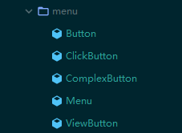
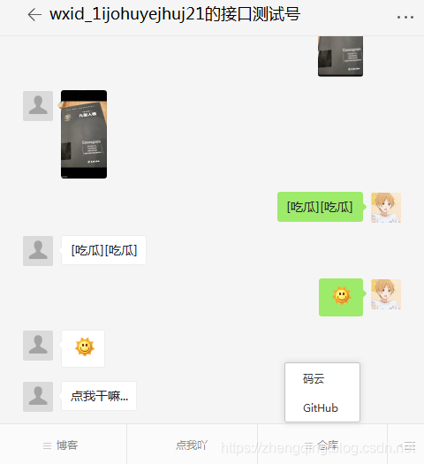

### 一、前言

1. [微信公众号开发 (1) 微信接入认证成为开发者](https://zhengqing.blog.csdn.net/article/details/86311495)
2. [微信公众号开发 (2) 消息处理](https://zhengqing.blog.csdn.net/article/details/103977209)

###### 本文将实现

1. 根据`AppID`和`AppSecret`获取`access_token`
2. 自定义菜单（`创建菜单`、`查询菜单`、`删除菜单`）

###### 微信文档中提示的一些注意点：

1. access_token的`存储`至少要保留`512`个`字符`空间。
2. access_token的`有效期`为`2小时`，需定时刷新，重复获取将导致上次获取的access_token失效
3. 自定义菜单最多`3个一级菜单`，每一级菜单最多`5个二级菜单`
4. `一级菜单最多4个汉字`，`二级菜单最多7个汉字`
5. `菜单刷新策略：`5分钟之后更新菜单。测试时可以尝试取消关注公众账号后再次关注，则可以看到创建后的效果

### 二、`RestTemplate`配置 (用于远程`调用`微信http`接口`方法)

RestTemplate是Spring提供的用于访问Rest服务的客户端,RestTemplate提供了多种便捷访问远程Http服务的方法,能够大大提高客户端的编写效率。

```java
@Configuration
public class RestTemplateConfig {

    @Bean
    public RestTemplate restTemplate() {
        RestTemplate restTemplate = new RestTemplate();
        // 解决post请求中文乱码问题
        restTemplate.getMessageConverters().set(1, new StringHttpMessageConverter(StandardCharsets.UTF_8));
        return restTemplate;
    }

}
```

### 三、微信接口调用说明

1. 获取access_token接口 ： `【GET请求】`  `https://api.weixin.qq.com/cgi-bin/token?grant_type=client_credential&appid=APPID&secret=APPSECRET` 
2. 查询菜单接口 ： `【GET请求】` `https://api.weixin.qq.com/cgi-bin/menu/get?access_token=ACCESS_TOKEN`
3. 删除菜单接口 : `【GET请求】` `https://api.weixin.qq.com/cgi-bin/menu/delete?access_token=ACCESS_TOKEN`
4. 创建菜单接口 : `【POST请求】` `https://api.weixin.qq.com/cgi-bin/menu/create?access_token=ACCESS_TOKEN`

###### 封装微信接口所需变量

```java
public class Constants {
    /**
     * TODO 填写自己的 `appID` 和 `appsecret`
     */
    public static final String APP_ID = "xxx";
    public static final String APP_SECRET = "xxx";

    /**
     * 通过 `GET请求方式` 获取 `access_token`
     */
    public static final String GET_ACCESS_TOKEN_URL = "https://api.weixin.qq.com/cgi-bin/token?grant_type=client_credential&appid=APPID&secret=APPSECRET";
    /**
     * TODO 只做临时方便测试使用
     */
    public static final String ACCESS_TOKEN = "xxx";

    /**
     * 查询菜单接口 - GET请求
     */
    public static final String GET_MENU_URL = "https://api.weixin.qq.com/cgi-bin/menu/get?access_token=ACCESS_TOKEN";
    /**
     * 删除菜单接口 - GET请求 （注意，在个性化菜单时，调用此接口会删除默认菜单及全部个性化菜单）
     */
    public static final String DELETE_MENU_URL = "https://api.weixin.qq.com/cgi-bin/menu/delete?access_token=ACCESS_TOKEN";
    /**
     * 创建菜单接口 - POST请求
     */
    public static final String CREATE_MENU_URL = "https://api.weixin.qq.com/cgi-bin/menu/create?access_token=ACCESS_TOKEN";

}
```

###  四、根据`AppID`和`AppSecret`获取`access_token`
access_token是公众号的全局唯一接口调用凭据，公众号调用各接口（下面的`创建菜单`、`查询菜单`、`删除菜单`等）时都需使用access_token！

> [这里可查看微信文档获取access_token方式](https://developers.weixin.qq.com/doc/offiaccount/Basic_Information/Get_access_token.html)

###### ① 封装响应结果`AccessTokenVO`

```java
@Data
@ApiModel(description = "access_token: 公众号的全局唯一接口调用凭据")
public class AccessTokenVO {

    @ApiModelProperty(value = "获取到的凭证")
    private String access_token;

    @ApiModelProperty(value = "凭证有效时间，单位：秒(微信目前暂7200秒，即2小时，过期后需再次获取)")
    private int expires_in;

}
```

###### ② 服务类

```java
public interface IWeixinService {

    /**
     * 根据AppID和AppSecret获取access_token
     *
     * @param appId:
     * @param appSecret:
     * @return: com.zhengqing.demo.modules.weixin.model.AccessTokenVO
     */
    AccessTokenVO getAccessToken(String appId, String appSecret);

}
```

###### ③ 服务实现类

```java
@Slf4j
@Service
public class WeixinServiceImpl implements IWeixinService {

    @Autowired
    private RestTemplate restTemplate;

    @Override
    public AccessTokenVO getAccessToken(String appId, String appSecret) {
        AccessTokenVO accessTokenVO = restTemplate.getForObject(Constants.GET_ACCESS_TOKEN_URL.replace("APPID", appId).replace("APPSECRET", appSecret), AccessTokenVO.class);
        return accessTokenVO;
    }

}
```

###  五、自定义菜单处理

#### `click`和`view`请求示例

```
{
     "button":[
     {	
          "type":"click",
          "name":"今日歌曲",
          "key":"V1001_TODAY_MUSIC"
      },
      {
           "name":"菜单",
           "sub_button":[
           {	
               "type":"view",
               "name":"搜索",
               "url":"http://www.soso.com/"
            },
            {
                 "type":"miniprogram",
                 "name":"wxa",
                 "url":"http://mp.weixin.qq.com",
                 "appid":"wx286b93c14bbf93aa",
                 "pagepath":"pages/lunar/index"
             },
            {
               "type":"click",
               "name":"赞一下我们",
               "key":"V1001_GOOD"
            }]
       }]
 }
```

#### 1、封装菜单数据

> 温馨小提示：这里封装数据建议多看下微信文档中给出的数据，不然可能会对最后组装菜单树数据创建菜单的时候感到迷惑 ~



###### ① 菜单类型枚举类

```java
public enum MenuType {
    // 点击式菜单
    CLICK("click"),
    // 链接式菜单
    VIEW("view");
}
```

###### ② 菜单 - 基类

```java
@Data
@ApiModel(description = "菜单 - 基类")
public class Button {

    @ApiModelProperty(value = "菜单标题，不超过16个字节，子菜单不超过60个字节")
    private String name;

}
```

###### ③ 点击式菜单

```java
@Data
@ApiModel(description = "用户点击菜单可接收消息推送")
public class ClickButton extends Button {

    @ApiModelProperty(value = "菜单的响应动作类型，view表示网页类型，click表示点击类型，miniprogram表示小程序类型")
    private String type = MenuType.CLICK.getType();

    @ApiModelProperty(value = "菜单KEY值，用于消息接口推送，不超过128字节")
    private String key;

}
```

###### ④ 链接式菜单

```java
@Data
@ApiModel(description = "用户点击菜单可打开链接")
public class ViewButton extends Button {

    @ApiModelProperty(value = "菜单的响应动作类型，view表示网页类型，click表示点击类型，miniprogram表示小程序类型")
    private String type = MenuType.VIEW.getType();

    @ApiModelProperty(value = "(view、miniprogram类型必须) 网页 链接，用户点击菜单可打开链接，不超过1024字节。 type为miniprogram时，不支持小程序的老版本客户端将打开本url")
    private String url;

}
```

###### ⑤ 含二级菜单的一级菜单

```java
@Data
@ApiModel(description = "含二级菜单的一级菜单")
public class ComplexButton extends Button {

    @ApiModelProperty(value = "二级菜单数组，个数应为1~5个")
    private Button[] sub_button;

}
```

###### ⑥ 最外层的菜单树

```java
@Data
@ApiModel(description = "菜单树")
public class Menu {

    @ApiModelProperty(value = "一级菜单数组，个数应为1~3个")
    private Button[] button;

}
```

#### 2、服务类

```java
public interface IMenuService {

    /**
     * 查询菜单
     *
     * @param accessToken:访问凭据
     * @return: java.lang.Object
     */
    Object getMenu(String accessToken);

    /**
     * 删除菜单
     *
     * @param accessToken:访问凭据
     * @return: com.zhengqing.demo.modules.weixin.model.WeixinResponseResult
     */
    WeixinResponseResult deleteMenu(String accessToken);

    /**
     * 创建菜单
     *
     * @param menu        : 创建的菜单数据
     * @param accessToken : 访问凭据
     * @return: com.zhengqing.demo.modules.weixin.model.WeixinResponseResult
     */
    WeixinResponseResult createMenu(Menu menu, String accessToken);

}
```

#### 3、服务实现类

```java
@Slf4j
@Service
public class MenuServiceImpl implements IMenuService {

    @Autowired
    private RestTemplate restTemplate;


    @Override
    public Object getMenu(String accessToken) {
        Object menu = restTemplate.getForObject(Constants.GET_MENU_URL.replace("ACCESS_TOKEN", accessToken), Object.class);
        return menu;
    }

    @Override
    public WeixinResponseResult deleteMenu(String accessToken) {
        WeixinResponseResult result = restTemplate.getForObject(Constants.DELETE_MENU_URL.replace("ACCESS_TOKEN", accessToken), WeixinResponseResult.class);
        return result;
    }

    @Override
    public WeixinResponseResult createMenu(Menu menu, String accessToken) {
        // 将菜单对象转换成json字符串
        String jsonMenu = JSON.toJSONString(menu);
        WeixinResponseResult result = restTemplate.postForObject(Constants.CREATE_MENU_URL.replace("ACCESS_TOKEN", accessToken), jsonMenu, WeixinResponseResult.class);
        return result;
    }

}
```

###  六、测试

###### 1、获取`access_token`

```java
@Slf4j
@RunWith(SpringRunner.class)
@SpringBootTest(classes = DemoApplication.class)
public class WeixinTest {

    @Autowired
    private IWeixinService weixinService;

    @Test // 获取 `access_token`
    public void getAccessToken() throws Exception {
        AccessTokenVO accessTokenVO = weixinService.getAccessToken(Constants.APP_ID, Constants.APP_SECRET);
        log.info("======================================== \n" + accessTokenVO.getAccess_token());
    }

}
```

###### 2、`创建自定义菜单`、`查询菜单`、`删除菜单`

注：这里小编将获取到的`access_token` 写死到常量 `Constants.ACCESS_TOKEN` 中做测试，实际项目中可将`access_token`保存到缓存中，每隔快到2个小时的时候去重新获取一次刷新缓存数据 ~

```java
@Slf4j
@RunWith(SpringRunner.class)
@SpringBootTest(classes = DemoApplication.class)
public class MenuTest {

    @Autowired
    private IMenuService menuService;

    @Test // 查询菜单
    public void getMenu() {
        Object menu = menuService.getMenu(Constants.ACCESS_TOKEN);
        log.info("======================================== \n" + JSON.toJSONString(menu));
    }

    @Test // 删除菜单
    public void deleteMenu() {
        WeixinResponseResult result = menuService.deleteMenu(Constants.ACCESS_TOKEN);
        log.info("======================================== \n" + result);
    }

    @Test // 创建菜单
    public void createMenu() {
        WeixinResponseResult result = menuService.createMenu(createMenuTree(), Constants.ACCESS_TOKEN);
        log.info("======================================== \n" + result);
    }

    /**
     * 菜单数据
     */
     private Menu createMenuTree() {
        // 链接式菜单
        ViewButton btn11 = new ViewButton();
        btn11.setName("CSDN");
        btn11.setUrl("https://zhengqing.blog.csdn.net/");

        ViewButton btn12 = new ViewButton();
        btn12.setName("个人博客");
        btn12.setUrl("http://zhengqingya.gitee.io/blog/");

        // 点击式菜单
        ClickButton mainBtn2 = new ClickButton();
        mainBtn2.setName("点我吖");
        mainBtn2.setKey("hello");

        ViewButton btn31 = new ViewButton();
        btn31.setName("码云");
        btn31.setUrl("https://gitee.com/zhengqingya/projects");

        ViewButton btn32 = new ViewButton();
        btn32.setName("GitHub");
        btn32.setUrl("https://github.com/zhengqingya?tab=repositories");

        // 含二级菜单的一级菜单
        ComplexButton mainBtn1 = new ComplexButton();
        mainBtn1.setName("博客");
        mainBtn1.setSub_button(new ViewButton[]{btn11, btn12});

        ComplexButton mainBtn3 = new ComplexButton();
        mainBtn3.setName("仓库");
        mainBtn3.setSub_button(new ViewButton[]{btn31, btn32});

        Menu menu = new Menu();
        menu.setButton(new Button[]{mainBtn1, mainBtn2, mainBtn3});

        return menu;
    }

}
```

最终自定义的菜单



### 本文案例demo源码

[https://gitee.com/zhengqingya/java-workspace](https://gitee.com/zhengqingya/java-workspace)


