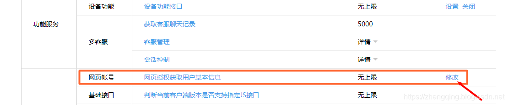
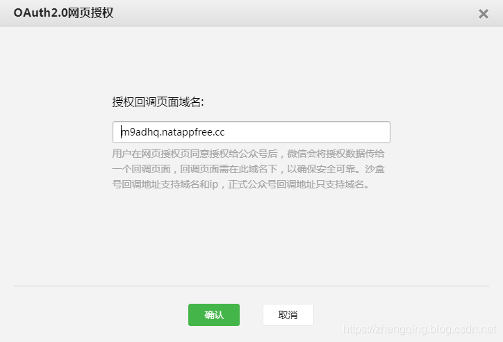
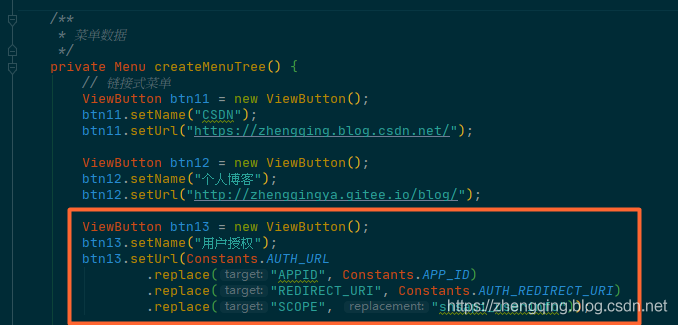
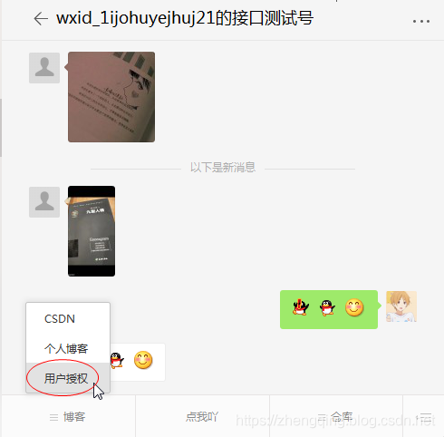
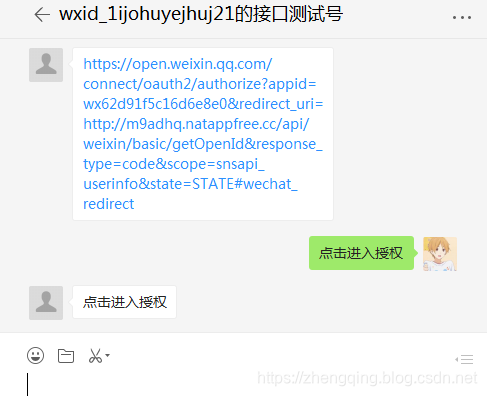
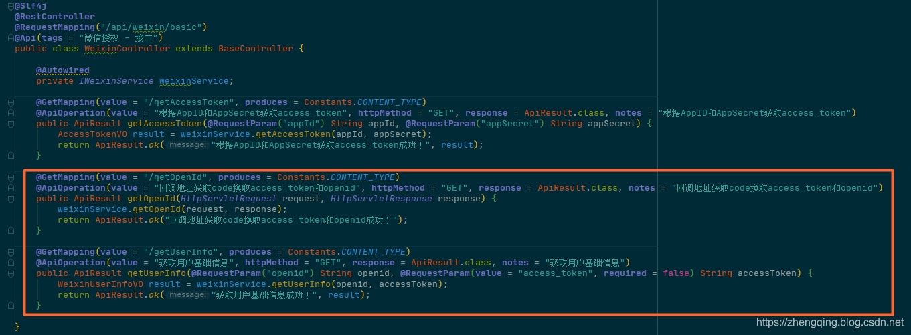
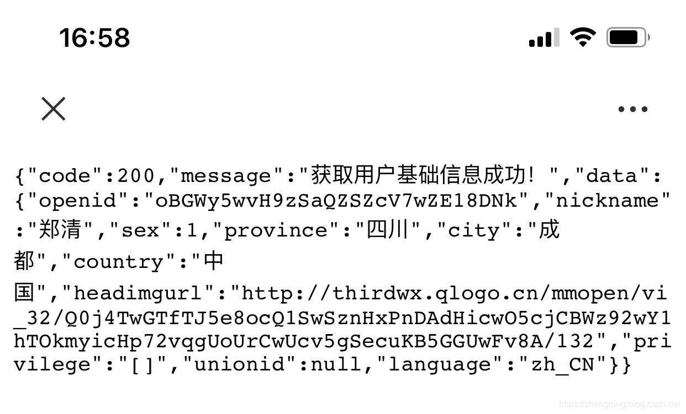

### 一、前言

1. [微信公众号开发 (1) 微信接入认证成为开发者](https://zhengqing.blog.csdn.net/article/details/86311495)
2. [微信公众号开发 (2) 消息处理](https://zhengqing.blog.csdn.net/article/details/103977209)
3. [微信公众号开发 (3) 菜单处理](https://zhengqing.blog.csdn.net/article/details/104005562)

###### 本文将实现

1. 网页授权
2. 获取用户基本信息

###### 网页授权流程

1. `填写`网页授权`回调域名`
2. 引导用户进入授权页面同意`授权`，`获取code`
3. 通过`code` `换` 取网页授权`access_token` 和 `openid` （注：与基础支持中的access_token不同）
4. `刷新`网页授权`access_token`，避免过期（可选择性操作）
5. `通过`网页授权`access_token和openid获取用户基本信息`（支持UnionID机制）

### 二、填写网页授权回调域名

`测试号`在如下地址中，`体验接口权限表` -> `网页帐号` -> `修改`
[http://mp.weixin.qq.com/debug/cgi-bin/sandboxinfo?action=showinfo&t=sandbox/index](http://mp.weixin.qq.com/debug/cgi-bin/sandboxinfo?action=showinfo&t=sandbox/index)


注：勿加 `http://` 等协议头！


### 三、授权相关接口

> 温馨小提示：接口相关参数说明可直接查看微信官方文档 [https://developers.weixin.qq.com/doc/offiaccount/OA_Web_Apps/Wechat_webpage_authorization.html](https://developers.weixin.qq.com/doc/offiaccount/OA_Web_Apps/Wechat_webpage_authorization.html)

###### 1、用户授权页面

```
https://open.weixin.qq.com/connect/oauth2/authorize?appid=APPID&redirect_uri=REDIRECT_URI&response_type=code&scope=SCOPE&state=STATE#wechat_redirect
```

| 参数       | 是否必须 | 说明                     |
| ---------- | -------- | ------------------------ |
| `appid`            | 是       | 公众号的唯一标识                                             |
| `redirect_uri`    | 是       | 授权后重定向的回调链接地址， 请使用 urlEncode 对链接进行处理 |
| response_type    | 是       | 返回类型，请填写code                                         |
| `scope`            | 是       | 应用授权作用域，`snsapi_base` （不弹出授权页面，直接跳转，只能获取用户openid），`snsapi_userinfo` （弹出授权页面，可通过openid拿到昵称、性别、所在地。并且， 即使在未关注的情况下，只要用户授权，也能获取其信息 ） |
| state            | 否       | 重定向后会带上state参数，开发者可以填写a-zA-Z0-9的参数值，最多128字节 |
| #wechat_redirect | 是       | 无论直接打开还是做页面302重定向时候，必须带此参数            |

###### 2、通过`code`换取网页授权`access_token`和`openid` 

```
【GET请求】https://api.weixin.qq.com/sns/oauth2/access_token?appid=APPID&secret=SECRET&code=CODE&grant_type=authorization_code
```

| 参数       | 是否必须 | 说明                     |
| ---------- | -------- | ------------------------ |
| `appid`      | 是       | 公众号的唯一标识         |
| `secret`     | 是       | 公众号的appsecret        |
| `code`       | 是       | 填写第一步获取的code参数 |
| grant_type | 是       | 填写为authorization_code |

###### 3、刷新access_token（如果需要）

```
【GET请求】https://api.weixin.qq.com/sns/oauth2/refresh_token?appid=APPID&grant_type=refresh_token&refresh_token=REFRESH_TOKEN
```

| 参数          | 是否必须 | 说明                                          |
| ------------- | -------- | --------------------------------------------- |
| `appid`         | 是       | 公众号的唯一标识                              |
| grant_type    | 是       | 填写为refresh_token                           |
| `refresh_token` | 是       | 填写通过access_token获取到的refresh_token参数 |

###### 4、获取用户信息(需scope为 `snsapi_userinfo`) 

```
【GET请求】https://api.weixin.qq.com/sns/userinfo?access_token=ACCESS_TOKEN&openid=OPENID&lang=zh_CN
```

| 参数         | 描述                                                         |
| ------------ | ------------------------------------------------------------ |
| `access_token` | 网页授权接口调用凭证,注意：此access_token与基础支持的access_token不同 |
| `openid`       | 用户的唯一标识                                               |
| lang         | 返回国家地区语言版本，zh_CN 简体，zh_TW 繁体，en 英语        |

###### 5、检验授权凭证（access_token）是否有效

```
【GET请求】https://api.weixin.qq.com/sns/auth?access_token=ACCESS_TOKEN&openid=OPENID
```

| 参数         | 描述                                                         |
| ------------ | ------------------------------------------------------------ |
| `access_token` | 网页授权接口调用凭证,注意：此access_token与基础支持的access_token不同 |
| `openid`       | 用户的唯一标识                                               |

---

### 注：下面部分只贴出了重要代码部分，完整案例可参考文末提供的源码

---

### 四、引导用户进入授权页面同意授权 -> 获取code

###### 方式①：通过创建`链接式菜单(view)`




###### 方式②：直接发送授权url消息，用户点击进入授权

```
https://open.weixin.qq.com/connect/oauth2/authorize?appid=wx62d91f5c16d6e8e0&redirect_uri=http://m9adhq.natappfree.cc/api/weixin/basic/getOpenId&response_type=code&scope=snsapi_userinfo&state=STATE#wechat_redirect
```


授权相关的几个api接口如下：


### 五、通过`code`换取网页授权`access_token`和`openid`（与基础支持中的access_token不同）

用户同意授权后，页面将跳转至 `redirect_uri/?code=CODE&state=STATE` 

> code说明 ： code作为换取access_token的票据，每次用户授权带上的code将不一样，code只能使用一次，5分钟未被使用自动过期。

注：小编这里拿到`access_token`和`openid`之后将页面重定向到了获取用户信息的接口，然后返回json用户信息数据~

```java
public void getOpenId(HttpServletRequest request, HttpServletResponse response) {
    String code = request.getParameter("code");
    String state = request.getParameter("state");

    log.debug("======================================= \n code值：" + code);

    String responseContent = restTemplate.getForObject(Constants.AUTH_GET_ACCESS_TOKEN_AND_OPENID
            .replace("APPID", Constants.APP_ID)
            .replace("SECRET", Constants.APP_SECRET)
            .replace("CODE", code), String.class);
    JSONObject result = JSON.parseObject(responseContent);
    String accessToken = result.getString("access_token");
    String openid = result.getString("openid");
    String refreshToken = result.getString("refresh_token");

    log.debug("======================================= \n access_token值：" + accessToken + "\n  openid值：" + openid);

    String redirectUrl = "http://m9adhq.natappfree.cc/api/weixin/basic/getUserInfo?openid=" + openid + "&access_token=" + accessToken;
    try {
        // 授权之后重定向到指定URL（这里是跳转到获取用户基本信息接口）
        response.sendRedirect(redirectUrl);
    } catch (IOException e) {
        e.printStackTrace();
    }
}
```

### 六、获取微信用户基本信息

```java
public WeixinUserInfoVO getUserInfo(String openId, String accessToken) {
    WeixinUserInfoVO weixinUserInfoVO = null;
    String responseContent = restTemplate.getForObject(Constants.AUTH_GET_USER_INFO
            .replace("ACCESS_TOKEN", accessToken)
            .replace("OPENID", openId), String.class);
    weixinUserInfoVO = JSON.parseObject(responseContent, WeixinUserInfoVO.class);
    return weixinUserInfoVO;
}
```

其中`WeixinUserInfoVO`基本信息类

```java
@Data
@ApiModel(description = "微信用户基本信息")
public class WeixinUserInfoVO {

    @ApiModelProperty(value = "用户的唯一标识")
    private String openid;

    @ApiModelProperty(value = "用户昵称")
    private String nickname;

    @ApiModelProperty(value = "用户的性别，值为1时是男性，值为2时是女性，值为0时是未知")
    private Integer sex;

    @ApiModelProperty(value = "用户个人资料填写的省份")
    private String province;

    @ApiModelProperty(value = "普通用户个人资料填写的城市")
    private String city;

    @ApiModelProperty(value = "国家，如中国为CN")
    private String country;

    @ApiModelProperty(value = "用户头像，最后一个数值代表正方形头像大小（有0、46、64、96、132数值可选，0代表640*640正方形头像），用户没有头像时该项为空。若用户更换头像，原有头像URL将失效。")
    private String headimgurl;

    @ApiModelProperty(value = "用户特权信息，json 数组，如微信沃卡用户为（chinaunicom）")
    private String privilege;

    @ApiModelProperty(value = "只有在用户将公众号绑定到微信开放平台帐号后，才会出现该字段。")
    private String unionid;

    @ApiModelProperty(value = "返回国家地区语言版本，zh_CN 简体，zh_TW 繁体，en 英语")
    private String language;

}
```

响应数据如下：


这里获取到用户信息之后，也就可以写页面，然后进行自己的业务交互了... (`openid：微信用户的唯一标识`)

### 七、刷新access_token（如果需要） 

由于access_token拥有较短的有效期，当access_token超时后，可以使用refresh_token进行刷新，refresh_token有效期为30天，当refresh_token失效之后，需要用户重新授权。

```java
public String refreshAccessToken(String appId, String refreshToken) {
    String responseResult = restTemplate.getForObject(Constants.AUTH_REFRESH_ACCESS_TOKEN
            .replace("APPID", appId)
            .replace("REFRESH_TOKEN", refreshToken), String.class);
    JSONObject jsonObject = JSON.parseObject(responseResult);
    return jsonObject.getString("access_token");
}
```

### 八、检验授权凭证（access_token）是否有效

```java
public WeixinResponseResult checkAccessToken(String openId, String accessToken) {
     String responseResult = restTemplate.getForObject(Constants.AUTH_CHECK_ACCESS_TOKEN
             .replace("ACCESS_TOKEN", accessToken)
             .replace("OPENID", openId), String.class);
     WeixinResponseResult weixinResponseResult = JSON.parseObject(responseResult, WeixinResponseResult.class);
     if (weixinResponseResult.getErrcode() != 0) {
         log.error("授权凭证无效：" + responseResult);
         throw new MyException(weixinResponseResult.getErrcode(), weixinResponseResult.getErrmsg());
     }
     return weixinResponseResult;
 }
```

### 九、总结

1. 微信公众号开发网上有很多教程，但针对于每一个开发者的环境以及语言不同而有所差异，建议认真看微信提供的官方文档去学习，大致也就是`查看文档` `封装数据` `调微信api接口` `业务处理`
2. 关于微信公众号开发小编也已经写了几篇了，大家在学习完微信官方提供的原始api之后，GitHub以及Gitee等上面有很多大神已经封装好了优秀的开源sdk，这时候我们有了一定的微信开发基础就可以去阅读参考学习
3. 小编建议大家在学习遇到问题，查看别人如何实现以及解决问题的时候，更多的是去学习思维方式处理逻辑，而不是拿到就跑，虽然写代码也不过就是复制黏贴运行完无bug就万事大吉，但我们也要 知其然知其所以然 ！

### 本文案例demo源码

[https://gitee.com/zhengqingya/java-workspace](https://gitee.com/zhengqingya/java-workspace)


