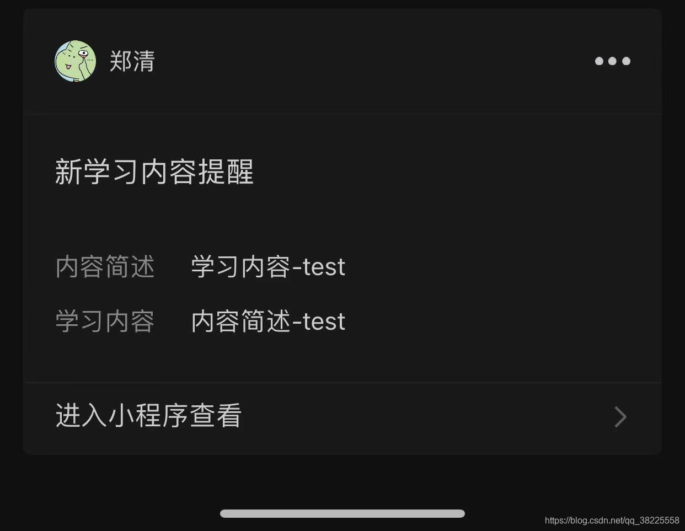
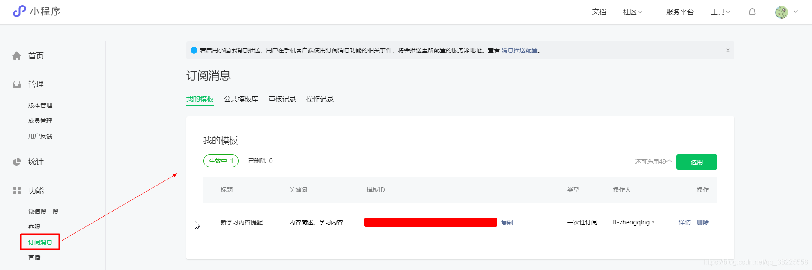

### 一、前言

1. 本文将基于springboot实现小程序 - 订阅消息通知
2. 可参考微信小程序订阅消息文档：[https://developers.weixin.qq.com/miniprogram/dev/framework/open-ability/subscribe-message.html](https://developers.weixin.qq.com/miniprogram/dev/framework/open-ability/subscribe-message.html)



### 二、获取模板 ID

> [https://mp.weixin.qq.com/wxamp/newtmpl/mytmpl?start=0&limit=10&token=721590608&lang=zh_CN](https://mp.weixin.qq.com/wxamp/newtmpl/mytmpl?start=0&limit=10&token=721590608&lang=zh_CN)

到`小程序-订阅消息-公共模板库`下选用模板

注：`{{thing2.DATA}}`和`{{thing1.DATA}}`为模板动态值


### 三、小程序端获取消息通知权限

> [https://developers.weixin.qq.com/miniprogram/dev/api/open-api/subscribe-message/wx.requestSubscribeMessage.html](https://developers.weixin.qq.com/miniprogram/dev/api/open-api/subscribe-message/wx.requestSubscribeMessage.html)

```javascript
// 小程序端示例代码
wx.requestSubscribeMessage({
  tmplIds: [''],
  success (res) { }
})
```

### 四、服务端编写消息通知代码

> [https://developers.weixin.qq.com/miniprogram/dev/api-backend/open-api/subscribe-message/subscribeMessage.send.html](https://developers.weixin.qq.com/miniprogram/dev/api-backend/open-api/subscribe-message/subscribeMessage.send.html)

```java
@Slf4j
public class DemoTest {

    @Test
    public void testPushWxMaMsg() {
        // TODO 1、填写自己的数据
        final String APPID = "xxx";
        final String APPSECRET = "xxx";
        final String touser = "xxx";
        final String template_id = "xxx";
        final String url = "pages/index/index";
        final HashMap<String, Object> templateDataMap = new HashMap<String, Object>() {
            {
                put("thing1", new HashMap<String, String>() {{
                    put("value", "内容简述-test");
                }});
                put("thing2", new HashMap<String, String>() {{
                    put("value", "学习内容-test");
                }});
            }
        };

        // 2、发送订阅消息
        Map<String, String> resultMap = this.sendWxMaMsg(WxMaTemplateMsgBO.builder()
                .access_token(this.getAccessToken(APPID, APPSECRET))
                .touser(touser)
                .template_id(template_id)
                .page(url)
                .miniprogram_state("developer")
                .data(templateDataMap)
                .lang("zh_CN")
                .build());
        log.info("小程序-发送订阅消息结果：{}", resultMap);
    }

    /**
     * 小程序-发送订阅消息
     *
     * @param wxMaTemplateMsgBO: 请求参数
     * @return 通知结果
     * @author zhengqingya
     * @date 2021/7/6 10:13
     */
    public Map<String, String> sendWxMaMsg(WxMaTemplateMsgBO wxMaTemplateMsgBO) {
        String sendWxMaMsgRequestUrl = String.format("https://api.weixin.qq.com/cgi-bin/message/subscribe/send?access_token=%s", wxMaTemplateMsgBO.getAccess_token());
        return new RestTemplate().postForEntity(sendWxMaMsgRequestUrl, wxMaTemplateMsgBO, Map.class).getBody();
    }


    /**
     * 获取小程序全局唯一后台接口调用凭据（access_token）
     *
     * @param appid:  小程序唯一凭证，即 AppID，可在「微信公众平台 - 设置 - 开发设置」页中获得。（需要已经成为开发者，且帐号没有异常状态）
     * @param secret: 小程序唯一凭证密钥，即 AppSecret，获取方式同 appid
     * @return 调用凭据
     * @author zhengqingya
     * @date 2021/7/6 10:04
     */
    private String getAccessToken(String appid, String secret) {
        String accessTokenRequestUrl = String.format("https://api.weixin.qq.com/cgi-bin/token?grant_type=client_credential&appid=%s&secret=%s", appid, secret);
        Map<String, String> tokenMap = new RestTemplate().getForObject(accessTokenRequestUrl, Map.class);
        return CollectionUtils.isEmpty(tokenMap) ? "" : tokenMap.get("access_token");
    }

}
```

运行之后，即可去微信上查看消息通知了 `^ _ ^`

### 本文案例demo源码

[https://gitee.com/zhengqingya/java-workspace](https://gitee.com/zhengqingya/java-workspace)

---

> 今日分享语句：要么读书、要么旅行,灵魂和身体,必须有一个在路上。
