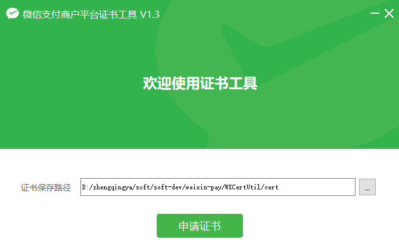

# 微信支付

### 一、微信支付 -> 申请证书

https://pay.weixin.qq.com

#### 1、`账号中心` -> `安全中心` -> `设置操作密码`

#### 2、`账号中心` -> `API安全`

##### 2.1、申请API证书

> tips: 可参考 https://kf.qq.com/faq/161222NneAJf161222U7fARv.html

1. 下载证书工具进行安装
   
2. 在【证书工具】，填写商户号信息（商户号、商户名称），点击下一步
3. 在【证书工具】，复制证书请求串到商户平台
4. 在【商户平台】，输入操作密码，安全验证后生成证书串
5. 在【商户平台】，复制证书串，到证书工具中下一步
6. 在【证书工具】，粘贴证书串，点击下一步，申请证书成功

记得保存好证书！！！

#### 2.2、设置API密钥

java生成32位密钥：`cn.hutool.crypto.SecureUtil.md5("xxx")`

### 二、授权小程序使用微信支付

#### `产品中心` -> `AppID账号管理` -> `我关联的AppID账号` -> `关联AppID`

申请授权小程序使用微信支付

### 三、微信公众平台

https://mp.weixin.qq.com

#### `微信支付` -> `待关联商户号` -> `商户号管理`

确认授权

### 四、`微信支付` -> `产品中心`

开通商户号有关产品权限用于支付 eg: `JSAPI支付`

### 五、项目开发

