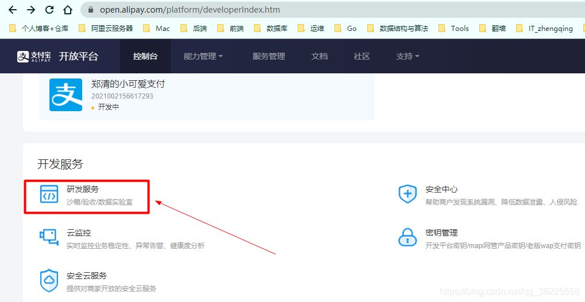
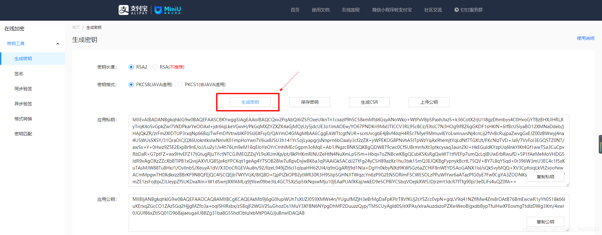
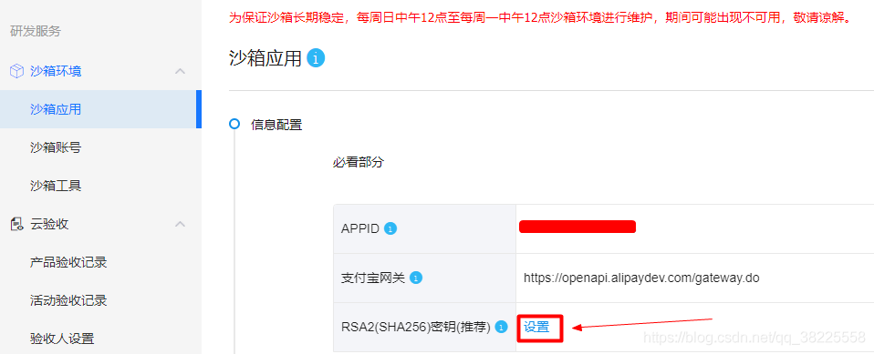
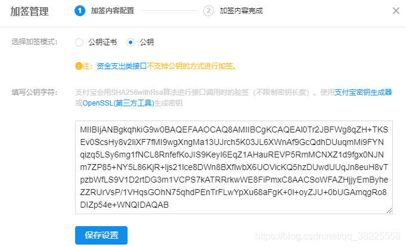
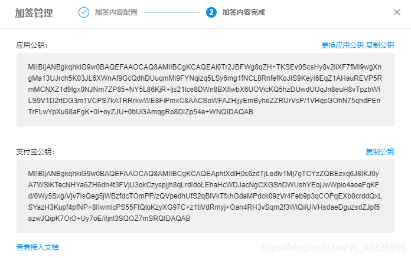
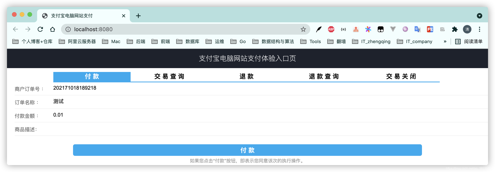
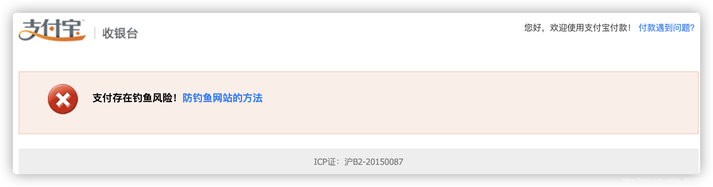
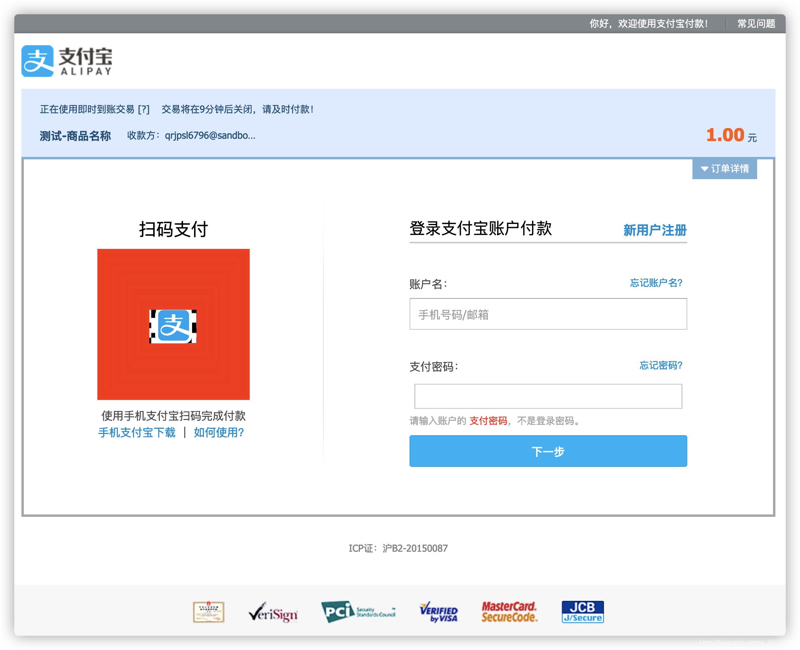

### 一、前言

本文将基于 `springboot+沙箱环境` 来简单实现支付宝的`电脑网站支付`功能

### 二、获取所需配置参数信息

1. APPID
2. 支付宝网关
3. 支付宝公钥
4. RSA2私钥

`登录支付宝` -> `研发服务` -> `沙箱`  [https://open.alipay.com/platform/appDaily.htm?tab=info](https://open.alipay.com/platform/appDaily.htm?tab=info)

设置`RSA2`

> 在线生成密钥工具：[https://miniu.alipay.com/keytool/create](https://miniu.alipay.com/keytool/create)
> 







> 沙箱钱包自己下载使用官网提供的沙箱账号登录即可.
> 


### 三、官网提供的电脑网站支付 Demo

> [https://opendocs.alipay.com/open/270/106291](https://opendocs.alipay.com/open/270/106291)
> 注：这个demo就自己tomcat跑一下看看吧，比较简单，记得修改一下`AlipayConfig`配置文件参数即可~




### 四、SpringBoot版Demo

> api文档： [https://opendocs.alipay.com/apis](https://opendocs.alipay.com/apis)

#### 1、`pom.xml`中新增依赖

```xml
<!-- alipay -->
<!-- https://mvnrepository.com/artifact/com.alipay.sdk/alipay-sdk-java -->
 <dependency>
     <groupId>com.alipay.sdk</groupId>
     <artifactId>alipay-sdk-java</artifactId>
     <version>4.15.6.ALL</version>
 </dependency>
```

#### 2、`application.yml`中添加配置

> 根据自己的配置修改即可

```yml
alipay:
  # 应用ID,您的APPID，收款账号既是您的APPID对应支付宝账号
  app_id: xxx
  # 商户私钥，您的PKCS8格式RSA2私钥
  merchant_private_key: xxx
  # 支付宝公钥,查看地址：https://openhome.alipay.com/platform/keyManage.htm 对应APPID下的支付宝公钥。
  alipay_public_key: xxx
  # 服务器异步通知页面路径  需http://格式的完整路径，不能加?id=123这类自定义参数 [需外网能访问]
  notify_url: http://tw6zc5.natappfree.cc/error.html
  # 页面跳转同步通知页面路径 需http://格式的完整路径，不能加?id=123这类自定义参数 [需外网能访问]
  return_url: http://tw6zc5.natappfree.cc/success
  # 签名方式
  sign_type: RSA2
  # 字符编码格式
  charset: utf-8
  # 支付宝网关
  gatewayUrl: https://openapi.alipaydev.com/gateway.do
  # 日志路径
  log_path: "log/"
```

#### 3、配置类

```java
@Data
@Configuration
@ConfigurationProperties(prefix = "alipay", ignoreUnknownFields = false)
public class AlipayConfigProperty {

    /**
     * 应用ID,您的APPID，收款账号既是您的APPID对应支付宝账号
     */
    public String app_id;

    /**
     * 商户私钥，您的PKCS8格式RSA2私钥
     */
    public String merchant_private_key;

    /**
     * 支付宝公钥,查看地址：https://openhome.alipay.com/platform/keyManage.htm 对应APPID下的支付宝公钥。
     */
    public String alipay_public_key;

    /**
     * 服务器异步通知页面路径  需http://格式的完整路径，不能加?id=123这类自定义参数，必须外网可以正常访问
     */
    public String notify_url;

    /**
     * 页面跳转同步通知页面路径 需http://格式的完整路径，不能加?id=123这类自定义参数，必须外网可以正常访问
     */
    public String return_url;

    /**
     * 签名方式
     */
    public String sign_type;

    /**
     * 字符编码格式
     */
    public String charset;

    /**
     * 支付宝网关
     */
    public String gatewayUrl;

    /**
     * 日志路径
     */
    public String log_path;

}
```

#### 4、测试支付接口

```java
@Slf4j
@Controller
@RequestMapping("")
@Api(tags = {"测试支付接口"})
public class TestController {

    @Autowired
    private AlipayConfigProperty alipayConfigProperty;

    @GetMapping("/index")
    public String index() {
        return "index.html";
    }

    // http://127.0.0.1:8080/alipay
    @ApiOperation("支付")
    @GetMapping(value = "alipay")
    @ResponseBody
    @SneakyThrows(Exception.class)
    public String alipay() {
        //获得初始化的AlipayClient
        AlipayClient alipayClient = new DefaultAlipayClient(alipayConfigProperty.gatewayUrl, alipayConfigProperty.app_id, alipayConfigProperty.merchant_private_key, "json", alipayConfigProperty.charset, alipayConfigProperty.alipay_public_key, alipayConfigProperty.sign_type);

        //设置请求参数
        AlipayTradePagePayRequest alipayRequest = new AlipayTradePagePayRequest();
        alipayRequest.setReturnUrl(alipayConfigProperty.return_url);
        alipayRequest.setNotifyUrl(alipayConfigProperty.notify_url);

        //商户订单号，商户网站订单系统中唯一订单号，必填
        String out_trade_no = "008";
        //付款金额，必填
        String total_amount = "1";
        //订单名称，必填
        String subject = "测试-商品名称";
        //商品描述，可空
        String body = "测试-商品描述";

        alipayRequest.setBizContent("{\"out_trade_no\":\"" + out_trade_no + "\","
                + "\"total_amount\":\"" + total_amount + "\","
                + "\"subject\":\"" + subject + "\","
                + "\"body\":\"" + body + "\","
                + "\"product_code\":\"FAST_INSTANT_TRADE_PAY\"}");

        //若想给BizContent增加其他可选请求参数，以增加自定义超时时间参数timeout_express来举例说明
        //alipayRequest.setBizContent("{\"out_trade_no\":\""+ out_trade_no +"\","
        //		+ "\"total_amount\":\""+ total_amount +"\","
        //		+ "\"subject\":\""+ subject +"\","
        //		+ "\"body\":\""+ body +"\","
        //		+ "\"timeout_express\":\"10m\","
        //		+ "\"product_code\":\"FAST_INSTANT_TRADE_PAY\"}");
        //请求参数可查阅【电脑网站支付的API文档-alipay.trade.page.pay-请求参数】章节

        //请求
        String result = alipayClient.pageExecute(alipayRequest).getBody();
        log.info("[支付] 请求响应结果：{}", result);
        return result;
    }


    @ApiOperation("支付成功回调")
    @GetMapping(value = "success")
    @SneakyThrows(Exception.class)
    public String alipaySuccess(HttpServletRequest request) {
        //获取支付宝GET过来反馈信息
        Map<String, String> params = new HashMap<>();
        Map<String, String[]> requestParams = request.getParameterMap();
        for (Iterator<String> iter = requestParams.keySet().iterator(); iter.hasNext(); ) {
            String name = iter.next();
            String[] values = requestParams.get(name);
            String valueStr = "";
            for (int i = 0; i < values.length; i++) {
                valueStr = (i == values.length - 1) ? valueStr + values[i]
                        : valueStr + values[i] + ",";
            }
            //乱码解决，这段代码在出现乱码时使用
            valueStr = new String(valueStr.getBytes("ISO-8859-1"), "utf-8");
            params.put(name, valueStr);
        }

        // 验签
        boolean signVerified = AlipaySignature.rsaCheckV1(params, alipayConfigProperty.alipay_public_key, alipayConfigProperty.charset, alipayConfigProperty.sign_type); //调用SDK验证签名

        // 请在这里编写您的程序（以下代码仅作参考）——
        if (signVerified) {
            //商户订单号
            String out_trade_no = new String(request.getParameter("out_trade_no").getBytes("ISO-8859-1"), "UTF-8");

            //支付宝交易号
            String trade_no = new String(request.getParameter("trade_no").getBytes("ISO-8859-1"), "UTF-8");

            //付款金额
            String total_amount = new String(request.getParameter("total_amount").getBytes("ISO-8859-1"), "UTF-8");

            log.info("trade_no:" + trade_no + "<br/>out_trade_no:" + out_trade_no + "<br/>total_amount:" + total_amount);
            return "success.html";
        } else {
            log.error("验签失败");
            return "error.html";
        }
    }

}
```

#### 5、回调成功/失败 html页面

success.html

```html
<!DOCTYPE html>
<html>
<head>
    <meta charset="utf-8">
    <title></title>
</head>
<body>
<h1>SUCCESS</h1>
</body>
</html>
```

error.html

```html
<!DOCTYPE html>
<html>
<head>
    <meta charset="utf-8">
    <title></title>
</head>
<body>
<h1>ERROR</h1>
</body>
</html>
```


#### 6、运行

调用支付接口 [http://127.0.0.1:8080/alipay](http://127.0.0.1:8080/alipay)

> 温馨小提示：如果出现提示`支付存在钓鱼风险！` ，解决：换个浏览器清除所有缓存再次尝试即可！
> 


支付成功后，会回调我们配置的`return_url`地址，然后处理自己的业务即可...

### 五、本文案例demo源码

[https://gitee.com/zhengqingya/java-workspace](https://gitee.com/zhengqingya/java-workspace)

---

> 今日分享语句：
> 学会自在，自在就是真正的自由，真正从许多虚妄中解脱出来，真正让一颗心获得喜悦。
> 自在就是从有心到无心，从有我到无我，从有生到无生。


