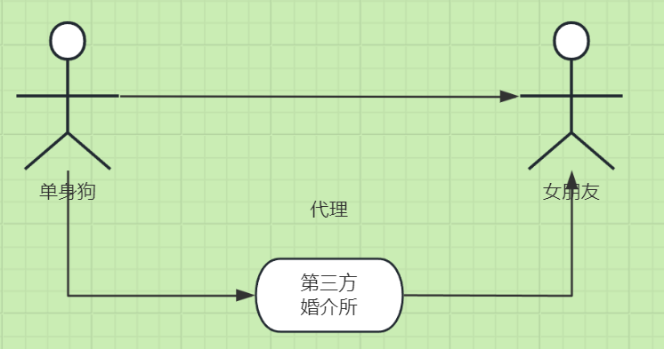

# 设计模式-静态代理



设计模式中的静态代理是一种结构型设计模式，它允许你提供一个代理对象来控制对另一个对象的访问。静态代理在编译时就已经确定了代理类和被代理类的关系。以下是静态代理的一些关键点：

- **代理类和被代理类实现相同的接口**：
    - 代理类和被代理类都实现同一个接口，这样代理类可以代替被代理类执行方法。

- **代理类中持有被代理类的引用**：
    - 代理类内部包含一个被代理类的实例引用，通过这个引用来调用被代理类的方法。

- **方法增强**：
    - 代理类可以在调用被代理类的方法前后添加额外的逻辑，例如日志记录、权限检查、事务管理等。

- **优点**：
    - 实现简单，易于理解。
    - 可以在不修改被代理类的情况下增加额外功能。

- **缺点**：
    - 每个被代理类都需要一个对应的代理类，导致类的数量增加。
    - 如果被代理类的方法较多，代理类的代码也会变得冗长。

静态代理适用于在编译时就已经明确代理类和被代理类的关系，并且需要对方法进行增强的场景。

### 示例代码

#### 1、用户service

```java
public interface UserService {
    Object selectList(String name);

    Object selectOne(String name);
}
```

#### 2、用户实现类

```java
public class UserServiceImpl implements UserService {
    @Override
    public Object selectList(String name) {
        System.out.println("执行了查询方法: " + name);
        return "ok";
    }

    @Override
    public Object selectOne(String name) {
        return "ok";
    }
}
```

#### 3、用户代理

```java
public class UserProxy implements UserService {

    private UserService userService;

    public UserProxy(UserService userService) {
        this.userService = userService;
    }

    @Override
    public Object selectList(String name) {
        System.out.println("代理类执行了 start...");
        Object list = this.userService.selectList(name);
        System.out.println("代理类执行了 end...");
        return list;
    }

    @Override
    public Object selectOne(String name) {
        System.out.println("代理类执行了 start...");
        Object one = this.userService.selectOne(name);
        System.out.println("代理类执行了 end...");
        return one;
    }
}
```

#### 4、测试代理模式

```java
import org.junit.Test;

public class TestProxy {
    @Test
    public void test() throws Exception {
        UserProxy userProxy = new UserProxy(new UserServiceImpl());
        Object xx = userProxy.selectList("xx");
        System.out.println(xx);
    }
}
```

输出结果：

```shell
代理类执行了 start...
执行了查询方法: xx
代理类执行了 end...
ok
```