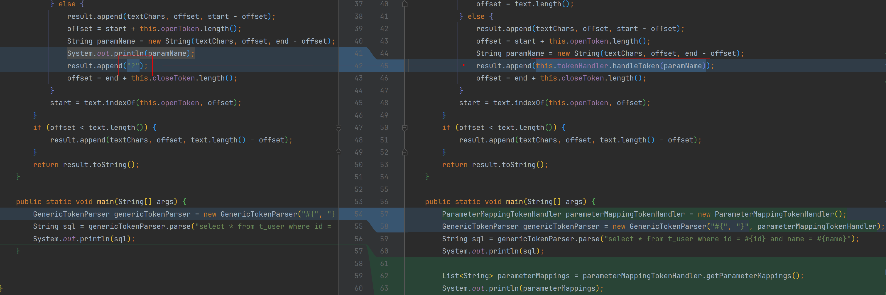

# 策略模式实现标记处理器

### 策略模式

允许你定义一系列算法，并将每个算法封装起来，使它们可以互换。
策略模式让算法独立于使用它的客户端而变化。

优点

- 灵活性： 可以在运行时动态地改变算法，客户端代码不需要修改。
- 可扩展性： 添加新的策略类非常简单，只需实现策略接口即可。
- 符合开闭原则： 对扩展开放，对修改关闭。可以添加新的策略类而不影响现有代码。

缺点

- 类数量增加： 每个具体的策略都需要一个单独的类，增加了类的数量。
- 客户端需要了解策略： 客户端需要了解不同的策略类，以便选择合适的策略。

### 通过策略模式实现标记处理器

#### 1、定义算法接口：标记处理器

```java
public interface TokenHandler {

    /**
     * 处理标记
     *
     * @param content 参数内容
     * @return 标记解析后的内容 eg: 参数名称 -> ?
     */
    String handleToken(String content);

}
```

#### 2、实现一个具体算法：参数处理器

```java
import com.google.common.collect.Lists;

import java.util.List;

public class ParameterMappingTokenHandler implements TokenHandler {

    private List<String> parameterMappings = Lists.newArrayList();

    public List<String> getParameterMappings() {
        return this.parameterMappings;
    }

    @Override
    public String handleToken(String content) {
        this.parameterMappings.add(content);
        return "?";
    }
}
```

#### 3、修改下SQL解析器，新增标记处理器来动态替换解析后的参数名称



通过这种方式，sql解析器可以在不修改代码的情况下，动态地选择不同的算法实现策略来完成解析替换操作。

```java
import cn.hutool.core.util.StrUtil;

import java.util.List;

public class GenericTokenParser {

    private String openToken; // 开始标记 -- eg: #{
    private String closeToken; // 结束标记 -- eg: }
    private TokenHandler tokenHandler; // 标记处理器

    public GenericTokenParser(String openToken, String closeToken, TokenHandler tokenHandler) {
        this.openToken = openToken;
        this.closeToken = closeToken;
        this.tokenHandler = tokenHandler;
    }

    public String parse(String text) {
        if (StrUtil.isBlank(text)) {
            return "";
        }
        StringBuilder result = new StringBuilder();
        char[] textChars = text.toCharArray();
        int offset = 0;
        // select * from t_user where id = #{id} and name = #{name}
        int start = text.indexOf(this.openToken);
        while (start > -1) {
            int end = text.indexOf(this.closeToken, start);
            if (end == -1) {
                result.append(textChars, offset, text.length() - offset);
                offset = text.length();
            } else {
                result.append(textChars, offset, start - offset);
                offset = start + this.openToken.length();
                String paramName = new String(textChars, offset, end - offset);
                result.append(this.tokenHandler.handleToken(paramName));
                offset = end + this.closeToken.length();
            }
            start = text.indexOf(this.openToken, offset);
        }
        if (offset < text.length()) {
            result.append(textChars, offset, text.length() - offset);
        }
        return result.toString();
    }

    public static void main(String[] args) {
        ParameterMappingTokenHandler parameterMappingTokenHandler = new ParameterMappingTokenHandler();
        GenericTokenParser genericTokenParser = new GenericTokenParser("#{", "}", parameterMappingTokenHandler);
        String sql = genericTokenParser.parse("select * from t_user where id = #{id} and name = #{name}");
        System.out.println(sql);

        List<String> parameterMappings = parameterMappingTokenHandler.getParameterMappings();
        System.out.println(parameterMappings);
    }
}
```