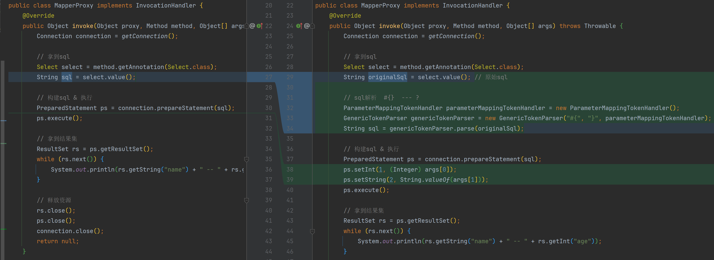

# MapperProxy完善SQL解析



```java
public class MapperProxy implements InvocationHandler {
    @Override
    public Object invoke(Object proxy, Method method, Object[] args) throws Throwable {
        Connection connection = getConnection();

        // 拿到sql
        Select select = method.getAnnotation(Select.class);
        String originalSql = select.value(); // 原始sql

        // sql解析  #{}  --- ?
        ParameterMappingTokenHandler parameterMappingTokenHandler = new ParameterMappingTokenHandler();
        GenericTokenParser genericTokenParser = new GenericTokenParser("#{", "}", parameterMappingTokenHandler);
        String sql = genericTokenParser.parse(originalSql);

        // 构建sql & 执行
        PreparedStatement ps = connection.prepareStatement(sql);
        ps.setInt(1, (Integer) args[0]);
        ps.setString(2, String.valueOf(args[1]));
        ps.execute();

        // 拿到结果集
        ResultSet rs = ps.getResultSet();
        while (rs.next()) {
            System.out.println(rs.getString("name") + " -- " + rs.getInt("age"));
        }

        // 释放资源
        rs.close();
        ps.close();
        connection.close();
        return null;
    }

    @SneakyThrows
    private static Connection getConnection() {
        // 加载JDBC驱动
        Class.forName("com.mysql.cj.jdbc.Driver");
        // 建立db连接
        Connection connection = DriverManager.getConnection("jdbc:mysql://127.0.0.1:3306/mybatis-zq?useUnicode=true&characterEncoding=UTF8&useSSL=false", "root", "root");
        return connection;
    }
}
```