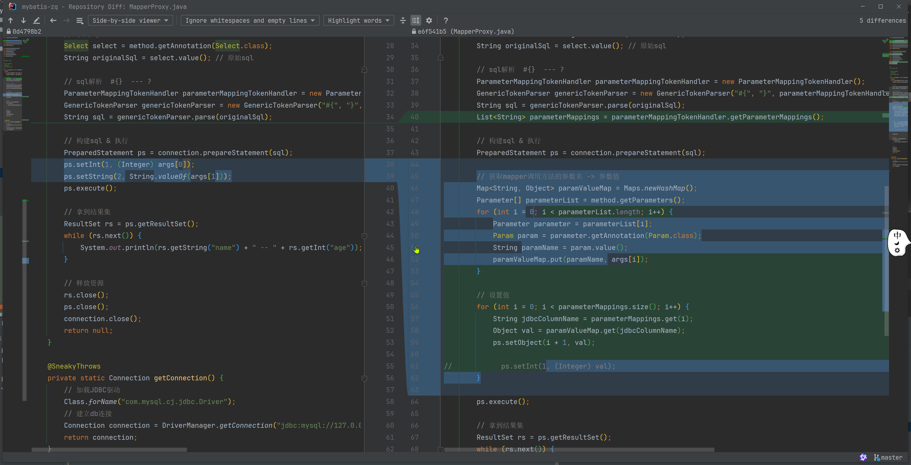

# UserMapper方法参数值获取

#### 1、新增mapper参数映射注解`@Param`

```java
import java.lang.annotation.ElementType;
import java.lang.annotation.Retention;
import java.lang.annotation.RetentionPolicy;
import java.lang.annotation.Target;

@Retention(RetentionPolicy.RUNTIME)
@Target(ElementType.PARAMETER)
public @interface Param {
    String value();
}
```

#### 2、mapper改写

```java
public interface UserMapper {
    @Select("select * from t_user where id = #{id} and name = #{name}")
    List<User> selectList(@Param("id") Integer id, @Param("name") String name);
}
```

#### 3、mapper代理方法获取参数值



```java
public class MapperProxy implements InvocationHandler {
    @Override
    public Object invoke(Object proxy, Method method, Object[] args) throws Throwable {
        Connection connection = getConnection();

        // 拿到sql
        Select select = method.getAnnotation(Select.class);
        String originalSql = select.value(); // 原始sql

        // sql解析  #{}  --- ?
        ParameterMappingTokenHandler parameterMappingTokenHandler = new ParameterMappingTokenHandler();
        GenericTokenParser genericTokenParser = new GenericTokenParser("#{", "}", parameterMappingTokenHandler);
        String sql = genericTokenParser.parse(originalSql);
        List<String> parameterMappings = parameterMappingTokenHandler.getParameterMappings();

        // 构建sql & 执行
        PreparedStatement ps = connection.prepareStatement(sql);

        // 获取mapper调用方法的参数名 -> 参数值
        Map<String, Object> paramValueMap = Maps.newHashMap();
        Parameter[] parameterList = method.getParameters();
        for (int i = 0; i < parameterList.length; i++) {
            Parameter parameter = parameterList[i];
            Param param = parameter.getAnnotation(Param.class);
            String paramName = param.value();
            paramValueMap.put(paramName, args[i]);
        }

        // 设置值
        for (int i = 0; i < parameterMappings.size(); i++) {
            String jdbcColumnName = parameterMappings.get(i);
            Object val = paramValueMap.get(jdbcColumnName);
            ps.setObject(i + 1, val);

//            ps.setInt(1, (Integer) val);
        }

        ps.execute();

        // 拿到结果集
        ResultSet rs = ps.getResultSet();
        while (rs.next()) {
            System.out.println(rs.getString("name") + " -- " + rs.getInt("age"));
        }

        // 释放资源
        rs.close();
        ps.close();
        connection.close();
        return null;
    }

    @SneakyThrows
    private static Connection getConnection() {
        // 加载JDBC驱动
        Class.forName("com.mysql.cj.jdbc.Driver");
        // 建立db连接
        Connection connection = DriverManager.getConnection("jdbc:mysql://127.0.0.1:3306/mybatis-zq?useUnicode=true&characterEncoding=UTF8&useSSL=false", "root", "root");
        return connection;
    }
}
```