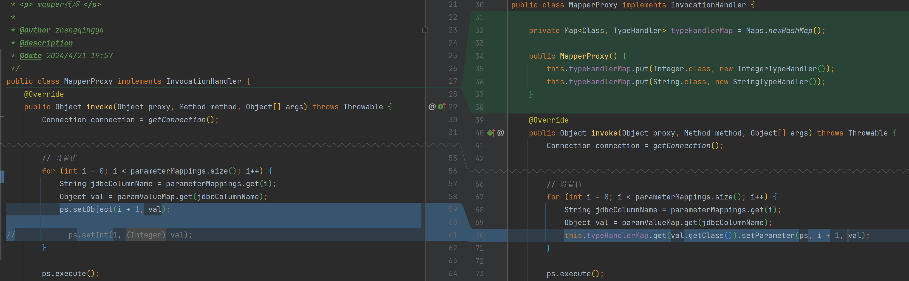

# TypeHandler设置ps参数值

`TypeHandler`（类型处理器）是MyBatis中的一个重要组件，负责在Java类型和JDBC类型之间进行转换。
具体来说，`TypeHandler`用于将Java对象映射到JDBC类型（例如，将`java.util.Date`映射到`java.sql.Timestamp`），以及将JDBC类型映射回Java对象。
以下是`TypeHandler`的主要作用和功能：

### 主要作用

1. **参数设置**：
    - 在执行SQL语句时，将Java对象设置为SQL参数（PreparedStatement的参数）。
    - 例如，将`java.util.Date`对象设置为`java.sql.Timestamp`参数。
2. **结果映射**：
    - 在查询结果返回时，将JDBC类型映射为Java对象。
    - 例如，将`java.sql.Timestamp`结果映射为`java.util.Date`对象。
3. **自定义类型转换**：
    - 允许用户自定义类型转换逻辑，以支持复杂的类型映射需求。
    - 例如，将数据库中的自定义类型映射为Java中的枚举类型。

### 代码实现

#### 1、字段类型处理器

```java
import java.sql.PreparedStatement;
import java.sql.SQLException;

public interface TypeHandler<T> {
    void setParameter(PreparedStatement ps, int i, T parameter) throws SQLException;
}

```

String字段类型处理器

```java
import java.sql.PreparedStatement;
import java.sql.SQLException;

public class StringTypeHandler implements TypeHandler<String> {
    @Override
    public void setParameter(PreparedStatement ps, int i, String parameter) throws SQLException {
        ps.setString(i, parameter);
    }
}
```

Integer字段类型处理器

```java
import java.sql.PreparedStatement;
import java.sql.SQLException;

public class IntegerTypeHandler implements TypeHandler<Integer> {
    @Override
    public void setParameter(PreparedStatement ps, int i, Integer parameter) throws SQLException {
        ps.setInt(i, parameter);
    }
}
```

#### 2、注册字段类型处理器 & 设置参数值



```java
public class MapperProxy implements InvocationHandler {

    private Map<Class, TypeHandler> typeHandlerMap = Maps.newHashMap();

    public MapperProxy() {
        this.typeHandlerMap.put(Integer.class, new IntegerTypeHandler());
        this.typeHandlerMap.put(String.class, new StringTypeHandler());
    }

    @Override
    public Object invoke(Object proxy, Method method, Object[] args) throws Throwable {
        // ...

        // 设置值
        for (int i = 0; i < parameterMappings.size(); i++) {
            String jdbcColumnName = parameterMappings.get(i);
            Object val = paramValueMap.get(jdbcColumnName);
            this.typeHandlerMap.get(val.getClass()).setParameter(ps, i + 1, val);
        }

        ps.execute();
        // ...
    }

}
```