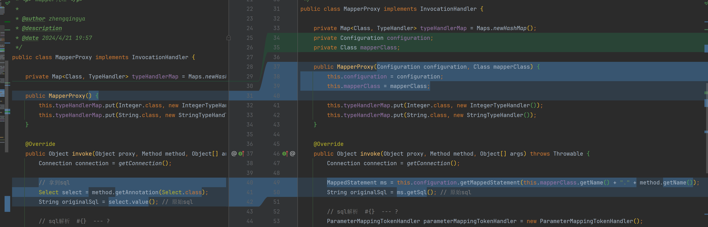
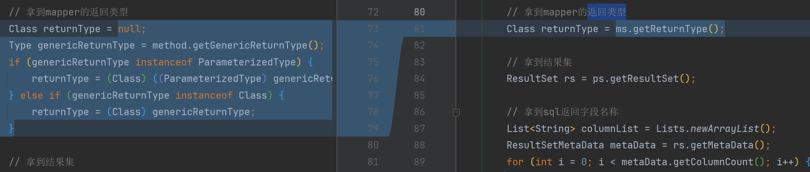

# MapperProxy优化mapper配置获取方式

1. 从configuration中获取mapper配置信息
2. 获取ms中解析的原始sql
3. 获取ms中解析的返回类型




### 具体修改点

MapperProxy

```java
import cn.hutool.core.util.ReflectUtil;
import com.google.common.collect.Lists;
import com.google.common.collect.Maps;
import com.zhengqing.mybatis.annotations.Param;
import com.zhengqing.mybatis.mapping.MappedStatement;
import com.zhengqing.mybatis.parsing.GenericTokenParser;
import com.zhengqing.mybatis.parsing.ParameterMappingTokenHandler;
import com.zhengqing.mybatis.session.Configuration;
import com.zhengqing.mybatis.type.IntegerTypeHandler;
import com.zhengqing.mybatis.type.StringTypeHandler;
import com.zhengqing.mybatis.type.TypeHandler;
import lombok.SneakyThrows;

import java.lang.reflect.Field;
import java.lang.reflect.InvocationHandler;
import java.lang.reflect.Method;
import java.lang.reflect.Parameter;
import java.sql.*;
import java.util.List;
import java.util.Map;

public class MapperProxy implements InvocationHandler {

    private Map<Class, TypeHandler> typeHandlerMap = Maps.newHashMap();
    private Configuration configuration;
    private Class mapperClass;

    public MapperProxy(Configuration configuration, Class mapperClass) {
        this.configuration = configuration;
        this.mapperClass = mapperClass;

        this.typeHandlerMap.put(Integer.class, new IntegerTypeHandler());
        this.typeHandlerMap.put(String.class, new StringTypeHandler());
    }

    @Override
    public Object invoke(Object proxy, Method method, Object[] args) throws Throwable {
        Connection connection = getConnection();

        MappedStatement ms = this.configuration.getMappedStatement(this.mapperClass.getName() + "." + method.getName());
        String originalSql = ms.getSql(); // 原始sql

        // sql解析  #{}  --- ?
        ParameterMappingTokenHandler parameterMappingTokenHandler = new ParameterMappingTokenHandler();
        GenericTokenParser genericTokenParser = new GenericTokenParser("#{", "}", parameterMappingTokenHandler);
        String sql = genericTokenParser.parse(originalSql);
        List<String> parameterMappings = parameterMappingTokenHandler.getParameterMappings();

        // 构建sql & 执行
        PreparedStatement ps = connection.prepareStatement(sql);

        // 获取mapper调用方法的参数名 -> 参数值
        Map<String, Object> paramValueMap = Maps.newHashMap();
        Parameter[] parameterList = method.getParameters();
        for (int i = 0; i < parameterList.length; i++) {
            Parameter parameter = parameterList[i];
            Param param = parameter.getAnnotation(Param.class);
            String paramName = param.value();
            paramValueMap.put(paramName, args[i]);
        }

        // 设置值
        for (int i = 0; i < parameterMappings.size(); i++) {
            String jdbcColumnName = parameterMappings.get(i);
            Object val = paramValueMap.get(jdbcColumnName);
            this.typeHandlerMap.get(val.getClass()).setParameter(ps, i + 1, val);
        }

        ps.execute();

        // 拿到mapper的返回类型
        Class returnType = ms.getReturnType();

        // 拿到结果集
        ResultSet rs = ps.getResultSet();

        // 拿到sql返回字段名称
        List<String> columnList = Lists.newArrayList();
        ResultSetMetaData metaData = rs.getMetaData();
        for (int i = 0; i < metaData.getColumnCount(); i++) {
            columnList.add(metaData.getColumnName(i + 1));
        }

        List list = Lists.newArrayList();
        while (rs.next()) {
            // 结果映射
            Object instance = returnType.newInstance();
            for (String columnName : columnList) {
                Field field = ReflectUtil.getField(returnType, columnName);
                Object val = this.typeHandlerMap.get(field.getType()).getResult(rs, columnName);
                ReflectUtil.setFieldValue(instance, columnName, val);
            }
            list.add(instance);
        }

        // 释放资源
        rs.close();
        ps.close();
        connection.close();
        return list;
    }

    @SneakyThrows
    private static Connection getConnection() {
        // 加载JDBC驱动
        Class.forName("com.mysql.cj.jdbc.Driver");
        // 建立db连接
        Connection connection = DriverManager.getConnection("jdbc:mysql://127.0.0.1:3306/mybatis-zq?useUnicode=true&characterEncoding=UTF8&useSSL=false", "root", "root");
        return connection;
    }
}
```

mapper代理工厂

```java
import com.zhengqing.mybatis.session.Configuration;

import java.lang.reflect.Proxy;

public class MapperProxyFactory {

    /**
     * 拿到代理类
     */
    public static <T> T getProxy(Class<T> mapperClass, Configuration configuration) {
        /**
         * 第一个参数：类加载器
         * 第二个参数：增强方法所在的类，这个类实现的接口，表示这个代理类可以执行哪些方法。
         * 第三个参数：实现InvocationHandler接口，
         */
        return (T) Proxy.newProxyInstance(mapperClass.getClassLoader(), new Class[]{mapperClass}, new MapperProxy(configuration, mapperClass));
    }
}
```

测试类

```java
import cn.hutool.json.JSONUtil;
import com.zhengqing.demo.entity.User;
import com.zhengqing.demo.mapper.UserMapper;
import com.zhengqing.mybatis.binding.MapperProxyFactory;
import com.zhengqing.mybatis.builder.XMLConfigBuilder;
import com.zhengqing.mybatis.session.Configuration;
import org.junit.Test;

import java.util.List;

public class TestApp {

    @Test
    public void test() throws Exception {
        XMLConfigBuilder xmlConfigBuilder = new XMLConfigBuilder();
        Configuration configuration = xmlConfigBuilder.parse();

        UserMapper userMapper = MapperProxyFactory.getProxy(UserMapper.class, configuration);
        List<User> userList = userMapper.selectList(1, "zq");
        System.out.println(JSONUtil.toJsonStr(userList));
    }
}
```