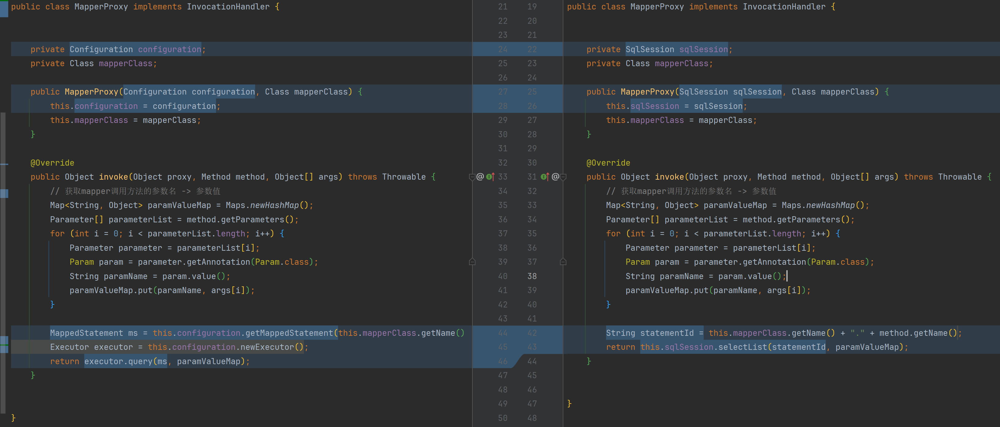

# mapper代理修改为SqlSession版



```java
import com.google.common.collect.Maps;
import com.zhengqing.mybatis.annotations.Param;
import com.zhengqing.mybatis.session.SqlSession;

import java.lang.reflect.InvocationHandler;
import java.lang.reflect.Method;
import java.lang.reflect.Parameter;
import java.util.Map;

public class MapperProxy implements InvocationHandler {
    private SqlSession sqlSession;
    private Class mapperClass;

    public MapperProxy(SqlSession sqlSession, Class mapperClass) {
        this.sqlSession = sqlSession;
        this.mapperClass = mapperClass;
    }

    @Override
    public Object invoke(Object proxy, Method method, Object[] args) throws Throwable {
        // 获取mapper调用方法的参数名 -> 参数值
        Map<String, Object> paramValueMap = Maps.newHashMap();
        Parameter[] parameterList = method.getParameters();
        for (int i = 0; i < parameterList.length; i++) {
            Parameter parameter = parameterList[i];
            Param param = parameter.getAnnotation(Param.class);
            String paramName = param.value();
            paramValueMap.put(paramName, args[i]);
        }

        String statementId = this.mapperClass.getName() + "." + method.getName();
        return this.sqlSession.selectList(statementId, paramValueMap);
    }
}
```

mapper代理工厂修改

```java
public class MapperProxyFactory {
    /**
     * 拿到代理类
     */
    public static <T> T getProxy(Class<T> mapperClass, SqlSession sqlSession) {
        /**
         * 第一个参数：类加载器
         * 第二个参数：增强方法所在的类，这个类实现的接口，表示这个代理类可以执行哪些方法。
         * 第三个参数：实现InvocationHandler接口，
         */
        return (T) Proxy.newProxyInstance(mapperClass.getClassLoader(), new Class[]{mapperClass}, new MapperProxy(sqlSession, mapperClass));
    }
}
```

SqlSession 新增`getMapper`方法获取mapper代理类

```java
public interface SqlSession {
    // ...
    <T> T getMapper(Class<T> mapper);
}
```

```java
public class DefaultSqlSession implements SqlSession {
    // ...
    @Override
    public <T> T getMapper(Class<T> mapper) {
        return MapperProxyFactory.getProxy(mapper, this);
    }
}
```

测试类

```java
public class TestApp {
    @Test
    public void test() throws Exception {
        XMLConfigBuilder xmlConfigBuilder = new XMLConfigBuilder();
        Configuration configuration = xmlConfigBuilder.parse();

        SqlSession sqlSession = new DefaultSqlSession(configuration, configuration.newExecutor());
        UserMapper userMapper = sqlSession.getMapper(UserMapper.class);

        List<User> userList = userMapper.selectList(1, "zq");
        System.out.println(JSONUtil.toJsonStr(userList));

//        System.out.println(userMapper.selectOne(1));
    }
}
```
