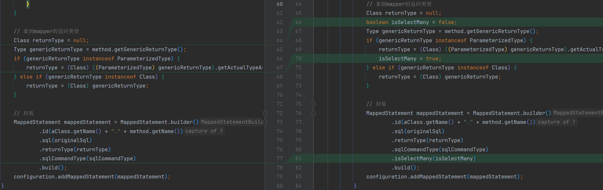

# MapperProxy完善sqlSession增删改查

```java
import com.google.common.collect.Maps;
import com.zhengqing.mybatis.annotations.Param;
import com.zhengqing.mybatis.mapping.MappedStatement;
import com.zhengqing.mybatis.mapping.SqlCommandType;
import com.zhengqing.mybatis.session.SqlSession;

import java.lang.reflect.InvocationHandler;
import java.lang.reflect.Method;
import java.lang.reflect.Parameter;
import java.util.Map;

public class MapperProxy implements InvocationHandler {


    private SqlSession sqlSession;
    private Class mapperClass;

    public MapperProxy(SqlSession sqlSession, Class mapperClass) {
        this.sqlSession = sqlSession;
        this.mapperClass = mapperClass;
    }

    @Override
    public Object invoke(Object proxy, Method method, Object[] args) throws Throwable {
        // 获取mapper调用方法的参数名 -> 参数值
        Map<String, Object> paramValueMap = Maps.newHashMap();
        Parameter[] parameterList = method.getParameters();
        for (int i = 0; i < parameterList.length; i++) {
            Parameter parameter = parameterList[i];
            Param param = parameter.getAnnotation(Param.class);
            String paramName = param.value();
            paramValueMap.put(paramName, args[i]);
        }

        String statementId = this.mapperClass.getName() + "." + method.getName();
        MappedStatement ms = this.sqlSession.getConfiguration().getMappedStatement(statementId);
        SqlCommandType sqlCommandType = ms.getSqlCommandType();
        switch (sqlCommandType) {
            case INSERT:
                return this.sqlSession.insert(statementId, paramValueMap);
            case DELETE:
                return this.sqlSession.delete(statementId, paramValueMap);
            case UPDATE:
                return this.sqlSession.update(statementId, paramValueMap);
            case SELECT:
                if (ms.getIsSelectMany()) {
                    return this.sqlSession.selectList(statementId, paramValueMap);
                } else {
                    return this.sqlSession.selectOne(statementId, paramValueMap);
                }
            default:
                break;
        }
        return null;
    }
}
```

XMLConfigBuilder 新增解析`isSelectMany`



```java
public class XMLConfigBuilder {

    private List<Class<? extends Annotation>> sqlAnnotationTypeList = Lists.newArrayList(Insert.class, Delete.class, Update.class, Select.class);

    public Configuration parse() {
        Configuration configuration = new Configuration();
        // 解析mapper
        this.parseMapper(configuration);
        return configuration;
    }

    @SneakyThrows
    private void parseMapper(Configuration configuration) {
        Set<Class<?>> classes = ClassUtil.scanPackage("com.zhengqing.demo.mapper");
        for (Class<?> aClass : classes) {
            Method[] methods = aClass.getMethods();
            for (Method method : methods) {
                SqlCommandType sqlCommandType = null;
                String originalSql = ""; // 原始sql
                for (Class<? extends Annotation> sqlAnnotationType : this.sqlAnnotationTypeList) {
                    Annotation annotation = method.getAnnotation(sqlAnnotationType);
                    if (annotation != null) {
                        originalSql = (String) annotation.getClass().getMethod("value").invoke(annotation);
                        if (annotation instanceof Insert) {
                            sqlCommandType = SqlCommandType.INSERT;
                        } else if (annotation instanceof Delete) {
                            sqlCommandType = SqlCommandType.DELETE;
                        } else if (annotation instanceof Update) {
                            sqlCommandType = SqlCommandType.UPDATE;
                        } else if (annotation instanceof Select) {
                            sqlCommandType = SqlCommandType.SELECT;
                        }
                        break;
                    }
                }

                // 拿到mapper的返回类型
                Class returnType = null;
                boolean isSelectMany = false;
                Type genericReturnType = method.getGenericReturnType();
                if (genericReturnType instanceof ParameterizedType) {
                    returnType = (Class) ((ParameterizedType) genericReturnType).getActualTypeArguments()[0];
                    isSelectMany = true;
                } else if (genericReturnType instanceof Class) {
                    returnType = (Class) genericReturnType;
                }

                // 封装
                MappedStatement mappedStatement = MappedStatement.builder()
                        .id(aClass.getName() + "." + method.getName())
                        .sql(originalSql)
                        .returnType(returnType)
                        .sqlCommandType(sqlCommandType)
                        .isSelectMany(isSelectMany)
                        .build();
                configuration.addMappedStatement(mappedStatement);
            }
        }
    }
}
```

mapper配置信息 新增`isSelectMany`

```java
public class MappedStatement {
    private String id; // 唯一标识 eg: com.zhengqing.demo.mapper.UserMapper.selectList
    private String sql; // SQL
    private Class returnType;// 返回类型
    private SqlCommandType sqlCommandType; // SQL命令类型
    private Boolean isSelectMany; // 是否查询多条数据
}
```

SqlSession 新增`getConfiguration`方法获取核心配置信息

```java
public interface SqlSession {
    // ...
    Configuration getConfiguration();
}
```

```java
public class DefaultSqlSession implements SqlSession {
    // ...
    @Override
    public Configuration getConfiguration() {
        return this.configuration;
    }
}
```