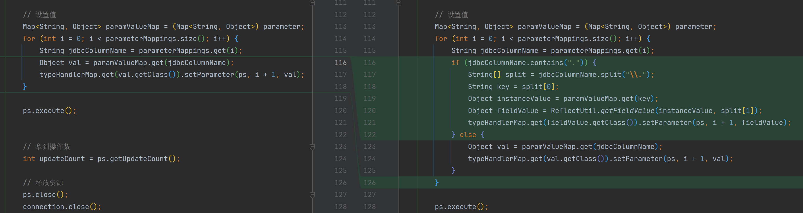

# 完善sql执行器-增删改操作-02

解析复杂对象属性值 eg: `#{user.name}`

```java
public interface UserMapper {
    @Insert("insert into t_user(name, age) values(#{user.name}, #{user.age})")
    Integer insert(@Param("user") User user);
}
```



```java
public class SimpleExecutor implements Executor {
    // ...
    @Override
    public int update(MappedStatement ms, Object parameter) {
        // ...
        // 设置值
        Map<String, Object> paramValueMap = (Map<String, Object>) parameter;
        for (int i = 0; i < parameterMappings.size(); i++) {
            String jdbcColumnName = parameterMappings.get(i);
            if (jdbcColumnName.contains(".")) {
                String[] split = jdbcColumnName.split("\\.");
                String key = split[0];
                Object instanceValue = paramValueMap.get(key);
                Object fieldValue = ReflectUtil.getFieldValue(instanceValue, split[1]);
                typeHandlerMap.get(fieldValue.getClass()).setParameter(ps, i + 1, fieldValue);
            } else {
                Object val = paramValueMap.get(jdbcColumnName);
                typeHandlerMap.get(val.getClass()).setParameter(ps, i + 1, val);
            }
        }

        ps.execute();
        // ...
    }
}
```

测试类

```java
public class TestApp {
    @Test
    public void test() throws Exception {
        SqlSessionFactory sqlSessionFactory = new SqlSessionFactoryBuilder().build();
        SqlSession sqlSession = sqlSessionFactory.openSession();
        UserMapper userMapper = sqlSession.getMapper(UserMapper.class);

//        List<User> userList = userMapper.selectList(1, "zq");
//        System.out.println(JSONUtil.toJsonStr(userList));
//        System.out.println(userMapper.selectOne(1));

//        System.out.println(userMapper.update(3, "xxx"));
//        System.out.println(userMapper.delete(3));
        System.out.println(userMapper.insert(User.builder().name(RandomUtil.randomString(5)).age(RandomUtil.randomInt(1, 100)).build()));
    }
}
```