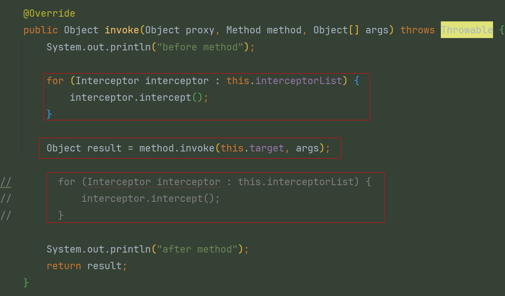

# 插件-多插件功能增强

### v1版

#### 1、定义拦截器

定义多个插件的接口约束，mybatis中叫拦截器

```java
public interface Interceptor {
    void intercept();
}
```

实现2个简单的拦截器，用于分页和打印日志

```java
public class LimitInterceptor implements Interceptor {
    @Override
    public void intercept() {
        System.out.println("分页插件执行了...");
    }
}
```

```java
public class SqlInterceptor implements Interceptor {
    @Override
    public void intercept() {
        System.out.println("sql日志打印插件执行了...");
    }
}
```

#### 2、修改插件代理类，新增拦截器

用于在invoke方法中执行多个拦截器功能

```java
public class Plugin implements InvocationHandler {

    private Object target;
    private List<Interceptor> interceptorList;

    public Plugin(Object target, List<Interceptor> interceptorList) {
        this.target = target;
        this.interceptorList = interceptorList;
    }

    @Override
    public Object invoke(Object proxy, Method method, Object[] args) throws Throwable {
        System.out.println("before method");

        for (Interceptor interceptor : this.interceptorList) {
            interceptor.intercept();
        }

        Object result = method.invoke(this.target, args);

//        for (Interceptor interceptor : this.interceptorList) {
//            interceptor.intercept();
//        }

        System.out.println("after method");
        return result;
    }

    public static <T> T wrap(T target, List<Interceptor> interceptorList) {
        return (T) Proxy.newProxyInstance(target.getClass().getClassLoader(), target.getClass().getInterfaces(), new Plugin(target, interceptorList));
    }
}
```

#### 3、测试类

```java
public class TestPlugin {
    @Test
    public void test() throws Exception {
        UserService userService = Plugin.wrap(new UserServiceImpl(), Lists.newArrayList(
                new LimitInterceptor(),
                new SqlInterceptor()
        ));
        System.out.println(userService.selectOne("xx"));
    }
}
```

v1版问题：目前插件功能只能放在 invoke 方法前或后执行一次...


### v2版

需求：将`method.invoke(this.target, args)`执行放在每个插件里面执行，这样每个插件可以自己控制`method.invoke(this.target, args)`前后执行的功能。

#### 1、定义代理对象执行所需参数

proceed 方法用于执行代理对象方法

```java

@Data
@AllArgsConstructor
public class Invocation {

    private Object target; // 代理对象
    private Method method; // 执行方法
    private Object[] args; // 方法参数

    @SneakyThrows
    public Object proceed() {
        return this.method.invoke(this.target, this.args);
    }

}
```

#### 2、拦截器新增 `Invocation invocation` 代理类执行参数

```java
public interface Interceptor {
    Object intercept(Invocation invocation);
}
```

```java
public class LimitInterceptor implements Interceptor {
    @Override
    public Object intercept(Invocation invocation) {
        System.out.println("分页插件start");
        Object result = invocation.proceed();
        System.out.println("分页插件end");
        return result;
    }
}
```

```java
public class SqlInterceptor implements Interceptor {
    @Override
    public Object intercept(Invocation invocation) {
        System.out.println("sql插件start");
        Object result = invocation.proceed();
        System.out.println("sql插件end");
        return result;
    }
}
```

#### 3、修改插件代理类

构建代理类执行参数，将`method.invoke(this.target, args)`放在插件里面执行，让每个插件可以自己控制方法前后执行的逻辑。

```java
public class Plugin implements InvocationHandler {
    // ...
    @Override
    public Object invoke(Object proxy, Method method, Object[] args) throws Throwable {
        System.out.println("before method");

        Object result = null;
        for (Interceptor interceptor : this.interceptorList) {
            result = interceptor.intercept(new Invocation(this.target, method, args));
        }

        // A -> B -> C

        System.out.println("after method");
        return result;
    }
    // ...
}
```

v2版问题：插件功能执行顺序问题。
插件A、插件B都执行`interceptor.intercept`方法，由于在循环里，最终的 result 结果只会是最后一个插件的执行结果。
实际项目中，插件A先执行完后，插件B再执行。插件B应该拿到插件A执行的结果再去执行。避免插件A无效执行。
