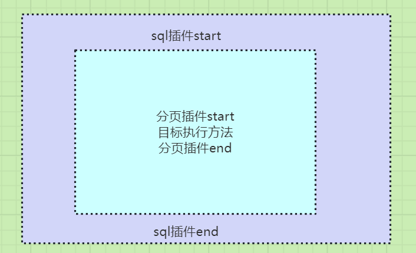

# 插件-链式调用处理结果值

将插件代理里面的多个拦截器执行改成单个拦截器执行。
在使用时，执行多个插件，将先执行插件的结果值，传递给下一个插件，即链式调用传递结果值。

```java
public class Plugin implements InvocationHandler {
    private Object target;
    private Interceptor interceptor;

    public Plugin(Object target, Interceptor interceptor) {
        this.target = target;
        this.interceptor = interceptor;
    }

    @Override
    public Object invoke(Object proxy, Method method, Object[] args) throws Throwable {
        return this.interceptor.intercept(new Invocation(this.target, method, args));
    }

    public static <T> T wrap(T target, Interceptor interceptor) {
        return (T) Proxy.newProxyInstance(target.getClass().getClassLoader(), target.getClass().getInterfaces(), new Plugin(target, interceptor));
    }
}
```

测试类，先执行分页插件，再去执行sql插件，套娃儿执行。`A -> B -> C`

```java
public class TestPlugin {
    @Test
    public void test() throws Exception {
        // A -> B -> C
        UserService userService = Plugin.wrap(new UserServiceImpl(), new LimitInterceptor());
        UserService userService2 = Plugin.wrap(userService, new SqlInterceptor());
        System.out.println(userService2.selectOne("xx"));
    }
}
```

执行结果：

```shell
sql插件start
分页插件start
执行了selectOne: xx
分页插件end
sql插件end
ok
```

执行顺序理解

