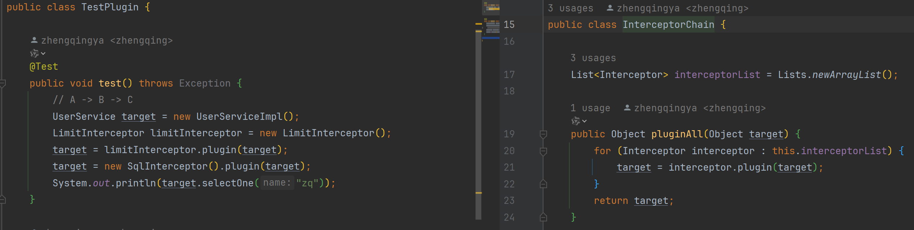

# 插件-责任链模式

责任链模式（Chain of Responsibility Pattern）是一种行为设计模式，它允许多个对象有机会处理请求，从而避免请求的发送者和接收者之间的耦合。
在责任链模式中，每个处理对象都包含对下一个处理对象的引用，并且请求沿着链传递，直到有一个对象处理它为止。

### 主要优点

- **解耦**：
    - 请求的发送者和接收者之间解耦，请求可以被多个对象处理，而不需要知道具体的处理对象。
- **灵活性**：
    - 可以动态地添加或删除处理者，改变处理逻辑。
- **可扩展性**：
    - 添加新的处理者类非常简单，符合开闭原则。

### 主要缺点

- **性能问题**：
    - 如果链中的处理者很多，请求可能需要经过多个处理者，影响性能。
- **调试困难**：
    - 请求的传递路径可能不容易跟踪，调试困难。

### 应用场景

- **日志记录**：
    - 多个日志处理器可以处理不同级别的日志信息。
- **权限检查**：
    - 多个权限检查器可以依次检查用户权限。
- **请求处理**：
    - 多个处理器可以依次处理请求，直到某个处理器处理完毕。

### MyBatis插件中的责任链模式

- **InterceptorChain**：
    - MyBatis内部使用`InterceptorChain`来管理所有的插件。
    - 当MyBatis启动时，会将所有配置的插件添加到`InterceptorChain`中。
- **拦截点**：
    - MyBatis定义了多个拦截点，允许插件拦截不同的方法。
    - 常见的拦截点包括`Executor`、`StatementHandler`、`ParameterHandler`和`ResultSetHandler`。
- **插件拦截**：
    - 在执行SQL操作时，插件会在指定的拦截点拦截目标方法的调用，并执行拦截逻辑。
    - 例如，`LoggingInterceptor`会在执行`Executor`的`query`方法时记录SQL ID和执行时间。

通过这种方式，MyBatis插件机制利用责任链模式提供了一种灵活且强大的方式来扩展和定制MyBatis的行为，满足各种业务需求。

### 代码实现

#### 1、定义拦截器责任链

```java
public class InterceptorChain {
    List<Interceptor> interceptorList = Lists.newArrayList();

    public Object pluginAll(Object target) {
        for (Interceptor interceptor : this.interceptorList) {
            target = interceptor.plugin(target);
        }
        return target;
    }

    public void addInterceptor(Interceptor interceptor) {
        this.interceptorList.add(interceptor);
    }

    public List<Interceptor> getInterceptorList() {
        return Collections.unmodifiableList(this.interceptorList);
    }
}
```

`pluginAll`方法理解



```java
public class TestPlugin {
    @Test
    public void test() throws Exception {
        // A -> B -> C
        UserService target = new UserServiceImpl();
        LimitInterceptor limitInterceptor = new LimitInterceptor();
        target = limitInterceptor.plugin(target);
        target = new SqlInterceptor().plugin(target);
        System.out.println(target.selectOne("zq"));
    }
}
```

#### 2、测试类

插件可配置、可拔插。

```java
public class TestPlugin {
    @Test
    public void test03() throws Exception {
        InterceptorChain interceptorChain = new InterceptorChain();
        interceptorChain.addInterceptor(new LimitInterceptor());
//        interceptorChain.addInterceptor(new SqlInterceptor());
        UserService userService = (UserService) interceptorChain.pluginAll(new UserServiceImpl());
        System.out.println(userService.selectOne("zq"));
    }
}
```

执行结果：

```shell
分页插件start
执行了selectOne: zq
分页插件end
ok111
```

### 总结

责任链模式是一种行为设计模式，它允许多个对象有机会处理请求，从而避免请求的发送者和接收者之间的耦合。
在MyBatis中，责任链模式常用于插件机制，允许你在SQL执行的生命周期中拦截和修改MyBatis的行为。
通过实现`Interceptor`接口并配置插件，可以灵活地扩展MyBatis的功能。