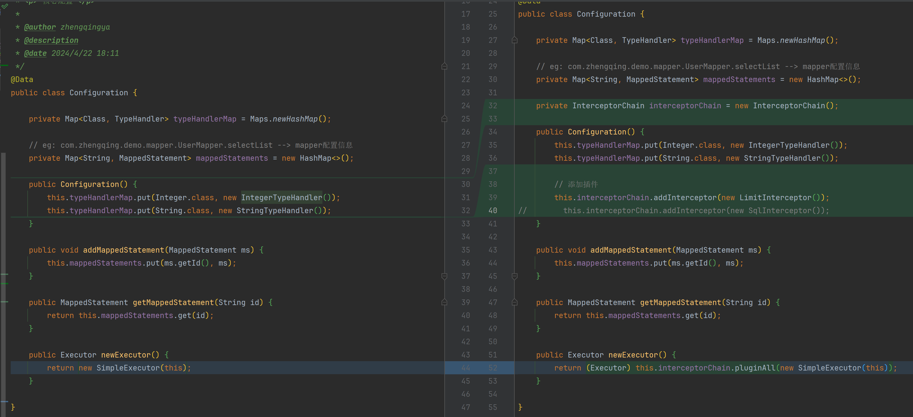

# 责任链插件包装sql执行器



```java
public class Configuration {
    // ...
    private InterceptorChain interceptorChain = new InterceptorChain();

    public Configuration() {
        // 添加插件
        this.interceptorChain.addInterceptor(new LimitInterceptor());
//        this.interceptorChain.addInterceptor(new SqlInterceptor());
    }

    public Executor newExecutor() {
        return (Executor) this.interceptorChain.pluginAll(new SimpleExecutor(this));
    }
}
```

测试类

```java
public class TestApp {
    @Test
    public void test() throws Exception {
        SqlSessionFactory sqlSessionFactory = new SqlSessionFactoryBuilder().build();
        SqlSession sqlSession = sqlSessionFactory.openSession();
        UserMapper userMapper = sqlSession.getMapper(UserMapper.class);

        List<User> userList = userMapper.selectList(1, "zq");
        System.out.println(JSONUtil.toJsonStr(userList));
    }
}
```

执行结果：

```shell
分页插件start
分页插件end
[{"id":1,"name":"zq","age":18}]
```
