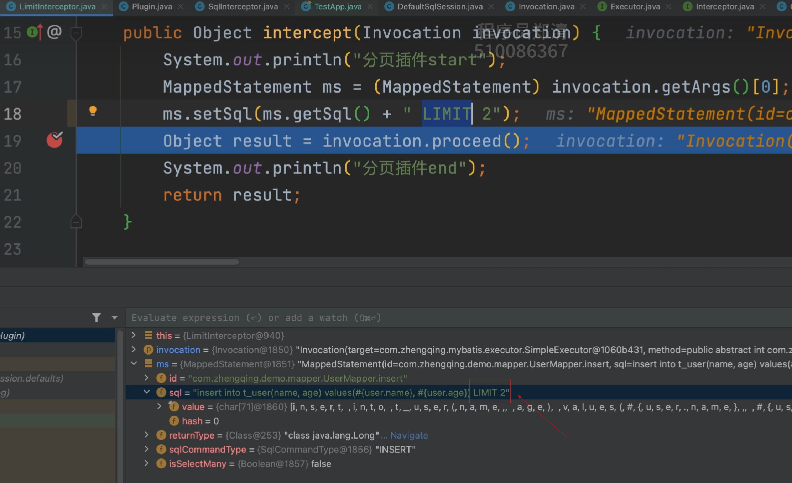

# 发现问题-增删改不能使用分页插件

---

Mybatis源码中的四种类型拦截器（拦截和修改执行流程）

1. **Executor**：执行器拦截器
    - 负责执行SQL语句，包括`SELECT`、`INSERT`、`UPDATE`和`DELETE`等操作。
    - 拦截`Executor`可以实现事务管理、缓存管理、性能监控等功能。
2. **StatementHandler**：语句拦截器
    - 负责处理SQL语句的预编译和参数设置。
    - 拦截`StatementHandler`可以实现SQL重写、参数修改等功能。
3. **ParameterHandler**：参数拦截器
    - 负责将Java对象转换为JDBC参数。
    - 拦截`ParameterHandler`可以实现参数的自定义处理，例如类型转换。
4. **ResultSetHandler**：结果集拦截器
    - 负责将`ResultSet`结果集映射到Java对象。
    - 拦截`ResultSetHandler`可以实现结果集的自定义处理，例如数据转换、结果集分页等。
