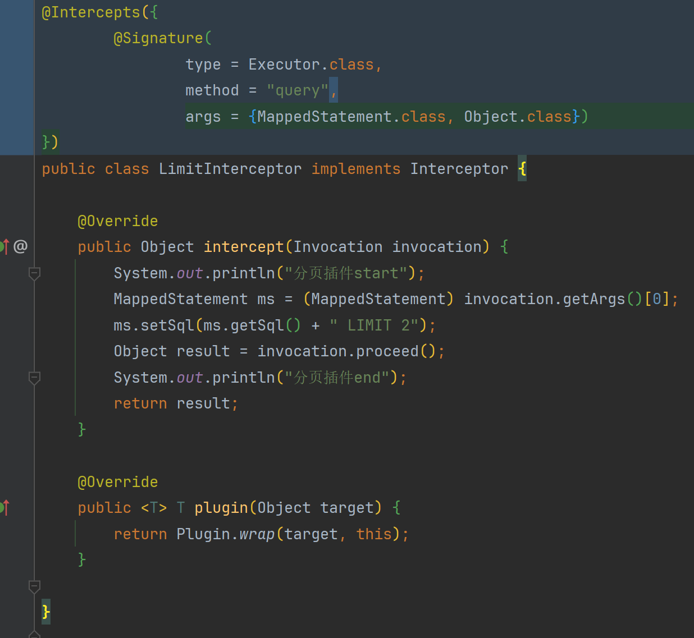

# 自定义注解-插件拦截指定类方法

#### 1、自定义注解

```java
import java.lang.annotation.ElementType;
import java.lang.annotation.Retention;
import java.lang.annotation.RetentionPolicy;
import java.lang.annotation.Target;

@Retention(RetentionPolicy.RUNTIME)
@Target(ElementType.TYPE)
public @interface Intercepts {
    Signature[] value();
}
```

```java
import java.lang.annotation.ElementType;
import java.lang.annotation.Retention;
import java.lang.annotation.RetentionPolicy;
import java.lang.annotation.Target;

@Retention(RetentionPolicy.RUNTIME)
@Target(ElementType.TYPE)
public @interface Signature {
    Class<?> type(); // 拦截到的类

    String method(); // 拦截到的方法

    Class<?>[] args(); // 拦截的方法参数
}
```

#### 2、使用

```
@Intercepts({
        @Signature(
                type = Executor.class,
                method = "query",
                args = {MappedStatement.class, Object.class})
})
```


