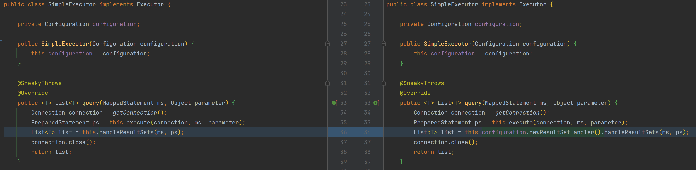

# 结果处理器

在MyBatis中，结果处理器（ResultSetHandler）负责将数据库查询结果（ResultSet）映射到Java对象。
结果处理器的主要职责包括处理结果集的遍历、类型转换和结果映射。

### 主要职责

1. **结果集遍历**：
    - 遍历`ResultSet`中的每一行数据。
2. **类型转换**：
    - 将JDBC类型转换为Java类型，例如将`java.sql.Timestamp`转换为`java.util.Date`。
3. **结果映射**：
    - 将`ResultSet`中的列值映射到Java对象的属性。

### 核心接口

MyBatis中的结果处理器主要涉及以下几个核心接口和类：

1. **ResultSetHandler接口**：
    - 定义了结果处理器的基本方法。
    - 主要方法包括`handleResultSets`和`handleOutputParameters`。
2. **DefaultResultSetHandler类**：
    - MyBatis提供的默认结果处理器实现。
    - 负责处理大多数常见的结果集映射和类型转换。

### 主要方法

1. **handleResultSets**：
    - 处理`ResultSet`并将其映射为Java对象列表。
2. **handleOutputParameters**：
    - 处理存储过程的输出参数。

### 代码实现

#### 1、定义结果处理器

```java
public interface ResultSetHandler {
    <T> List<T> handleResultSets(MappedStatement ms, PreparedStatement ps);
}
```

```java
public class DefaultResultSetHandler implements ResultSetHandler {

    private Configuration configuration;

    public DefaultResultSetHandler(Configuration configuration) {
        this.configuration = configuration;
    }

    @SneakyThrows
    @Override
    public <T> List<T> handleResultSets(MappedStatement ms, PreparedStatement ps) {
        // 拿到mapper的返回类型
        Class returnType = ms.getReturnType();

        // 拿到结果集
        ResultSet rs = ps.getResultSet();

        // 拿到sql返回字段名称
        List<String> columnList = Lists.newArrayList();
        ResultSetMetaData metaData = rs.getMetaData();
        for (int i = 0; i < metaData.getColumnCount(); i++) {
            columnList.add(metaData.getColumnName(i + 1));
        }

        Map<Class, TypeHandler> typeHandlerMap = this.configuration.getTypeHandlerMap();
        List list = Lists.newArrayList();
        while (rs.next()) {
            // 结果映射
            Object instance = returnType.newInstance();
            for (String columnName : columnList) {
                Field field = ReflectUtil.getField(returnType, columnName);
                Object val = typeHandlerMap.get(field.getType()).getResult(rs, columnName);
                ReflectUtil.setFieldValue(instance, columnName, val);
            }
            list.add(instance);
        }
        rs.close();
        ps.close();
        return list;
    }
}
```

#### 2、通过核心配置拿到结果处理器

```java
public class Configuration {
    // ...
    public ResultSetHandler newResultSetHandler() {
        return (ResultSetHandler) this.interceptorChain.pluginAll(new DefaultResultSetHandler(this));
    }
}
```

#### 3、执行器修改



```java
public <T> List<T> query(MappedStatement ms, Object parameter) {
    Connection connection = getConnection();
    PreparedStatement ps = this.execute(connection, ms, parameter);
    List<T> list = this.configuration.newResultSetHandler().handleResultSets(ms, ps);
    connection.close();
    return list;
}
```


