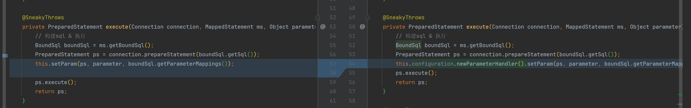

# 参数处理器

在MyBatis中，参数处理器（ParameterHandler）负责将Java对象转换为JDBC参数，以便在执行SQL语句时正确地设置这些参数。
参数处理器的主要职责包括处理参数映射、类型转换和参数设置。

### 主要职责

1. **参数映射**：
    - 将Java对象中的属性映射到SQL语句中的参数占位符（如`#{paramName}`）。
2. **类型转换**：
    - 将Java类型转换为JDBC类型，例如将`java.util.Date`转换为`java.sql.Timestamp`。
3. **参数设置**：
    - 将转换后的参数设置到`PreparedStatement`中。

### 核心接口

MyBatis中的参数处理器主要涉及以下几个核心接口和类：

1. **ParameterHandler接口**：
    - 定义了参数处理器的基本方法。
    - 主要方法包括`getParameterObject`和`setParameters`。
2. **DefaultParameterHandler类**：
    - MyBatis提供的默认参数处理器实现。
    - 负责处理大多数常见的参数映射和类型转换。

### 主要方法

1. **getParameterObject**：
    - 获取参数对象，即传递给Mapper方法的参数。
2. **setParameters**：
    - 将参数对象设置到`PreparedStatement`中。

### 代码实现

#### 1、定义参数处理器

```java
public interface ParameterHandler {
    void setParam(PreparedStatement ps, Object parameter, List<String> parameterMappings);
}
```

```java
public class DefaultParameterHandler implements ParameterHandler {
    private Configuration configuration;

    public DefaultParameterHandler(Configuration configuration) {
        this.configuration = configuration;
    }

    @SneakyThrows
    @Override
    public void setParam(PreparedStatement ps, Object parameter, List<String> parameterMappings) {
        // 设置值
        Map<Class, TypeHandler> typeHandlerMap = this.configuration.getTypeHandlerMap();
        Map<String, Object> paramValueMap = (Map<String, Object>) parameter;
        for (int i = 0; i < parameterMappings.size(); i++) {
            String jdbcColumnName = parameterMappings.get(i);
            if (jdbcColumnName.contains(".")) {
                String[] split = jdbcColumnName.split("\\.");
                String key = split[0];
                Object instanceValue = paramValueMap.get(key);
                Object fieldValue = ReflectUtil.getFieldValue(instanceValue, split[1]);
                typeHandlerMap.get(fieldValue.getClass()).setParameter(ps, i + 1, fieldValue);
            } else {
                Object val = paramValueMap.get(jdbcColumnName);
                typeHandlerMap.get(val.getClass()).setParameter(ps, i + 1, val);
            }
        }
    }
}
```

#### 2、通过核心配置拿到参数处理器

```java
public class Configuration {
    // ...
    public ParameterHandler newParameterHandler() {
        return (ParameterHandler) this.interceptorChain.pluginAll(new DefaultParameterHandler(this));
    }
}
```

#### 3、执行器修改



```java
private PreparedStatement execute(Connection connection, MappedStatement ms, Object parameter) {
    // 构建sql & 执行
    BoundSql boundSql = ms.getBoundSql();
    PreparedStatement ps = connection.prepareStatement(boundSql.getSql());
    this.configuration.newParameterHandler().setParam(ps, parameter, boundSql.getParameterMappings());
    ps.execute();
    return ps;
}
```
