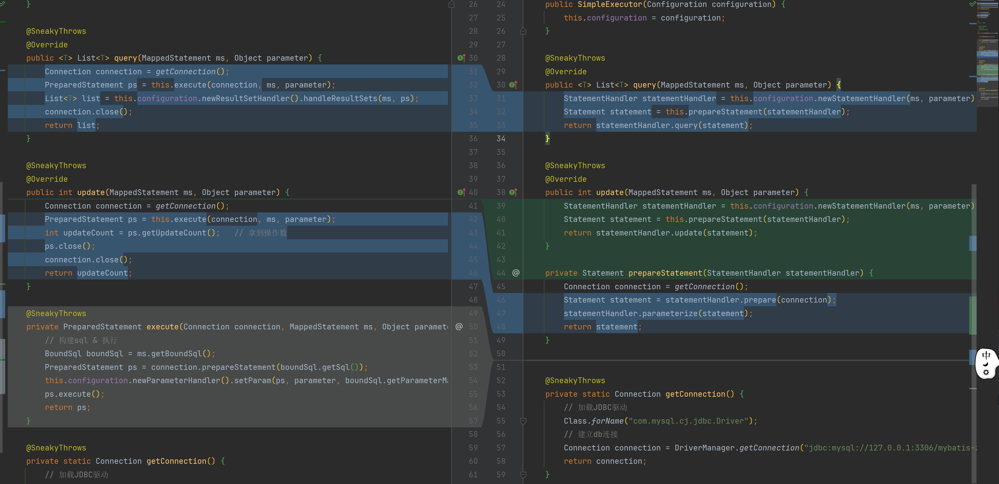

# sql执行器通过语句处理器调用

#### 1、核心配置新增获取语句处理器方法

```java
public class Configuration {
    // ...
    public StatementHandler newStatementHandler(MappedStatement ms, Object parameter) {
        return (StatementHandler) this.interceptorChain.pluginAll(new PreparedStatementHandler(this, ms, parameter));
    }
}
```

#### 2、执行器通过语句处理器调用



```java
public class SimpleExecutor implements Executor {

    private Configuration configuration;

    public SimpleExecutor(Configuration configuration) {
        this.configuration = configuration;
    }

    @SneakyThrows
    @Override
    public <T> List<T> query(MappedStatement ms, Object parameter) {
        StatementHandler statementHandler = this.configuration.newStatementHandler(ms, parameter);
        Statement statement = this.prepareStatement(statementHandler);
        return statementHandler.query(statement);
    }

    @SneakyThrows
    @Override
    public int update(MappedStatement ms, Object parameter) {
        StatementHandler statementHandler = this.configuration.newStatementHandler(ms, parameter);
        Statement statement = this.prepareStatement(statementHandler);
        return statementHandler.update(statement);
    }

    private Statement prepareStatement(StatementHandler statementHandler) {
        Connection connection = getConnection();
        Statement statement = statementHandler.prepare(connection);
        statementHandler.parameterize(statement);
        return statement;
    }


    @SneakyThrows
    private static Connection getConnection() {
        // 加载JDBC驱动
        Class.forName("com.mysql.cj.jdbc.Driver");
        // 建立db连接
        Connection connection = DriverManager.getConnection("jdbc:mysql://127.0.0.1:3306/mybatis-zq?useUnicode=true&characterEncoding=UTF8&useSSL=false", "root", "root");
        return connection;
    }
}
```