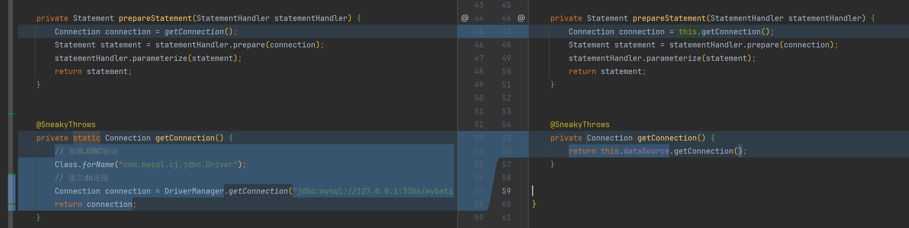

# sql执行器通过连接池拿到连接

```java
public class Configuration {
    // ...
    private DataSource dataSource = new PooledDataSource();

    public DataSource getDataSource() {
        return this.dataSource;
    }
}
```



```java
public class SimpleExecutor implements Executor {
    private Configuration configuration;
    private DataSource dataSource;

    public SimpleExecutor(Configuration configuration) {
        this.configuration = configuration;
        this.dataSource = configuration.getDataSource();
    }

    // ...

    private Statement prepareStatement(StatementHandler statementHandler) {
        Connection connection = this.getConnection();
        Statement statement = statementHandler.prepare(connection);
        statementHandler.parameterize(statement);
        return statement;
    }

    @SneakyThrows
    private Connection getConnection() {
        return this.dataSource.getConnection();
    }
}
```