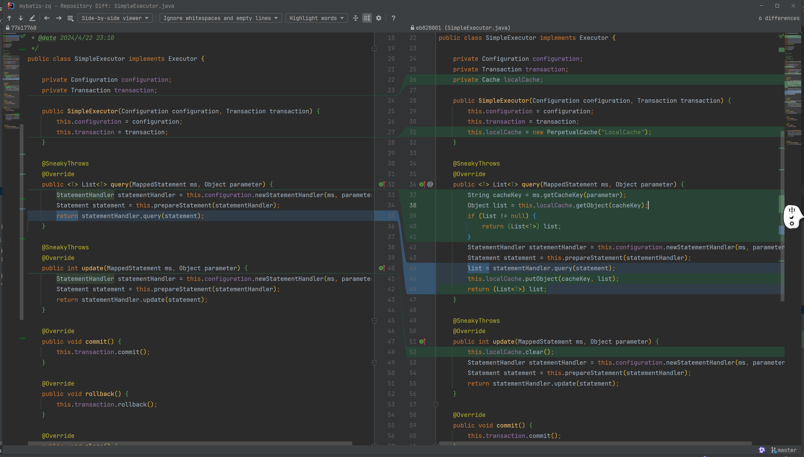

# 实现一级缓存

#### 1、定义缓存接口

```java
public interface Cache {
    String getId();

    void putObject(Object key, Object value);

    Object getObject(Object key);

    Object removeObject(Object key);

    void clear();
}
```

#### 2、实现一个简单的一级缓存

采用map存储方式，永久缓存

```java
import java.util.HashMap;
import java.util.Map;

public class PerpetualCache implements Cache {
    private String id;
    private Map<Object, Object> cacheMap = new HashMap<>();

    public PerpetualCache(String id) {
        this.id = id;
    }

    @Override
    public String getId() {
        return this.id;
    }

    @Override
    public void putObject(Object key, Object value) {
        this.cacheMap.put(key, value);
    }

    @Override
    public Object getObject(Object key) {
        return this.cacheMap.get(key);
    }

    @Override
    public Object removeObject(Object key) {
        return this.cacheMap.remove(key);
    }

    @Override
    public void clear() {
        this.cacheMap.clear();
    }
}
```

#### 3、MappedStatement获取缓存唯一key

```java
public class MappedStatement {
    public String getCacheKey(Object parameter) {
        return this.id + ":" + this.sql + ":" + parameter;
    }
}
```

#### 4、SimpleExecutor 执行器实现缓存逻辑



```java
public class SimpleExecutor implements Executor {
    // ...
    private Cache localCache;

    public SimpleExecutor(Configuration configuration, Transaction transaction) {
        // ...
        this.localCache = new PerpetualCache("LocalCache");
    }

    @SneakyThrows
    @Override
    public <T> List<T> query(MappedStatement ms, Object parameter) {
        String cacheKey = ms.getCacheKey(parameter);
        Object list = this.localCache.getObject(cacheKey);
        if (list != null) {
            return (List<T>) list;
        }
        StatementHandler statementHandler = this.configuration.newStatementHandler(ms, parameter);
        Statement statement = this.prepareStatement(statementHandler);
        list = statementHandler.query(statement);
        this.localCache.putObject(cacheKey, list);
        return (List<T>) list;
    }

    @SneakyThrows
    @Override
    public int update(MappedStatement ms, Object parameter) {
        this.localCache.clear();
        StatementHandler statementHandler = this.configuration.newStatementHandler(ms, parameter);
        Statement statement = this.prepareStatement(statementHandler);
        return statementHandler.update(statement);
    }
}
```

#### 5、测试

```java
public class TestApp {
    @Test
    public void test() throws Exception {
        SqlSessionFactory sqlSessionFactory = new SqlSessionFactoryBuilder().build();
        SqlSession sqlSession = sqlSessionFactory.openSession(false);
        UserMapper userMapper = sqlSession.getMapper(UserMapper.class);
        System.out.println(JSONUtil.toJsonStr(userMapper.selectList(1, "zq")));
        System.out.println(JSONUtil.toJsonStr(userMapper.selectList(1, "zq")));
//        System.out.println(userMapper.selectOne(1));
//        System.out.println(userMapper.insert(User.builder().name(RandomUtil.randomString(5)).age(RandomUtil.randomInt(1, 100)).build()));
//        System.out.println(userMapper.delete(5));
        System.out.println(userMapper.update(2, "xxx"));
        System.out.println(JSONUtil.toJsonStr(userMapper.selectList(1, "zq")));
        sqlSession.commit();
        sqlSession.close();
    }
}
```
