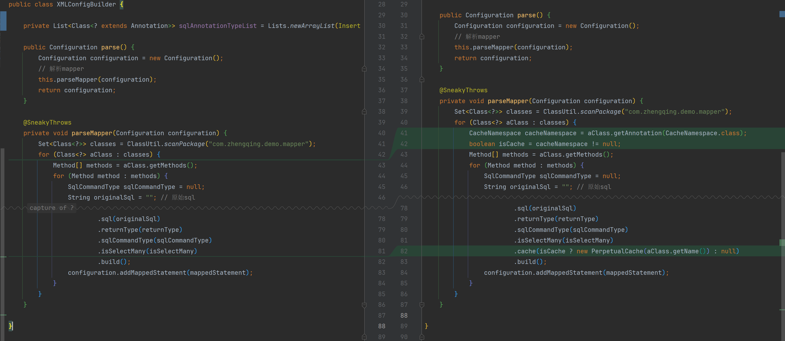

# 二级缓存-01

### 二级缓存概述

- **定义**：二级缓存是 MyBatis 中的一种缓存机制，它存在于同一个命名空间下的多个 SqlSession 之间。
  与一级缓存（SqlSession 级别的缓存）不同，二级缓存可以在多个 SqlSession 之间共享，从而减少数据库的访问次数，提高查询效率。
- **作用范围**：二级缓存的作用范围是 Mapper 的命名空间级别，即同一个命名空间下的所有 SqlSession 可以共享同一个二级缓存。
- **工作原理**：
    - 当一个 SqlSession 查询数据时，MyBatis 会先检查二级缓存中是否存在所需的数据。
    - 如果存在，则直接从二级缓存中获取数据，避免了对数据库的访问。
    - 如果不存在，则会继续查询数据库，并将查询结果存入二级缓存中，供后续查询使用。

### 启用二级缓存

- **全局配置**：在 MyBatis 的全局配置文件 `mybatis-config.xml` 中，设置 `<setting name="cacheEnabled" value="true"/>` 来启用二级缓存。
- **注解方式**：在 Mapper 接口上添加 `@CacheNamespace` 注解来启用该命名空间的二级缓存。
- **Mapper 配置**：在具体的 Mapper XML 文件中，添加 `<cache/>` 标签来启用该命名空间的二级缓存。例如：
  ```xml
  <mapper namespace="com.example.mapper.UserMapper">
      <cache/>
      <!-- SQL 映射语句 -->
  </mapper>
  ```

### 注意事项

- **事务管理**：二级缓存默认是跨事务的，因此在多线程环境下需要注意数据一致性问题。
- **缓存失效策略**：可以通过配置缓存的失效时间、刷新间隔等参数来控制缓存的行为。
- **序列化**：二级缓存中的对象需要支持序列化，因为缓存数据可能会被存储到磁盘或其他持久化介质中。

### 代码实现

#### 1、定义二级缓存注解

```java
import java.lang.annotation.ElementType;
import java.lang.annotation.Retention;
import java.lang.annotation.RetentionPolicy;
import java.lang.annotation.Target;

@Retention(RetentionPolicy.RUNTIME)
@Target(ElementType.TYPE)
public @interface CacheNamespace {
}
```

#### 2、使用

```java

@CacheNamespace
public interface UserMapper {
    // ...
}
```

#### 3、MappedStatement里存放缓存

```java
public class MappedStatement {
    private Cache cache; // 缓存
}
```

#### 4、XMLConfigBuilder中判断是否需要开启二级缓存



```java
public class XMLConfigBuilder {
    private void parseMapper(Configuration configuration) {
        Set<Class<?>> classes = ClassUtil.scanPackage("com.zhengqing.demo.mapper");
        for (Class<?> aClass : classes) {
            CacheNamespace cacheNamespace = aClass.getAnnotation(CacheNamespace.class);
            boolean isCache = cacheNamespace != null;
            // ...

            // 封装
            MappedStatement mappedStatement = MappedStatement.builder()
                    .id(aClass.getName() + "." + method.getName())
                    .sql(originalSql)
                    .returnType(returnType)
                    .sqlCommandType(sqlCommandType)
                    .isSelectMany(isSelectMany)
                    .cache(isCache ? new PerpetualCache(aClass.getName()) : null)
                    .build();
            configuration.addMappedStatement(mappedStatement);
        }
    }
}
```
