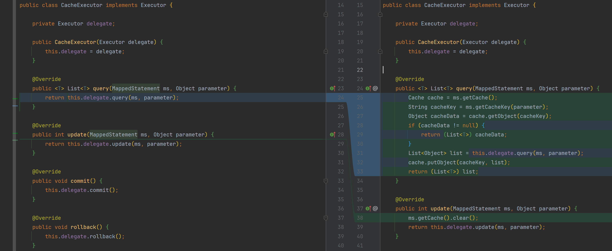

# 二级缓存-03

缓存装饰器中完善二级缓存逻辑



```java
public class CacheExecutor implements Executor {

    private Executor delegate;

    public CacheExecutor(Executor delegate) {
        this.delegate = delegate;
    }

    @Override
    public <T> List<T> query(MappedStatement ms, Object parameter) {
        Cache cache = ms.getCache();
        String cacheKey = ms.getCacheKey(parameter);
        Object cacheData = cache.getObject(cacheKey);
        if (cacheData != null) {
            return (List<T>) cacheData;
        }
        List<Object> list = this.delegate.query(ms, parameter);
        cache.putObject(cacheKey, list);
        return (List<T>) list;
    }

    @Override
    public int update(MappedStatement ms, Object parameter) {
        ms.getCache().clear();
        return this.delegate.update(ms, parameter);
    }
    // ...
}
```