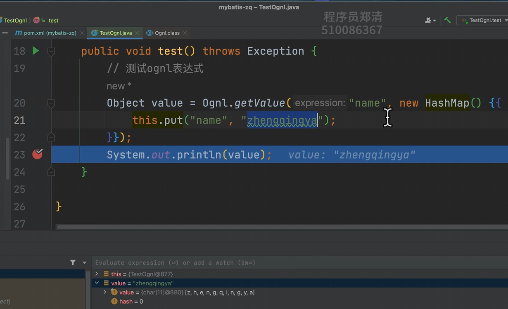

# 动态sql-ognl表达式

### OGNL 表达式概述

OGNL（Object-Graph Navigation Language）是一种强大的表达式语言，用于在 Java 应用程序中访问和操作对象图。
MyBatis 使用 OGNL 表达式来动态生成 SQL 语句，特别是在处理复杂的条件查询、动态 SQL 等场景时非常有用。

#### 主要特点

- **对象导航**：可以通过点号（`.`）或方括号（`[]`）语法访问对象的属性和方法。
- **表达式求值**：支持逻辑运算、算术运算、字符串拼接等操作。
- **动态 SQL**：可以根据传入的参数动态生成 SQL 语句，避免硬编码。

#### 常见用法

1. **访问对象属性**
    - `user.name`：访问 `user` 对象的 `name` 属性。
    - `user['name']`：同上，使用方括号语法。
2. **调用方法**
    - `user.getName()`：调用 `user` 对象的 `getName` 方法。
3. **逻辑运算**
    - `age > 18`：判断 `age` 是否大于 18。
    - `name == 'John' && age < 30`：组合多个条件。
4. **三元运算**
    - `age > 18 ? 'Adult' : 'Minor'`：根据条件返回不同结果。
5. **集合操作**
    - `users[0].name`：访问 `users` 列表中的第一个元素的 `name` 属性。
    - `users.size() > 0`：判断 `users` 列表是否为空。

### 入门体验

#### 1、添加依赖

```
<!-- ognl表达式 -->
<dependency>
    <groupId>ognl</groupId>
    <artifactId>ognl</artifactId>
    <version>2.3.2</version>
</dependency>
```

#### 2、测试ognl表达式



```java
public class TestOgnl {
    @Test
    public void test() throws Exception {
        // 测试ognl表达式
        Object value = Ognl.getValue("user.age >= 18", new HashMap() {{
            this.put("name", "zhengqingya");
            this.put("user", new HashMap() {{
                this.put("age", 18);
                this.put("name", "zq");
            }});
        }});
        System.out.println(value); // true
    }
}
```