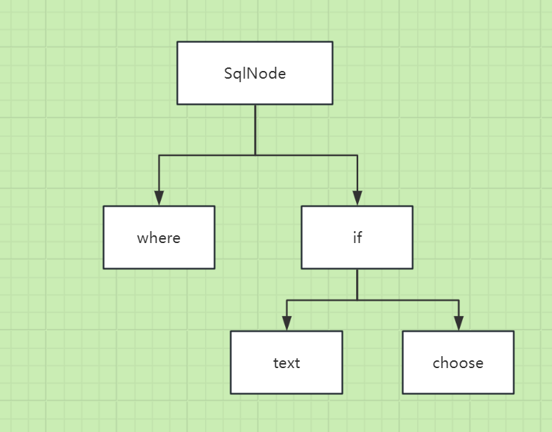

# 动态sql-定义sql节点（组合模式）



### 组合模式概述

组合模式（Composite Pattern）是一种结构型设计模式，它允许你将对象组合成树形结构来表示“部分-整体”的层次结构。
组合模式使得客户端可以一致地处理单个对象和对象组合，从而简化了客户端代码。

#### 主要特点

- **透明性**：客户端可以统一处理单个对象和组合对象，无需关心它们的具体类型。
- **灵活性**：可以动态地添加或删除组件，支持复杂的层次结构。
- **符合开闭原则**：对扩展开放，对修改关闭，可以在不修改现有代码的基础上增加新的功能。

#### 组成部分

1. **Component（组件接口）**：
    - 定义了所有组件的共同操作接口，既可以是具体对象，也可以是组合对象。
2. **Leaf（叶子节点）**：
    - 实现了 Component 接口，代表树形结构中的叶节点，没有子节点。
3. **Composite（组合节点）**：
    - 实现了 Component 接口，包含多个子组件（可以是 Leaf 或 Composite），负责管理子组件的添加、删除和遍历等操作。
4. **Client（客户端）**：
    - 通过 Component 接口与组合结构交互，无需区分单个对象和组合对象。

#### 代码实现

#### 1、定义SQL节点接口约束

```java
public interface SqlNode {
    void apply(Map context);
}
```

#### 2、IF 节点

```java
import lombok.SneakyThrows;
import ognl.Ognl;

import java.util.Map;

public class IfSqlNode implements SqlNode {
    private String test; // eg: id != null

    private SqlNode sqlNode; // eg: IfSqlNode

    public IfSqlNode(String test, SqlNode sqlNode) {
        this.test = test;
        this.sqlNode = sqlNode;
    }

    @SneakyThrows
    @Override
    public void apply(Map context) {
        Boolean value = (Boolean) Ognl.getValue(this.test, context);
        if (value) {
            this.sqlNode.apply(context);
        }
    }
}
```

#### 3、混合节点

```java
import lombok.SneakyThrows;

import java.util.List;
import java.util.Map;

public class MixedSqlNode implements SqlNode {
    private List<SqlNode> contents; // eg: IfSqlNode, xx

    public MixedSqlNode(List<SqlNode> contents) {
        this.contents = contents;
    }

    @SneakyThrows
    @Override
    public void apply(Map context) {
        for (SqlNode content : this.contents) {
            content.apply(context);
        }
    }
}
```
