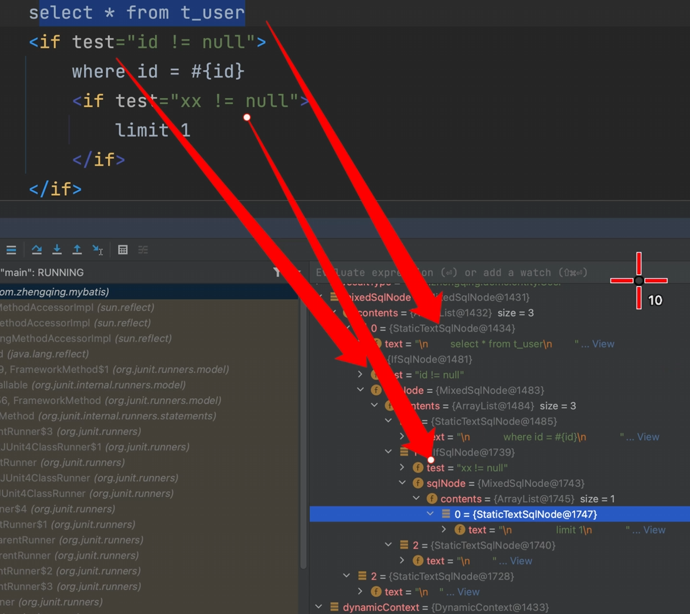

# 动态sql-静态文本节点和解析最终sql值

静态文本节点：无特殊节点类型判断，纯sql语句。

#### 1、动态上下文

```java
public class DynamicContext {
    private Map<String, Object> bindings; // ognl所需上下文数据
    private StringJoiner sqlBuilder = new StringJoiner(" "); // 拼接最终sql

    public DynamicContext(Map<String, Object> bindings) {
        this.bindings = bindings;
    }

    public Map<String, Object> getBindings() {
        return this.bindings;
    }

    public void appendSql(String sqlText) {
        this.sqlBuilder.add(sqlText.trim());
    }

    public String getSql() {
        return this.sqlBuilder.toString();
    }
}
```

#### 2、SQL节点 传递动态上下文

```java
public interface SqlNode {
    void apply(DynamicContext context);
}
```

IF节点

```java
public class IfSqlNode implements SqlNode {
    private String test; // eg: id != null

    private SqlNode sqlNode; // eg: IfSqlNode

    public IfSqlNode(String test, SqlNode sqlNode) {
        this.test = test;
        this.sqlNode = sqlNode;
    }

    @SneakyThrows
    @Override
    public void apply(DynamicContext context) {
        Boolean value = (Boolean) Ognl.getValue(this.test, context.getBindings());
        if (value) {
            this.sqlNode.apply(context);
        }
    }
}
```

混合节点

```java
public class MixedSqlNode implements SqlNode {
    private List<SqlNode> contents; // eg: IfSqlNode, xx

    public MixedSqlNode(List<SqlNode> contents) {
        this.contents = contents;
    }

    @SneakyThrows
    @Override
    public void apply(DynamicContext context) {
        for (SqlNode content : this.contents) {
            content.apply(context);
        }
    }
}
```

静态文本sql节点

```java
public class StaticTextSqlNode implements SqlNode {
    private String text; // eg: select * from t_user

    public StaticTextSqlNode(String text) {
        this.text = text;
    }

    @SneakyThrows
    @Override
    public void apply(DynamicContext context) {
        context.appendSql(this.text);
    }
}
```

#### 3、测试

```java
import cn.hutool.core.io.FileUtil;
import com.google.common.collect.Lists;
import com.zhengqing.mybatis.scripting.*;
import org.dom4j.Document;
import org.dom4j.Element;
import org.dom4j.Node;
import org.dom4j.io.SAXReader;
import org.junit.Test;
import org.xml.sax.EntityResolver;
import org.xml.sax.InputSource;
import org.xml.sax.SAXException;

import java.io.BufferedInputStream;
import java.io.ByteArrayInputStream;
import java.io.IOException;
import java.util.HashMap;
import java.util.List;

public class TestXml {

    @Test
    public void test() throws Exception {
        // 解析xml
        SAXReader saxReader = new SAXReader();
        saxReader.setEntityResolver(new EntityResolver() {
            @Override
            public InputSource resolveEntity(String publicId, String systemId) throws SAXException, IOException {
                return new InputSource(new ByteArrayInputStream("<?xml version='1.0' encoding='UTF-8'?>".getBytes()));
            }
        });  // 跳过 xml DTD 验证 -- 解决解析慢的问题
        BufferedInputStream inputStream = FileUtil.getInputStream("/Users/zhengqingya/zhengqingya/code/workspace-me/mybatis-zq/src/main/java/com/zhengqing/demo/mapper/UserMapper.xml");
        Document document = saxReader.read(inputStream);
        Element rootElement = document.getRootElement();
        List<Element> list = rootElement.selectNodes("//select"); // insert update delete select
        for (Element selectElement : list) {
            String methodName = selectElement.attributeValue("id");
            String resultType = selectElement.attributeValue("resultType");
            MixedSqlNode mixedSqlNode = this.parseTags(selectElement);
            DynamicContext dynamicContext = new DynamicContext(
                    new HashMap<String, Object>() {{
                        this.put("id", 1);
                        this.put("xx", 2);
                    }}
            );
            mixedSqlNode.apply(dynamicContext);
            dynamicContext.getSql();

            System.out.println("最终sql:" + dynamicContext.getSql());
        }
    }

    private MixedSqlNode parseTags(Element element) {
        List<SqlNode> contents = Lists.newArrayList();
        List<Node> contentList = element.content();
        for (Node node : contentList) {
            if (node.getNodeType() == Node.ELEMENT_NODE) {
                Element childNodeElement = (Element) node;
                String sqlNodeType = childNodeElement.getName();
                String test = childNodeElement.attributeValue("test");
//                System.out.println("类型：" + sqlNodeType);
//                System.out.println("表达式：" + test);

                if (sqlNodeType.equals("if")) {
                    contents.add(new IfSqlNode(test, this.parseTags(childNodeElement)));
                } else if (sqlNodeType.equals("choose")) {
//                contents.add(new ChooseSqlNode(test, this.parseTags(childNodeElement)));
                }
            } else {
                String sql = node.getText();
                contents.add(new StaticTextSqlNode(sql));
            }
        }
        return new MixedSqlNode(contents);
    }
}
```

解析内容


